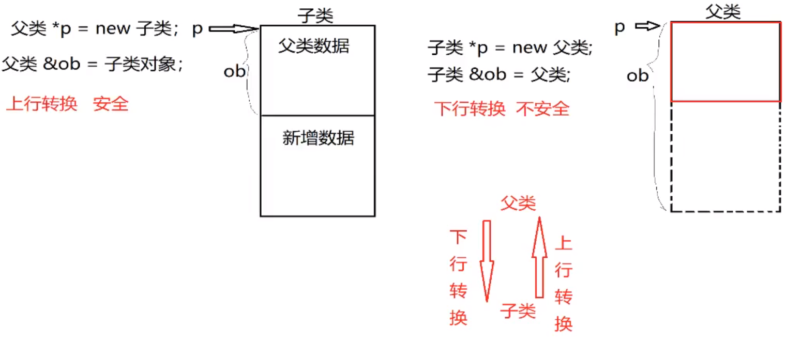

# 1 指针的引用

```c++
void test(char* &str)
{
    str = malloc(sizeof(str) * 12);
    strcpy(str,"hello world"); 
}

void test1()
{
     char * str = null;
     test(str);
}
```

# 2 类的大小

<font color=blue>类中成员属性占类的大小，类中成员函数不占用类的大小。</font>

- 空类占用一个字节大小，为了区分不同对象。

- 成员函数存放在.text区（代码区）
- 类中如果有<font color=red>虚函数</font>会占用4个字节大小（32位）即一个虚指针的大小，且与虚函数个数无关。
- 同结构体一样，类也需要内存对齐
- 类中静态成员变量不占类的大小，因为静态成员存放在常量区

# 3 static关键字

- 静态变量只会被定义一次，重复执行时，编译器会直接跳过定义

- 无论类实例了多少个对象，static关键字修饰的成员变量在内存中只会有一份，被所有对象共享
- 静态成员函数存在的目的就是操作静态成员变量，静态成员函数不能访问非静态成员变量

# 4 C++的封装性

- C++将数据和方法封装在一起，但是数据和方法是分开存储的。
- 所有对象共享同一个方法，所有对象都有独立的一份数据<font color=red>（静态、内联除外）</font>。
- 不同对象调用同一方法时，方法中会产生一个this指针，始终指向调用他的对象。

# 5 explicit关键字

- `explicit`关键字作用：<font color=red>禁止通过构造函数进行隐式转换</font>

```c++
class Date;
Date d = Date();//显示调用无参构造
Date d = 30;//等同于 Date d(30); 隐式转换调用有参构造，
//通过在构造函数前面加explicit关键字可以禁止隐式转换
//（只有类提供了有参构造，才可能进行隐式转换）。
Date()//匿名对象
```

# 6 子类继承父类，构造函数调用顺序

子类继承父类创建子类对象后

1. 调用父类构造函数，<font color=red>如果父类没有提供无参构造，需要显式调用父类有参构造</font>
2. 调用子类构造函数
3. 调用子类析构函数
4. 调用父类析构函数

## 6.1 显式调用父类有参构造方法

```c++
class Base{
private:
    int a;    
public:
    Base(int a)
    {
        this->a = a;
    }
};
class son:public Base
{
public:
    son(int a):Base(a)
    {}              
};
```

# 7. 构造函数与初始化列表

## 7.1 构造函数的执行阶段：

1. 初始化阶段（先于计算阶段）

    所有类成员都会在初始化阶段初始化，即使该成员不在初始化列表中

2. 计算阶段

    一般用于执行构造函数体内的赋值操作

## 7.2 初始化列表使用时机

- 非必须使用初始化列表情况

    1. 使用初始化列表某些情况下可以不调用默认构造函数

    2. 能使用初始化列表的时候尽量使用初始化列表

- 必须使用初始化列表情况
    1. 常量成员。因为常量只能初始化，不能赋值。
    2. 引用类型。引用必须在定义的时候初始化，且不能重新赋值
    3. 没有提供默认构造函数的类。初始化列表可以直接调用拷贝构造函数进行初始化。

```c+
class Base{
private:
    int m_a;
public: 
    Base(int a):m_a(a)//初始化列表，将a的值赋给m_a。
    {}
};
```

# 8 this指针

- this指针就是类的实例起始地址，实例的变量存储区的起始地址，和代码区分开的。
- this指针不属于类，也不占类的空间大小
- 静态成员函数内部没有this指针，没有实例起始地址，所以无法操作非静态成员变量

<font color=red>静态成员函数之所以可以访问静态成员变量，是因为静态成员变量是属于类的（不占用类的大小），不属于某个对象，可以通过类名直接访问</font>

# 9 const修饰成员函数

const修饰成员函数时，函数体内任何成员变量的值都不可以修改，mutable关键字修饰的成员变量除外

```c++
void test() const{
    //除mutable修饰的成员变量外，其余成员变量值都不能更改
}
```

# 10 友元函数

## 10.1 友元函数使用事项

- 友元函数不属于类，也不带this指针
- 友元函数可以访问类中任何成员变量，包括私有属性
- friend关键字只出现在声明处
- 类、其他类成员函数、全局函数都可以声明为友元函数
- 友元函数只能类内声明，类外定义

## 10.2 友元函数例子

```c++
class GoodGay;
class Room
{
    //全局函数做Room类的友元（与其他类的成员函数做Room类的友元用法一样）
	friend void goodFriend(Room& room);
    //GoodGay类做Room类的友元，整个GoodGay类的成员函数都能访问Room类的所有属性
    friend class GoodGay; 
private:
	string bedRoom;
public:
	string sittingRoom;
	Room()
	{
         bedRoom = "卧室";
         sittingRoom = "客厅";
	}
	~Room()	{}
};
//全局函数作为类的友元
void goodFriend(Room &room)//此处加friend关键字编译不通过
{
	cout << room.sittingRoom << endl;
	//bedRoom属性为私有属性，将goodFriend()函数作为友元后，可以访问私有数据
	cout << room.bedRoom << endl;
}

int main()
{
	Room room;
	goodFriend(room);
	return 0;
}
```

## 10.3 友元全局函数重载“+”号运算符

```c++
class Person
{
    friend Person operator+(Person& p1, Person& p2);
private:
    char* m_name;
    int m_num;
public:
    char* getName() { return m_name; }
    int getNum() { return m_num; }
    Person() { cout << "调用了无参构造" << endl; }
    Person(char* name, int num){
        cout << "调用了有参构造" << endl;
        cout << "开辟了空间" << endl;
        this->m_name = new char[strlen(name) + 1];
        strcpy(this->m_name,name);
        this->m_num = num;
    }
    Person(const Person& p){
        cout << "调用了拷贝构造函数" << endl;
        this->m_name = new char[strlen(p.m_name) + 1];
        strcpy(this->m_name,p.m_name);
        this->m_num = p.m_num;
    }
    ~Person()
    {
        cout << "调用了析构函数"  << endl;
        if (this->m_name != nullptr){
            delete[] this->m_name;
            this->m_name = nullptr;
        }
    }
};

Person operator+(Person & p1, Person & p2)
{
    char* temp_name = new char[(strlen(p1.m_name) + strlen(p2.m_name) + 1)];
    strcpy(temp_name, p1.m_name);
    strcat(temp_name, p2.m_name);

    int temp_num = p1.m_num + p2.m_num;
    Person p(temp_name, temp_num);
    delete [] temp_name;

    return p;
}

int main()
{
    Person p1("lucy",18);
    Person p2("bobo",19);
    Person p3 = p1 + p2;
    cout << p3.getName() << p3.getNum() << endl;
    //输出lucybobo37
    return 0;
}
```

## 10.4 成员函数重载“=”号运算符

- <font color=blue>成员函数中有指针时，一般都要自定义拷贝函数、重载“=”号运算符</font>

```c++
class Person
{
public:
    Person()
    {
        cout << "无参构造被调用" << endl;
    }
    Person(char* name, int num)
    {
        cout << "有参构造被调用" << endl;
        this->m_name = new char[strlen(name) + 1];
        strcpy(this->m_name, name);
        this->m_num = num;
    }
    Person(const Person& p)
    {
        cout << "拷贝构造被调用" << endl;
        this->m_name = new char[strlen(p.m_name) + 1];
        strcpy(this->m_name, p.m_name);
        this->m_num = p.m_num;
    }
    ~Person()
    {
        cout << "析构函数被调用" << endl;
        if (this->m_name != NULL)
        {
            delete this->m_name;
            this->m_name = nullptr;
        }
    }
    void showPerson()
    {
        cout << "姓名为：" << this->m_name << "\t年龄为：" 
        << this->m_num << endl;
    }
    //这样的写法使得对象之间可以连等
    Person& operator=(const Person &p)
    {
        if (this->m_name != nullptr)
        {
            delete[] this->m_name;
            this->m_name = nullptr;
        }
        cout << "=号重载被调用" << endl;
        this->m_name = new char[strlen(p.m_name) + 1];
        strcpy(this->m_name, p.m_name);
        this->m_num = p.m_num;
        return *this;
    }
private:
    char* m_name;
    int m_num;
};

int main()
{
    Person p1((char*)"lucy",19);
    //Person p2 = p1; 调用的拷贝构造函数，如果不写拷贝构造，会因为浅拷贝而程序崩溃
    //p2 = p1; 此处调用的是赋值构造，如果不重载”=“号运算符，也会造成程序崩溃。
    Person p2(p1);//调用的拷贝构造函数
    p2.showPerson();
    return 0;
}
```

# 11 引用、指针传递时机选择


# 12 仿函数

- <font color=blue>重载了"()" 运算符后叫仿函数</font>
- 重载运算符后，对象与重载的运算符结合就会调用重载后的运算符

```c++
class Person
{
public:
    void operator()(int a, int b)
    {
        return a+b;
    }
};
cout << Person()(10,20) << endl;//输出30
//此处Person()代表的是匿名对象，当对象与重载后的小括号结合时，相当于Person().operator()(10,20),来调用了重载的()，经过编译器优化后operator()可以省去，变成了Person()(10,20).
```

# 13 函数多态

## 13.1 多态定义

- 多态建立在继承的基础上
- 不同子类在继承父类时，重写了父类中的方法，即父类方法在子类中表现出不同的形态
- <font color=blue>父类指针指向子类对象</font>
    - 换句话说：多态成立的一个条件就是创建子类时必须使用父类new子类的方式。

## 13.2 多态分类

- 静态多态：函数的入口地址是在编译阶段确定
- 动态多态：函数的入口地址是在运行阶段确定

# 14 虚函数

[虚函数详解](https://blog.csdn.net/haoel/article/details/1948051)

- 当父类中showData()函数<font color=red>不是虚函数</font>时，父类指针指向子类对象仍然只能调用父类的数据，所以这里调用的是<font color=red>父类的showData()</font>函数
- 当父类中showData()函数<font color=red>是虚函数</font>时，父类指针可以操作到子类的数据，所以这里调用的就是<font color=red>子类的showData()</font>函数

```c++
#include <stdio.h>
#include <iostream>
using namespace std;
class Animal
{
public:
	int data;
public:
	Animal(){
		data = 10;
		cout << "Animal的无参构造" << endl;
	}
	virtual int showData()
	{
		cout << "父类的showData()" << endl;
		return data;
	}
	~Animal() {
		cout << "Animal的析构函数" << endl;
	}
};
class Sheep :public Animal
{
public:
	int data;
	int showData()
	{
		cout << "子类的showData" << endl;
		return data;
	}
	Sheep(){
		data = 20;
		cout << "Sheep的无参构造函数" << endl;
	}
	~Sheep(){
		cout << "Sheep的析构函数" << endl;
	}
};

void test01()
{
	Animal* a = new Sheep;//父类指针指向子类对象
	cout << a->showData() << endl;
}
int main()
{
	test01();
	return 0;
}
```

## 问题：C++的动态绑定机制

​	当编译器发现类中有虚函数时，就会创建一个虚函数表，把虚函数的入口地址放在表中，然后在类实例中增加一个虚函数指针(vptr)，指向对象的虚函数表，在多态调用的时候，就可以根据指针找到虚函数表来实现动态绑定。

## 四种虚函数总结

- <font color=red>虚函数：</font>用virtual关键字修饰，有函数体
    - 目的：在使用父类指针创建子类对象时，通过父类指针访问子类数据（调用子类方法）
- <font color=red>纯虚函数：</font>用virtual关键字修饰，没有函数体，让函数等于0，所在类为抽象类。
    - 目的：为子类提供一套统一的接口或流程
- <font color=red>虚析构：</font>用virtual关键字修饰，有函数体
    - 目的：父类指针指向子类对象时，通过释放父类指针，调用子类析构函数，释放子类内存
- <font color=red>纯虚析构：</font>用virtual关键字修饰，有函数体，让函数等于0
    - 目的：为子类提供一套统一的接口或流程

# 15 函数模板

- 函数模板可以重载
- 函数模板与普通函数重名时，优先调用普通函数，如果要调用函数模板，需要加<>
- 函数模板参数类型不会自动转换

```c++
void mySwap(int &a,int &b);

template<typename T>
void mySwap(T &a,T &b);

int main()
{
    int a = 10, b = 20;
    mySwap(a,b);//此时会优先选择普通函数mySwqp()
    mySwqp<>(a,b);//此时会选择调用函数模板
   
    int c = 10;
    char d = 'a';
    mySwap(c,d);
    //此时会调用普通函数，因为普通函数的参数会自动转换将char转换为asc码，
    //而函数模板不会将参数进行隐式类型转换。
}
```

# 16 类模板

- 类模板不会进行类型推导，必须人为指定类型
- 类模板在派生出子类时，必须指定基类模板类型
- 类模板会经过两次编译
    - 第一次发生在类模板本身编译
    - 第二次在类模板的成员函数调用时候编译

```c++
template<class T1, class T2> class Person{
private:
    T1 name;
    T2 age;
public:
    Person(T1 name, T2 age)
    {
        this->name = name;
        this->age = age;
    }
    void showPerson()
    {
        cout << this->name << this->age << endl;
    }
};

int main()
{
    Person<string, int > b1("德玛西亚", 100);
    b1.showPerson();
    return 0;
}
```

# 17 C++四种类型转换方式

- 静态类型转换：`static_cast`

    - <font color=red>支持基本数据类型转换</font>
    - 支持自定义类型转换
    - 主要用作子父类间转换，但无法作用于不相干类之间的转换

    上行转换：父类指针或引用指向子类对象（安全）

    下行转换：子类指针或引用指向父类对象（不安全）

    

- 动态类型转换：`dynamic_cast`

    - <font color=red>不支持基本数据类型的转换</font>
    - 在子父类转换中，支持上行转换（子类转父类），不支持下行转换（父类转子类）

- 常量转换：`const_cast`

    - 用来修改类型的const属性
        - 常量指针被转换为非常量指针并且仍然指向原来的对象
        - 常量引用被转换为非常量引用并且仍然指向原来的对象
    - <font color=red>不支持非指针或引用的转换</font>

- 重新解释转换：`reinterpret_cast`

    - 最不安全的一种转换，等价于C中小括号转换
    - <font color=red>不支持基本数据类型之间的转换</font>
    - 相当于强制转换，不管能不能转，也不会进行查验

```c++
int a = 97;
char b = static_cast<char>(a);//b为'a'
```


