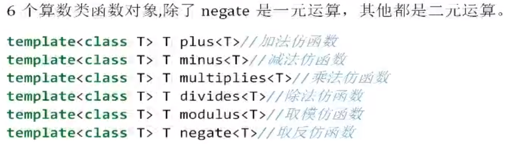
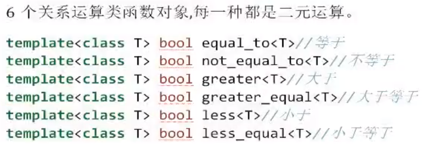
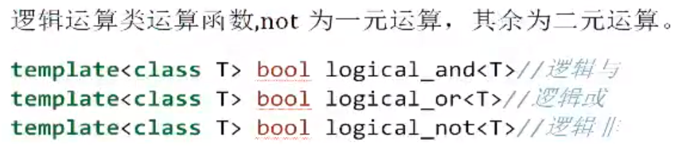

# 1 谓词

谓词是指普通函数或重载的operator()后返回值为bool类型的函数对象（仿函数）。如果operator接受了一个参数，那么就叫一元谓词；如果operator接受了两个参数，那么就叫二元谓词。

其中find_if函数相当于是起一个筛选的作用，将v.begin()和v.end()中的数，一个一个传递给谓词，谓词作为判断的载体，如果满足函数体内条件返回true，find_if就会返回一个迭代器。否则返回v.end()。

```c
#include <iostream>
#include <vector>
#include <algorithm>
using namespace std;
//普通函数作为一元谓词
bool greaterThan20(int val)
{
    return val > 20;
}
//仿函数作为一元谓词
class MyGreaterThan20
{
public:
    bool operator()(int val)
    {
        return val > 20;
    }
};

void test()
{
    vector<int> v;
    v.push_back(10);
    v.push_back(20);
    v.push_back(30);
    v.push_back(40);
    v.push_back(50);
    //找到第一个大于20的数。find_if函数会将v的区间内的数据一个一个传递给greaterThan20函数，用作判断
    vector<int>::iterator ret1 = find_if(v.begin(), v.end(), greaterThan20);
    vector<int>::iterator ret2 = find_if(v.begin(), v.end(), MyGreaterThan20());
    cout << *ret1 << endl; //30
    cout << *ret2 << endl; //30
}
int main()
{
    test();
}
```

# 2 函数对象（仿函数）

传递给算法的“函数型实参”不一定得是函数，可以是行为类似函数的对象。这种对象称为函数对象（function object），或称为仿函数（functor）。

# 3 内建函数对象

STL内建了一些函数对象。分为：

1. 算数类函数对象
2. 关系运算类函数对象
3. 逻辑运算类仿函数

这些仿函数所产生的对象，用法和一般函数完全相同，还可以产生无名的临时对象来履行函数功能。

## 算数类函数对象



```c
void test(){
    plus<int> p;
    cout << p(10,20) << endl;//输出30 
}
```

## 运算类函数对象



## 逻辑运算类运算函数




