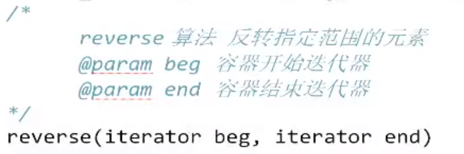

算法主要由头文件组成。是所有STL中头文件最大的一个，其中常用的功能涉及到比较、交换、查找、遍历、复制、修改、反转、排序、合并等。

# 1 常用遍历算法

## `for_each`遍历算法


## `transform`算法

- 将指定容器区间元素搬运到另一容器中
- 搬运过程中，要保证源容器与目标容器类型一样


```c++
#include <iostream>
#include <algorithm>
#include <vector>
using namespace std;
//此处由于自己提供搬运方式，所以还可以加料，例如return val+100;这样就可以在搬运过程中完成更多的事。
int Mytrans(int val){
    return val;
}//此处利用仿函数也是可以的。

void test() {
    vector<int> v1;
    v1.push_back(10);
    v1.push_back(20);

    vector<int> v2;
    //容器v2需要开辟空间，此处与push_back不同的是，push_back会自动开辟空间，但是由函数Mytrans中
    //可以看出，搬运过程中将v1的值一一取出，传给Mytrans函数，然后将返回值利用迭代器返给v2容器的。
    v2.resize(v1.size());
    transform(v1.begin(), v1.end(), v2.begin(), Mytrans);
    //for_each遍历
    for_each(v2.begin(), v2.end(), [](int val) {cout << val << ""; });
}
int main()
{
    test();
}
```

# 2 常见查找算法

## `find`算法

- 查找元素，失败返回`end()`迭代器
- 针对随机访问迭代器的，对于使用双向迭代器的容器，其自身提供有`find()`算法


## `find_if`算法

- 按条件查找


## `adjacent_find`算法

- 查找相邻重复元素
- 只查找到第一次重复的元素


```c++
//自定义数据类型在查找的时候要比较有没有查到，所以需要重载==运算符或者使用普通函数作为函数对象
#include <iostream>
#include <vector>
#include <algorithm>
using namespace std;
class Person {
public:
    string name;
    int age;
    Person(string name, int age) {
        this->name = name;
        this->age = age;
    }
    //bool operator==(const Person& ob) {
    //    if (this->name == ob.name && this->age == ob.age)
    //    {
    //        return true;
    //    }
    //    return false;
    //}

};
bool myCompare(const Person& ob1, const Person& ob2)  {
	if (ob1.name == ob2.name && ob1.age == ob2.age)
		return true;
	return false;
}
void test() {
    vector<Person> v;
    v.push_back(Person("hh", 18));
    v.push_back(Person("hh", 18));
    v.push_back(Person("ouou", 18));
    vector<Person>::iterator ret = adjacent_find(v.begin(), v.end(),myCompare);
    if (ret != v.end()){
        cout << "找到了 重复相邻的数据:" << endl;
    }
}
int main(){
    test();
}
```

## `binary_search`算法

- 二分查找法（要求容器必须有序）
- 找到返回true，否则返回false


## `count`算法

- 统计元素出现的次数


## `count_if`算法

- 可以筛选条件的统计元素出现的次数


# 3 常见排序算法

## `merge算法`

- 容器元素合并，并存储到另一容器中
- 三个容器类型须一致，且容器1、2有序


## `sort`算法

- 容器元素排序


## `random_shuffle`算法

- 对指定范围内的元素随机调整次序
- `random_shuffle`采用随机数进行打乱容器内数据，所以使用前需要添加随机数种子`srand(time(NULL))`


## `reverse`算法

- 反转指定范围的元素



# 4 常用拷贝和替换算法

## `copy`算法

- 将容器内指定范围的元素拷贝到另一容器中


## `replace`算法

- 将容器内指定范围的旧元素修改为新元素


## `replace_if`算法

- 将容器内指定范围满足条件的元素替换为新元素


## `swap`算法

- 互换两个容器的元素


# 5 常用算数生成算法

## `accumulate`算法

- 计算容器元素累计总和


## `fill`算法

- 向容器中添加元素


```c++
void test(){
    vector<int> v;
    v.resize(5);//这里记得先开辟空间
    v.fill(v.begin(),v.end(),100);//向容器中填充5个100
}
```

# 6 常用集合算法

## `set_intersection`算法

- 求两个set集合的交集，将两个容器的交集放到目标容器中


## `set_union`算法

- 求两个集合的并集


## `set_difference`算法

- 求两个set集合的差集

