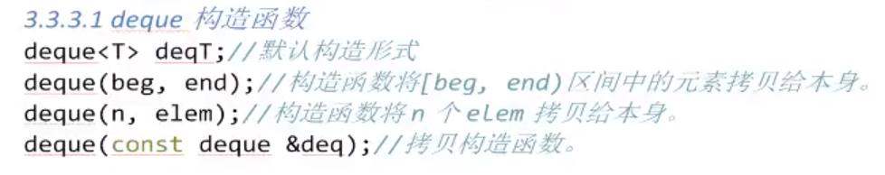
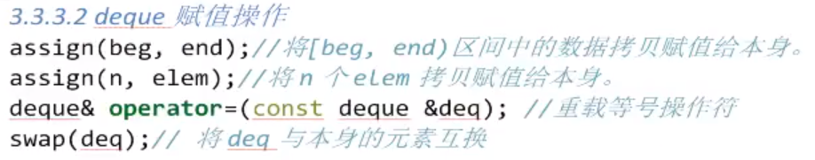
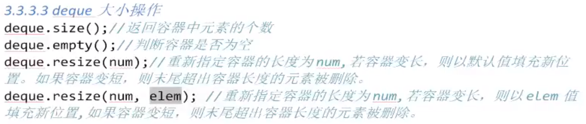
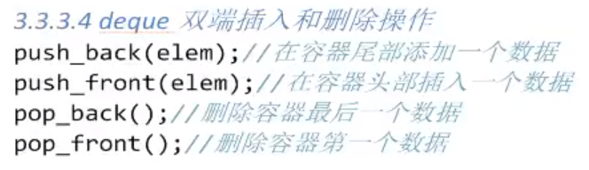
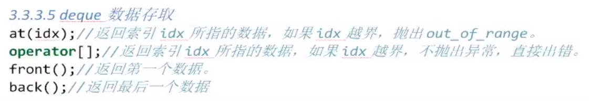
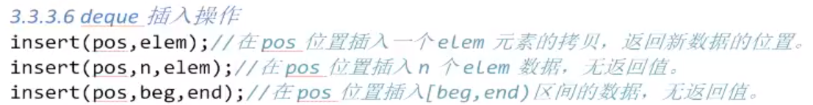
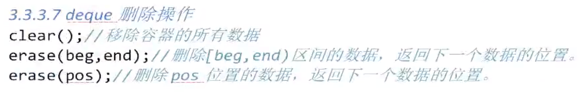

# 1 数据结构

- 双端动态数组（可以在头尾进行插入、删除操作）
- 双向开口的分段连续空间，将一段一段的连续空间放在中控器上保存，形成连续空间
- 当空间满时，会增加一段新的空间在中控器上链接起来

# 2 deque容器与vector容器区别

- deque容器不会因为数据量的大小而影响插入删除所花费的时间
- deque容器没有容量的概念
- deque容器可以在头尾进行插入、删除操作

# 3 deque构造函数

# 4 deque赋值操作

# 5 deque大小操作

# 6 deque双端插入和删除操作

# 7 deque数据存取操作

# 8 deque插入操作

# 9 deque删除操作

