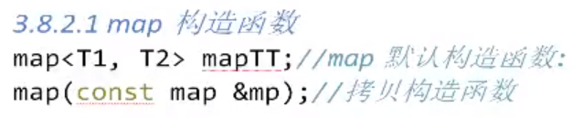
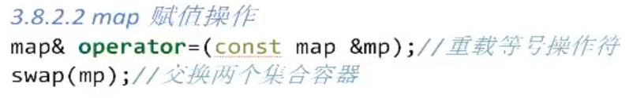
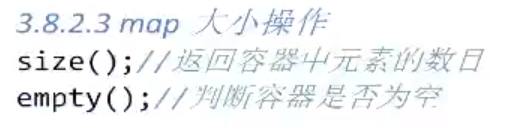
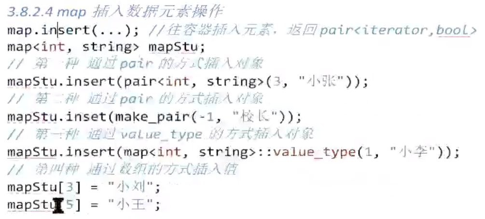
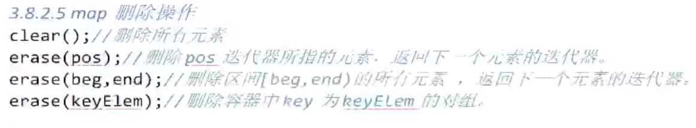
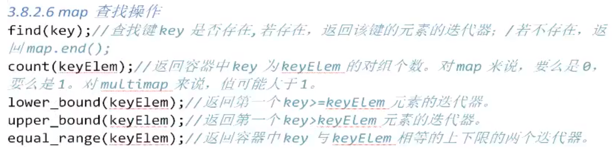

# 1 数据结构

- map容器所有元素会自动按键值进行排序
- map容器不允许键值相同
- map容器中所有元素都是pair
    - pair中第一元素为键值且不可变
    - pair中第二元素为实值可变
- map容器提供只读迭代器
- 任意改变map容器的键值会严重破坏map组织，但是当进行插入、删除操作时不会
- map/multimap底层都是红黑树实现的

# 2 map构造函数



# 3 map赋值操作



# 4 map大小操作



# 5 map插入数据元素操作



# 6 map删除操作



# 7 map查找操作



# map容器实例

```c++
#include <iostream>
#include <map>
#include <string>
#include <algorithm>
using namespace std;
void  test()
{
	map<int, string> m;
	//第一种插入方式：
	m.insert(pair<int, string>(3, "个和尚没水喝"));
	//第二种插入方式：
	m.insert(make_pair(1, "个和尚打水喝"));
	//第三种插入方式：
	m.insert(map<int, string>::value_type(2, "个和尚抬水喝"));
	//第四种插入方式：
	m[4] = "个和尚喝多了";

	//第一种遍历方式：
	for_each(m.begin(), m.end(), [](pair<int,string> p) {
		cout << p.first << p.second << endl;
	});

	//第二种遍历方式：
	for (map<int,string>::const_iterator it = m.begin(); it != m.end(); it++)
	{
		cout << (*it).first << (*it).second << endl;
	}
	//访问一个数据(此种方式当map中没有key为3的实值时，会自动创建key=3,value=null的)
	cout << m[3] << endl;//个和尚没水喝
	//可用find()函数代替
	map<int, string>::const_iterator ret = m.find(3);//如果找到返回key为3的迭代器，找不到返回m.end()
	cout <<(*ret).first << (*ret).second << endl;
 	if (m.find(5) == m.end())//可以用来判断是否找到值
	{
		cout << "没找到" << endl;
	}
}
```


