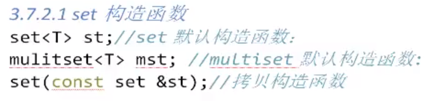

# 1 数据结构

- set容器会自动按键值排序
- set容器的元素既是键值又是实值
- set容器的键值不允许相同
- set容器提供了只读迭代器
- 如果任意改变set容器中的元素会严重破坏set组织，但进行插入和删除操作时不会

# 2 set构造函数



# 3 set赋值操作


# 4 set大小操作


# 5 set插入、删除操作


# 6 set查找操作


# 7 使用仿函数更改set容器的排序规则

```c++
#include <iostream>
#include <set>
#include <algorithm>
using namespace std;
class MySort
{
public:
    bool operator()(int val1,int val2){
        return val1 > val2;
    }
};

void test() {
    set<int,MySort> s;//set容器默认排序规则从小到大，使用仿函数 更改排序规则为从大到小
    s.insert(10);
    s.insert(5);
    s.insert(7);
    for_each(s.begin(), s.end(), [](int val) {
        cout << val << " ";
    });//10 7 5
    cout << endl;
}
```


