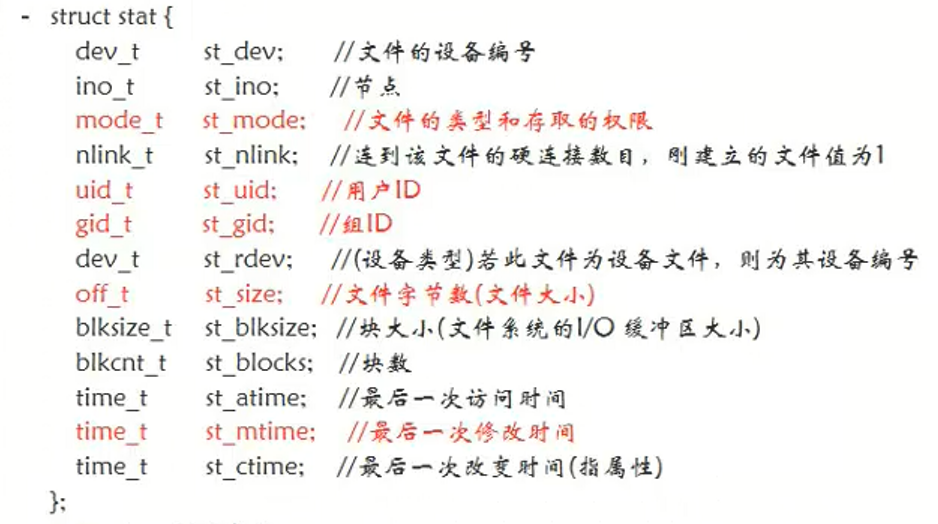
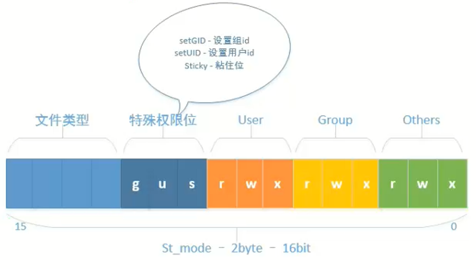
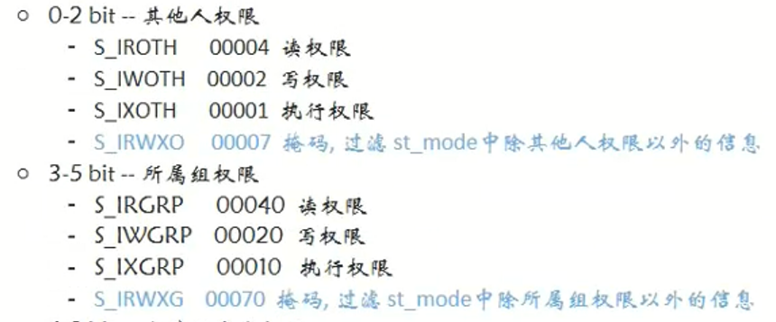
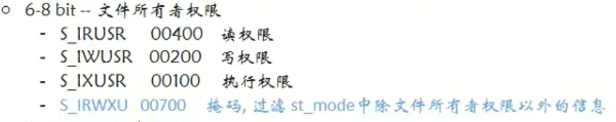
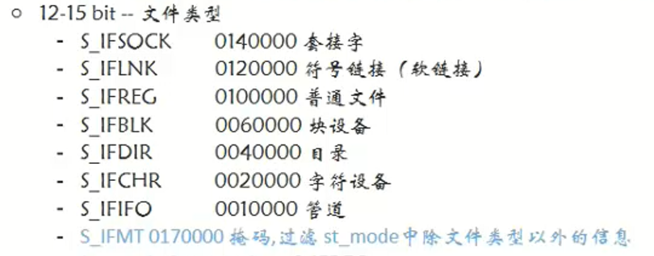

# 1 `stat`结构体

- 包含着文件各种属性



## 1.1 参数st_mode -- 16位整数

- <font color=blue>16位数中每三位对应一类权限，第12位~15位代表文件类型</font>



### 1.1.1 判断文件权限方法

<font color=blue>下图中左边是宏名，右边为八进制数</font>

- 将st_mode与读、写、可执行权限分别做按位与运算
- `if(st_mode && S_IRUSR)`：
    - 结果为0，说明文件所有者没有读权限
    - 结果不为0，说明文件所有者有读权限





### 1.1.2 判断文件类型方法

- 将st_mode参数与掩码做按位与运算
    - `if((st_mode & S_IFMT)) == S_IFREG`：成立，说明为普通文件



## 1.2 例子

```c
#include<stdio.h>
#include<stdlib.h>
#include<unistd.h>
#include<fcntl.h>
#include<sys/types.h>
#include<sys/stat.h>
int main(int argc,char* argv[]){
    struct stat st;
    int res = stat("hello",&st);
    if(res == -1){
        perror("stat error");
        exit(1);
    }
    printf("文件大小为：%d\n",(int)st.st_size);
    //判断是不是普通文件，此处可用switch语句，判断是哪种权限
    if((st.st_mode & S_IFMT) == S_IFREG){
        printf("这是一个普通文件\n");
    }
    
    //判断所有者的权限
    //方法一：可以自己编写权限作为条件。此处00600意思为所有者具有读权限
    if((st.st_mode & S_IRWXU) == 00600){
            printf("读写权限\n");
    }
    //方法二：详见1.1.1
    if(st.st_mode & S_IRUSR){
        printf("读权限\n");
    }
    if(st.st_mode & S_IWUSR){
        printf("写权限\n");
    }
    if(st.st_mode & S_IXUSR){
        printf("可执行权限\n");
    }//答案输出为读写权限
    return 0;
```

# 2 `stat`函数

- 函数原型

    `int stat(const char* path, struct stat *buf)`

- 返回值

    - -1：失败
    - 0：成功

- 参数

    - `path`：文件路径
    - `buf`：传出参数，此类型为结构体的参数用来获得文件各种属性

# 3 `lstat`函数

- 函数原型

    `int lstat(const char* path, struct stat* buf)`

- 与`stat`函数唯一区别

    - `lstat`读取链接文件时，读取的是软链接文件本身的属性
    - `stat`函数读取链接文件时，读取的是软链接文件指向的文件的属性

# 4 `fstat`函数

- 函数原型

    `int fstat(int fd, struct stat* buf)`

- 第一个参数传入一个文件描述符，也直接获取文件属性。


