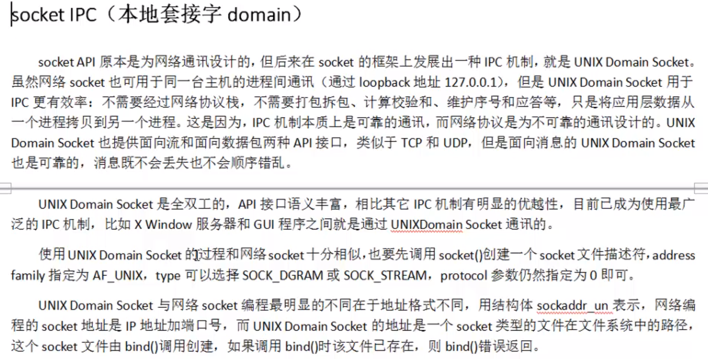
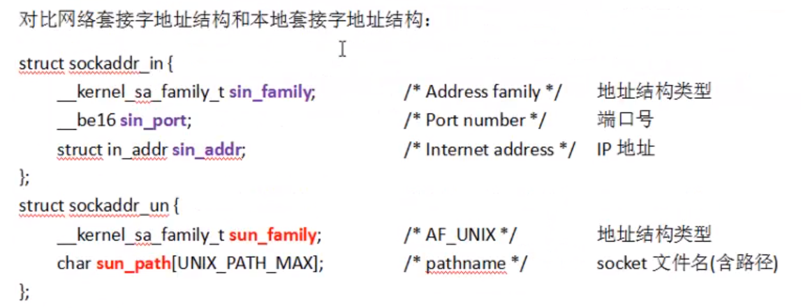
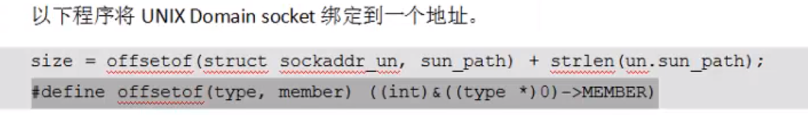

# 1 本地套接字





# 2 `offsetof`宏函数



# 3 例子

**<font color=blue>在利用本地套接字进行进程间通信的时候，需要保证套接字文件在同一个路径下</font>**

## 服务端

```c
#include <stdio.h>
#include <sys/socket.h>
#include <arpa/inet.h>
#include <stddef.h>
#include <sys/un.h>
#include <unistd.h>
#include <ctype.h>

#define SERVFILENAME "/home/server.socket"

int main()
{
    //本地套接字不需要tcp或udp，但第2个参数需要随便给一个
    int sfd = socket(AF_UNIX,SOCK_STREAM,0);

    struct sockaddr_un serv_addr;
    bzero(&serv_addr,sizeof (serv_addr));
    serv_addr.sun_family = AF_UNIX;
    strcpy(serv_addr.sun_path,SERVFILENAME);

    /*offsetof是一个宏函数，第二个参数是第一个参数的成员，用来计算第二个参数在第一个参数中的偏移位置
    struct sockaddr_un结构体一共就两个成员，一个AF_UNIX和一个sun_path
    offsetof函数计算出AF_UNIX的长度，加上sun_path的长度，求得的len是sockaddr_un的有效长度，如果用sizeof求的话是整个结构体长度，sun_path不一定会占完AF_UNIX后面的全部空间*/
    int len = offsetof(struct sockaddr_un,sun_path)+strlen(serv_addr.sun_path);

    //unlink函数可以删除一个文件，或者一个目录项
    //bind调用后会创建一个套接字文件(此处名为SERVFILENAME)，如果调用之前套接字文件已经存在，那么bind会出错
    unlink(SERVFILENAME);
    bind(sfd,(struct sockaddr*)&serv_addr,len);//此处会创建SERVFILENAME文件，且第三个参数不能写sizeof(serv_addr)

    listen(sfd,20);

    struct sockaddr_un clie_addr;
    printf("accept..........\n");
    int readlen = 0;
    char buf[BUFSIZ];
    while (1) {
        len = sizeof (clie_addr);//此处len为clie_addr长度
        int cfd = accept(sfd,(struct sockaddr*)&clie_addr,(socklen_t*)&len);//传入传出参数，此处len为客户端的struct sockaddr_un大小
        len -= offsetof(struct sockaddr_un,sun_path);//相当于减去了结构体中第一个成员的长度，得到的是客户端文件名大小
        clie_addr.sun_path[len] = '\0';//客户段也使用strlen求的长度，没有'\0'结束标记，手动加上，防止打印出错

        printf("bind client file name：%s\n",clie_addr.sun_path);

        while((readlen = read(cfd,buf,sizeof (buf))) > 0){
            for(int i = 0; i < readlen; i++){
                buf[i] = toupper(buf[i]);
            }
            write(cfd,buf,readlen);
            memset(buf,0,sizeof (buf));
        }
        close(cfd);
    }
    close(sfd);
    return 0;
}
```

## 客户端

```c
#include <stdio.h>
#include <sys/socket.h>
#include <unistd.h>
#include <sys/un.h>
#include <ctype.h>
#include <stddef.h>
#define SERVFILENAME "/home/server.socket"
#define CLIEFILENAME "/home/client.socket"

int main()
{
    int cfd = socket(AF_UNIX,SOCK_STREAM,0);

    struct sockaddr_un clie_addr;
    bzero(&clie_addr,sizeof (clie_addr));
    strcpy(clie_addr.sun_path,CLIEFILENAME);
    clie_addr.sun_family = AF_UNIX;
    //计算客户端地址有效长度
    int len = offsetof(struct sockaddr_un,sun_path) + strlen(clie_addr.sun_path);
    unlink(CLIEFILENAME);
    //客户端也需要绑定，不能依赖自动绑定，需要指定套接字文件
    bind(cfd,(struct sockaddr*)&clie_addr,len);

	//构造server地址    
    struct sockaddr_un serv_addr;
    bzero(&serv_addr,sizeof (serv_addr));
    serv_addr.sun_family = AF_UNIX;
    strcpy(serv_addr.sun_path,SERVFILENAME);
    //计算服务器端地址有效长度
    len = offsetof(struct sockaddr_un,sun_path) + strlen(serv_addr.sun_path);
    connect(cfd,(struct sockaddr*)&serv_addr,len);//此处为传入参数

    char buf[BUFSIZ];
    memset(buf,0,sizeof (buf));
    while(fgets(buf,sizeof (buf),stdin) != NULL){
        write(cfd,buf,strlen(buf));
        memset(buf,0,sizeof (buf));
        len = read(cfd,buf,sizeof (buf));
        write(STDOUT_FILENO,buf,len);
        memset(buf,0,sizeof (buf));
    }
    close(cfd);
    return 0;
}
```

# 4 四种进程间通信方法对比

1. pipe fifo实现方法简单（管道）
2. mmap 非血缘关系之间的进程间通信
3. 信号 开销小
4. domain 稳定性好


