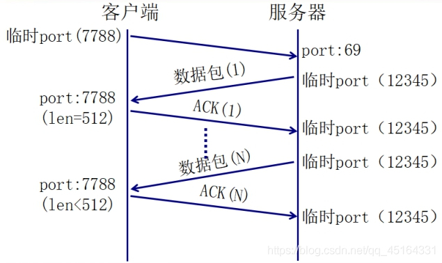
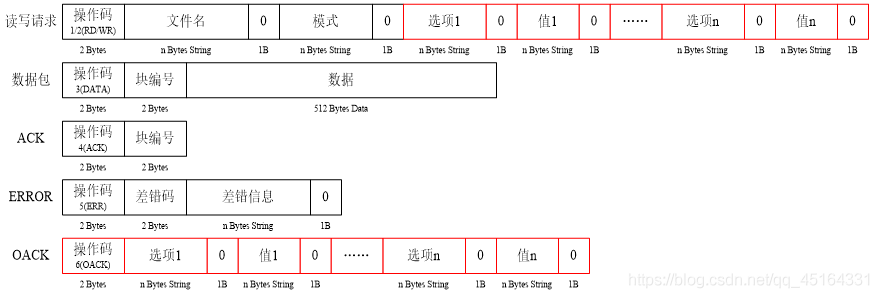

**tftp协议**

1. TFTP基于UDP协议。

2. TFTP的编程思想 和 UDP一样

3. **TFTP：简单文件传送协议**

最初用于引导无盘系统，被设计用来传输小文件

**特点：**

1. 基于UDP协议实现

2. 不进行用户有效性认证

**数据传输模式：**

1. octet：二进制模式

2. netascii：文本模式

3. mail：已经不再支持

**协议的学习：通信过程（流程）、通信原理（协议）**



**TFTP通信过程总结（无选项）**

1. 服务器在69号端口等待客户端的请求

2. 服务器若批准此请求,则使用临时端口与客户端进行通信

3. 每个数据包的编号都有变化（从1开始）、逐次递增

4. 每个数据包都要得到ACK的确认如果出现超时,则需要重新发送最后的包（数据或ACK）

5. 数据的长度以512Byte传输

**<font color = red>小于512Byte的数据意味着传输结束</font>**

**TFTP协议分析：**

报文的前2个字节 叫操作码（体现报文的功能）



**注意：**

- 以上的0代表的是'\0'

- 不同的差错码对应不同的错误信息


**错误码：**

- 0 未定义,参见错误信息

- 1 File not found.

- 2 Access violation.

- 3 Disk full or allocation exceeded.

- 4 illegal TFTP operation.

- 5 Unknown transfer ID.

- 6 File already exists.

- 7 No such user.

- 8 Unsupported option(s) requested.

**TFTP带选项：（了解内容）**


如果发送带选项的读写请求：

- **tsize选项**

    当读操作时，tsize选项的参数必须为“0”，服务器会返回待读取的文件的大小

    当写操作时，tsize选项参数应为待写入文件的大小，服务器会回显该选项

- **blksize选项**

    修改传输文件时使用的数据块的大小（范围：8～65464）

- **timeout选项**

    修改默认的数据传输超时时间（单位：秒）

注意：我们写的是客户端   服务器 是windows下的一个程序。

[tftp.exe ]: https://download.csdn.net/download/qq_45164331/13750561	"下载链接"

```c++
#include <iostream>
#include <sys/socket.h>
#include <netinet/in.h>
#include <arpa/inet.h>
#include <sys/types.h>
#include <fcntl.h>
#include <sys/stat.h>
#include <cstdio>
#include <cstring>
#include <unistd.h>

using namespace std;

int main(int argc,char *argv[])
{
    if(argc != 2){
        perror("参数过少");
        exit(1);
    }
    int sockfd;
    if((sockfd = socket(AF_INET,SOCK_DGRAM,0)) == -1){
        perror("socket err");
        exit(1);
    }
    char cmd[128] = "";
    int len = sprintf(cmd,"%c%c%s%c%s%c",0x00,0x01,argv[1],0,"octet",0);

    struct sockaddr_in servAddr;
    servAddr.sin_family = AF_INET;
    servAddr.sin_addr.s_addr = inet_addr("192.168.217.1");
    servAddr.sin_port = htons(69);
    socklen_t servLen = sizeof(servAddr);
    sendto(sockfd,cmd,len,0,(struct sockaddr*)&servAddr,servLen);
    int fd = open("/home/hehe.mp4",O_CREAT|O_RDWR|O_TRUNC,S_IRWXU);
    if(fd == -1){
        perror("open error");
        exit(1);
    }
    unsigned char buf[1024] = "";
    memset(buf,0,sizeof (buf));
    struct sockaddr_in clieAddr;
    socklen_t clieLen = sizeof(clieAddr);
    unsigned short num = 1;
    while (1) {
        int recvLen = recvfrom(sockfd,buf,sizeof (buf),0,(struct sockaddr*)&clieAddr,&clieLen);
        //如果收到的是数据包的操作码，那么将数据写入到文件中
        if(buf[1] == 0x03){
        	//假如自己回的ACK包丢失了，服务器会重新传这个包，所以需要对包编号加判断，如果是正确的包才写入文件，防止文件混乱
            if(num == ntohs(*(unsigned short*)(buf+2))){
                //将数据写入到本地文件"./home/test.txt"中，四个字节的包头跳过
                write(fd,buf+4,recvLen-4);
                ++num;
                cout << ntohs(*(unsigned short*)(buf+2)) << endl;
            }
            //回复服务器ACK包
            buf[1] = 0x04;
            sendto(sockfd,buf,4,0,(struct sockaddr*)&clieAddr,clieLen);
            //如果接受的文件大小小于512字节，说明是最后一个包了，已经传输完毕，跳出循环
            if(recvLen < 512){
                break;
            }
        }
    }
    close(fd);
    close(sockfd);
    return 0;
}
```

