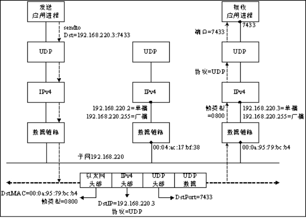
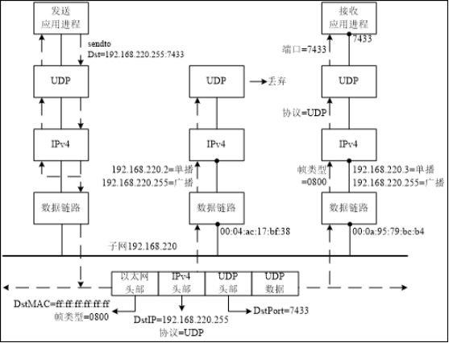
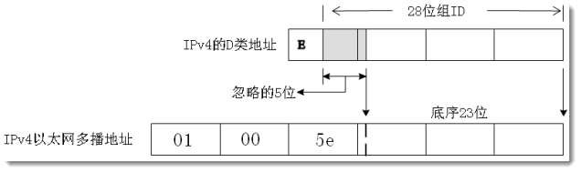
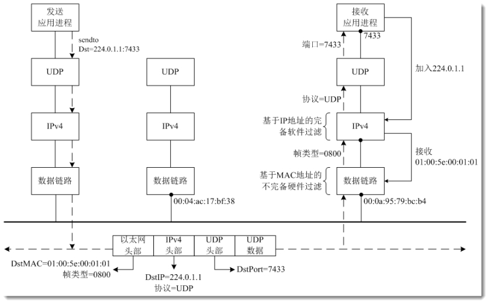
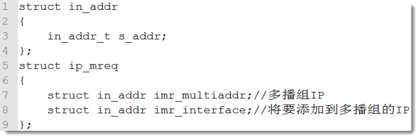

# 广播

**以下几个协议都用到广播**

1. 地址解析协议（ARP）  通IP得到mac地址

2. 动态主机配置协议（DHCP） 自动主机IP

3. 网络时间协议（NTP）

## UDP广播特点

1. 处于同一子网的所有主机都必须处理数据

2. UDP数据包会沿协议栈向上一直到UDP层

3. 运行音视频等较高速率工作的应用，会带来大负

- 局限于局域网内使用

## 广播地址

- 定向广播地址：主机ID全1

    1. 例：对于192.168.220.0/24，其定向广播地址为192.168.220.255

    2. 通常路由器不转发该广播

- 受限广播地址：255.255.255.255

    路由器从不转发该广播

如果你指向在某个局域网内广播 请选择 定向广播地址

如果你想在任何局域网内部广播  只能选择 受限广播地址

## 单播工作流程



## 多播工作流程



- 广播的mac地址：ff:ff:ff:ff:ff:ff

- socket创建的套接字 默认不支持广播

使用setsockopt设置套接字的选项 支持广播

```c++
int setsockopt(int sockfd, int level,
         int optname,const void *optval,   
         socklen_t optlen);
成功执行返回0，否则返回-1
```

| **level**  | **optname**  | **说明**           | **optval类型** |
| ---------- | ------------ | ------------------ | -------------- |
| SOL_SOCKET | SO_BROADCAST | 允许发送广播数据包 | int            |
|            | SO_RCVBUF    | 接收缓冲区大小     | int            |
|            | SO_SNDBUF    | 发送缓冲区大小     | int            |

```c++
#include <iostream>
#include <sys/socket.h>
#include <arpa/inet.h>
#include <string>
#include <sys/types.h>
#include <unistd.h>
#include <cstring>

using namespace std;

int main()
{
    int sockfd = socket(AF_INET,SOCK_DGRAM,0);//设置udp

    //给sockfd通信套接字设定允许广播
    int yes = 1;
    setsockopt(sockfd,SOL_SOCKET,SO_BROADCAST,&yes,sizeof(yes));

    struct sockaddr_in dst_addr;
    bzero(&dst_addr,sizeof (dst_addr));
    dst_addr.sin_family = AF_INET;
    dst_addr.sin_port = htons(8000);
    dst_addr.sin_addr.s_addr = inet_addr("192.168.217.255");
    
    string buf = "i am broadcast";
    //char buf[] = "i am broadcast";
    sendto(sockfd,buf.c_str(),sizeof(buf),0,(struct sockaddr*)&dst_addr,sizeof (dst_addr));

    close(sockfd);

    return 0;
}
```

# 多播

## 多播地址

**IPv4的D类地址是多播地址**

- 十进制：224.0.0.1 ~ 239.255.255.254 任意一个IP地址 都代表一个多播组
- 十六进制：E0.00.00.01 ~ EF.FF.FF.FE

**多播地址向以太网MAC地址的映射**



## UDP多播工作过程



**总结**

1. 主机先加入多播组
2. 往多播组发送数据

## 多播地址结构体

- 在IPv4因特网域(AF_INET)中，多播地址结构体用如下结构体ip_mreq表示



```c++
int setsockopt(int sockfd, int level,int optname,   
                const void *optval, socklen_t optlen);
成功执行返回0，否则返回-1
```

| **level**          | **optname**        | **说明**   | **optval类型** |
| ------------------ | ------------------ | ---------- | -------------- |
| IPPROTO_IP         | IP_ADD_MEMBERSHIP  | 加入多播组 | ip_mreq{}      |
| IP_DROP_MEMBERSHIP | IP_DROP_MEMBERSHIP | 离开多播组 | ip_mreq{}      |

```c++
#include <iostream>
#include <arpa/inet.h>
#include <sys/socket.h>
#include <cstring>
#include <unistd.h>
/*
 * 设置将本机加入多播组 "224.0.0.2"
*/

using namespace std;

int main()
{
    int sockfd = socket(AF_INET,SOCK_DGRAM,0);

    struct sockaddr_in myAddr;
    bzero(&myAddr,sizeof(myAddr));
    myAddr.sin_addr.s_addr = htonl(INADDR_ANY);
    myAddr.sin_port = htons(8000);
    myAddr.sin_family = AF_INET;
    bind(sockfd,(struct sockaddr*)&myAddr,sizeof (myAddr));

    struct ip_mreq mreq;
    mreq.imr_multiaddr.s_addr = inet_addr("224.0.0.2");
    mreq.imr_interface.s_addr = htonl(INADDR_ANY);
    setsockopt(sockfd,IPPROTO_IP,IP_ADD_MEMBERSHIP,&mreq,sizeof (mreq));

    while(1){
        char buf[1500] = "";
        recvfrom(sockfd,buf,sizeof(buf),0,NULL,NULL);
        cout << buf << endl;
    }
    close(sockfd);
    return 0;
}
```

