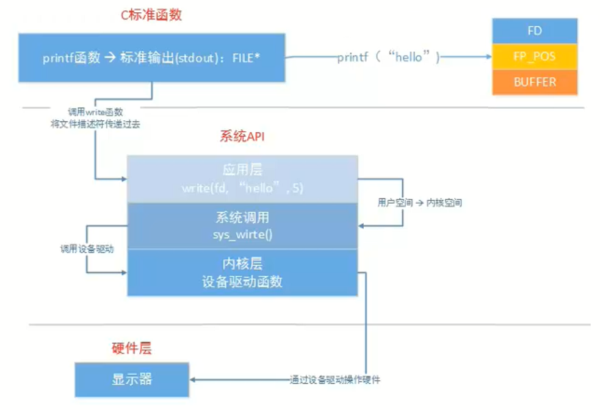
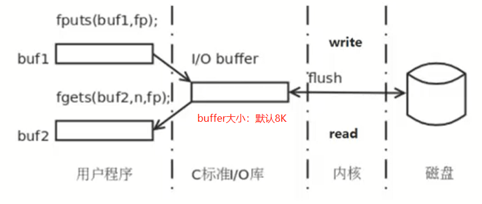

# 一、C库函数与系统函数的关系





# 二、虚拟地址空间

<font color=blue>操作系统会为每一个正在运行的程序（进程）分配一个0~4G（32位）的虚拟地址空间。</font>


# 三、pcb和文件描述符

一个进程有一个文件描述符表，包含1024个文件描述符

1. 前三个被标准输入、标准输出、标准错误占用
2. <font color=red>文件描述符的作用是：通过文件描述符才可以找到磁盘中对应的文件位置</font>


# 四、文件I/O函数

## 1.open函数

<font color=blue>返回值为文件描述符</font>

### 1.1 函数原型

- `int open(const char* filename,int flags);`
- `int open(const char* filename,int flags,mode_t mode);`

### 1.2 参数

- flags
    - 必选项：O_RDONLY/O_WRONLY/O_RDWR
    - 可选项：
        - 创建文件：O_CREAT
            - 创建文件时检测文件是否存在：O_EXCL
            - 如果文件存在，返回-1
            - 必须与O_CREAT一起使用
        - 追加文件：O_APPEND
        - 文件截断：O_TRUNC：如果文件中有内容，会将文件中内容清空
        - 设置非阻塞：O_NONBLOCK


- mode（本质就是一个8进制数，给要创建的文件设置权限）
    - `mode & ~umask`：所给权限需要与上本地掩码后得到的值才是真正的文件的权限。

## 2.read函数

### 2.1 函数原型

- `ssize_t read(int fd,void* buf,size_t count);`
    - fd：open函数的返回值
    - buf：缓冲区，存储要读取的数据
    - count：缓冲区最大能存储的字节数

### 2.2 返回值

- -1：读取失败
- \>0：读出的字节数
- =0：文件读完了

## 3.write函数

### 3.1 函数原型

- `ssize_t write(int fd,const void* buf,size_t count);`
    - fd：open函数的返回值
    - buf：要写入到文件的数据
    - count：写入的字节数

### 3.2 返回值

- -1：写入失败
- \>0：写入到文件的字节数

**<font color=red>文件读写操作练习</font>**

```c
#include<stdio.h>
#include<stdlib.h>
#include<unistd.h>
#include<fcntl.h>
#include<sys/types.h>
#include<sys/stat.h>
int main(int argc,char* argv[]){
    //读文件操作
    int fd_read = open("./hello",O_RDONLY);
    printf("读文件文件描述符：%d\n",fd_read); 
    //写文件操作
    int fd_write = open("./hello.back",O_WRONLY|O_CREAT,0664);
    printf("写文件文件描述符：%d\n",fd_write);  
    char buf[1024*4];
    int len = read(fd_read,buf,sizeof(buf));
    //判断是否读完了，当len>0时，说明还有数据在读，当len<=0时，说明已经读完了，跳出循环
    while(len > 0){
        int w_len = write(fd_write,buf,len);
        printf("写入的字节数为：%d\n",w_len);
        len = read(fd_read,buf,sizeof(buf));
    }
    //关闭文件操作
    close(fd_read);
    close(fd_write);
```

## 4.lseek函数

### 4.1 函数原型

- `off_t lseek(int fd,off_t offset,int whence);`
    - fd：open函数的返回值
    - offset：文件指针要偏移的量
    - whence
        - SEEK_SET
        - SEEK_CUR
        - SEEK_END

### 4.2 使用

- 文件指针移动到头部

    `lseek(fd,0,SEEK_SET);`

- 获取文件指针当前的位置

    `int len = lseek(fd,0,SEEK_CUR);`

- 获取文件的长度(文件指针在开头)

    `int len = lseek(fd,0,SEEK_END);`

- 给文件扩展大小

    假如源文件大小为100K，扩展为1100K

    `lseek(fd,1000,SEEK_END);`

    再做一次随意写的操作才可以扩展成功

    `write(fd,'a',1);`

**<font color=red>lseek函数使用例子</font>**

```c
#include<stdio.h> 
#include<stdlib.h> 
#include<unistd.h> 
#include<fcntl.h> 
#include<sys/types.h> 
#include<sys/stat.h> 
int main(int argc,char* argv[]){ 
    int fd = open("hello",O_RDWR); 
    printf("fd:%d；文件指针当前位置：%d\n",fd,lseek(fd,0,SEEK_SET));  
    lseek(fd,1000,SEEK_END); 
    write(fd,"a",1); 
    printf("文件大小为：%d\n",lseek(fd,0,SEEK_END)); 
    close(fd); //文件由0字节扩展1001字节
}   
```

## 5. 阻塞与非阻塞

### 5.1 普通文件

- 默认不阻塞

### 5.2 终端设备

- 默认阻塞
    - 管道
    - 套接字


