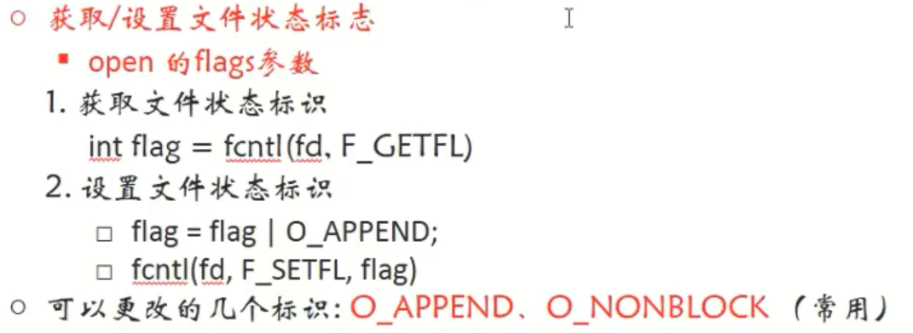

# 1 `access`函数

## 函数作用

- 传入文件，判断此文件是否存在，或者当前用户是否对此文件具有某种权限

## 函数原型

`int access(const char* pathname, int mode)`

- 参数
    - `pathname`：文件名
    - `mode`：4种权限
        - `R_OK`：读权限
        - `W_OK`：写权限
        - `X_OK`：可执行权限
        - `F_OK`：文件是否存在
- 返回值
    - 0：具有某种权限或者文件存在
    - -1：不具有某种权限或者文件不存在

## 例子

```c
#include<stdio.h>
#include<stdlib.h>
#include<unistd.h>
#include<fcntl.h>
#include<string.h>
int main(int argc, char* argv[]){
    if(argc < 2){
        perror("文件参数过少");
        exit(1);
    }
    //判断当前用户是否具有读写权限
    int ret = access(argv[1],W_OK|R_OK);
    if(ret == -1){
        printf("您没有读写权限\n");
    }else{
        printf("您有读写权限\n");
    }
    return 0;
}//输出：您有读写权限
```

# 2 `chmod`函数

## 函数作用

- 修改文件权限

## 函数原型

`int chmod(const char* pathname, int mode)`

- 参数
    - `pathname`：文件名
- `mode`：文件权限，八进制数（需要减去umask值后才算真正的权限）

## 例子

```c
#include<stdio.h> 
#include<stdlib.h> 
#include<unistd.h> 
#include<fcntl.h> 
int main(int argc, char* argv[]){ 
    if(argc < 2){ 
        perror("文件参数过少"); 
        exit(1); 
    } 
    //判断当前用户是否具有读写权限 
    int ret = chmod(argv[1],0777-0022);//0022为Linux中的umask值 
    if(ret == -1){ 
        printf("文件权限修改失败\n"); 
    }else{ 
        printf("文件权限修改成功\n"); 
    } //文件权限成功修改为0755
    return 0; 
} 
```

# 3 `truncate`函数

## 函数作用

- 修改文件大小

## 函数原型

`int truncate(const char* pathname, off_t length)`

- 参数
    - `pathname`：文件名
    - `length`：文件扩展后的最终大小
        - 比原来大，向后扩展
        - 比原来小，删掉后边多余的部分
- 返回值
    - -1：修改失败
    - 0：修改成功

## 例子

```c
#include<stdio.h> 
#include<stdlib.h> 
#include<unistd.h> 
#include<fcntl.h> 
//将文件修改为了100字节
int main(int argc, char *argv[]){ 
    int res = truncate("hello",100); 
    if(res == -1){ 
        perror("修改文件大小失败"); 
        exit(1); 
    }else{ 
        printf("文件大小修改成功！\n"); 
    } 
    return 0; 
}
```


# 4 `chown`函数

## 函数作用

- 修改文件所有者和所属组

## 函数原型

`int chown(const char* pathname, uid_t owner, gid_t group)`

- 参数
    - `pathname`：文件名
    - `owner`：文件所有者的uid（整型值）
        - /etc/passwd
    - `group`：。。组id
        - /etc/group

# 5 `dup/dup2`函数

## 函数功能

- 复制文件描述符

## 函数原型

`int dup(int oldfd);`

- 参数

    `oldfd`：旧的文件描述符

- `dup`函数调用成功

    - 返回值

        新的文件描述符，取最小的且没被占用的文件描述符

`int dup2(int oldfd,int newfd);`

- 假如oldfd指向一个名为file的文件，那么文件描述符newfile也指向oldfd
    - 如果oldfd此时已经指向有文件，那么会先close与之前文件的链接，然后指向file文件
    - 如果oldfd没有指向的文件，那么直接指向file文件
    - 如果oldfd已经指向的就是file文件，那么该函数等于没被调用
- 该函数也叫文件描述符的重定向

## 例子

```c
#include<stdio.h>
#include<stdlib.h>
#include<unistd.h>
#include<fcntl.h>
#include<string.h>
int main(){
    int fd = open("hello",O_RDONLY);
    int newfd = dup(fd);
    printf("此时newfd也指向了hello文件，且文件描述符为:%d\n",newfd);
    //这里开始利用新的文件描述符newfd操作hello文件
    int writeFd = open("hello.back",O_CREAT|O_RDWR,0666);
    char buf[1024*4];
    int len = 0;
    while((len = read(newfd,buf,sizeof(buf))) != 0){
        write(writeFd,buf,len);
    }
    close(newfd);
    close(writeFd);
    close(fd);
    return 0;
}
```

# 6 `fcntl函数`

## 函数功能

- 改变已经打开的文件属性，改变一个已经使用`open`函数打开的文件，更改`open`函数的`flag`参数中已经确定的状态，例如`O_RDONLY`，使用`fcntl`可以添加改变状态为`O_RDWR`.



## 函数原型

`int fcntl(int fd, int cmd, ...);`

- 参数

    `fd`：文件描述符

    cmd：决定`fcntl`函数对fd文件执行什么样的操作

    `...`：第三个参数有没有也是cmd参数决定的


