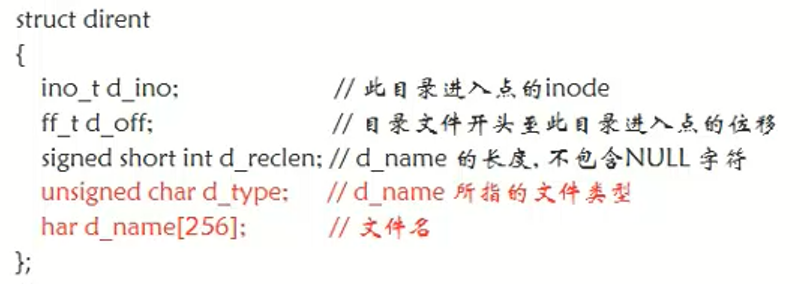
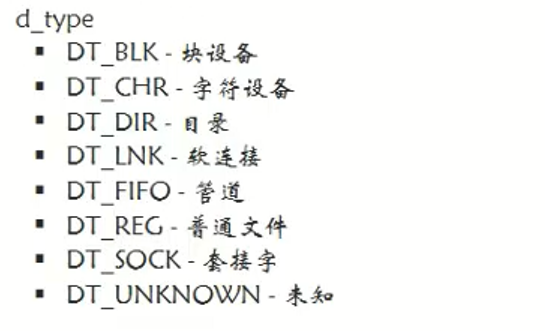

# 1 `opendir`函数

## 函数功能

- 打开一个目录

## 函数原型

`DIR opendir(const char* name);`

- 参数：目录名
- 返回值：指向目录的指针

## 例子

```c
#include<stdio.h>
#include<stdlib.h>
#include<unistd.h>
#include<fcntl.h>
#include<string.h>
#include<dirent.h>
int main(){
    DIR* d = opendir("./测试");
    if(d == NULL){
        perror("目录打开失败");
        exit(1);
    }else{
        printf("目录打开成功！\n");
    }
    return 0;
}
```

# 2 `struct dirent`结构体



## `d_type`参数



# 3 `readdir`函数

## 函数功能

- 读目录

## 函数原型

`struct dirent* readdir(DIR* dirp);`

- 参数

    `opendir()`的返回值，目录指针

- 返回值

    目录项结构体

## 例子

- **<font color=red>使用readdir函数进行对Linux目录判空方法</font>**
    - 目录中默认存在. ..目录，判空时需要忽略这两个目录
    - struct dirent结构体指针需要放在while循环中，每次循环都更新新的指针

```c
#include<stdio.h>
#include<stdlib.h>
#include<unistd.h>
#include<fcntl.h>
#include<string.h>
#include<dirent.h>
int main(){
    //与文件一样，读目录前也要先打开目录
    DIR* dir = opendir("./hah");
    if(dir == NULL){
        perror("打开目录失败");
        exit(1);
    }
    struct dirent *ptr = NULL;
    while((ptr=readdir(dir)) != NULL){
        if(strcmp(".",ptr->d_name)!=0 && strcmp("..",ptr->d_name)!= 0)
        {
            printf("目录不为空\n");
            break;
        }
    }
    if(ptr == NULL){
        printf("目录为空\n");
    }
    return 0;
}

int main(){
    //与文件一样，读目录前也要先打开目录
    DIR* dir = opendir("./hah");
    if(dir == NULL){
        perror("打开目录失败");
        exit(1);
    }
    struct dirent *ptr = NULL;
    while((ptr=readdir(dir)) != NULL){
        if(strcmp(".",ptr->d_name)!=0 || strcmp("..",ptr->d_name)!= 0)
        {
            continue;
        }
        printf("目录不为空\n");
    }
    
    return 0;
}

int main(){
    //与文件一样，读目录前也要先打开目录
    DIR* dir = opendir("./hah");
    if(dir == NULL){
        perror("打开目录失败");
        exit(1);
    }
    struct dirent *ptr = NULL;
    while((ptr=readdir(dir)) != NULL){
        if(strcmp(".",ptr->d_name)!=0 && strcmp("..",ptr->d_name)!= 0)
        {
            break;
        }
    }
    if(ptr == NULL){
        printf("目录为空\n");
    }else{
        printf("目录不为空\n");
    }
    return 0;
}
```


# 4 `closedir`函数

## 函数功能

- 关闭目录

## 函数原型

`int closedir(DIR* dirp);`

# 5 目录遍历例子

```c
#include<stdio.h>
#include<stdlib.h>
#include<unistd.h>
#include<fcntl.h>
#include<string.h>
#include<dirent.h>
int get_file_num(const char* root){
    int total = 0;
    //打开目录
    DIR *dir = NULL;
    dir = opendir(root);
    if(dir == NULL){
        perror("打开目录失败！");
        exit(2);
    }

    //循环读取目录内文件
    struct dirent* dirent = NULL;
    while((dirent = readdir(dir)) != NULL){
        //遇到目录下. ..目录跳过
        if(strcmp(".",dirent->d_name)==0||strcmp("..",dirent->d_name)==0){
            continue;
        }
        //如果是普通文件就让total数量加一
        if(dirent->d_type == DT_REG ){
            total++;
        }
        //如果是目录，就递归读子目录中文件
        if(dirent->d_type == DT_DIR){
            //获取子目录名字
            char path[1024] = {0};
            sprintf(path,"%s/%s",root,dirent->d_name);
            total += get_file_num(path);
        }

    }
    //关闭目录
    closedir(dir);
    return total;
}
int main(int argc, const char* argv[] ){
    if(argc < 2){
        perror("参数过少");
        exit(1);
    }
    int total = get_file_num(argv[1]);
    printf("%s目录下共%d个普通文件！\n",argv[1],total);
    return 0;
}
```


