# 1 预备知识

- 大端法：首先取高字节的数据存放在低地址

- 小端法：首先取低字节的数据存放在低地址
- 网络数据流采用大端字节序

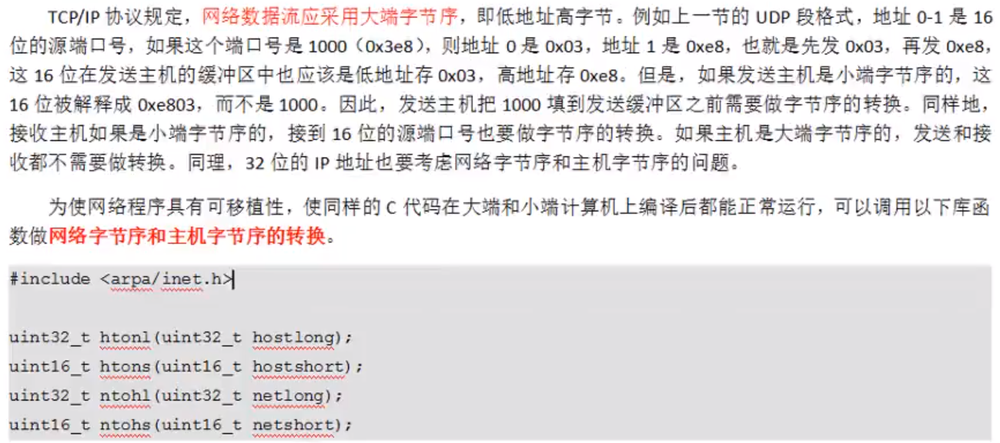

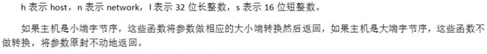

关于IP地址的转换现在有一种更简单的方法：可以直接将点分十进制转换为网络字节序；也可以将网络字节序直接转换为点分十进制的字符串格式传出。

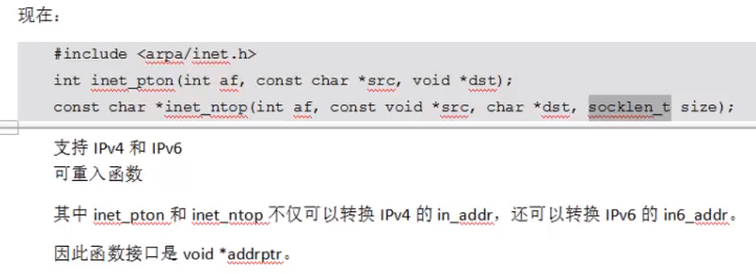

## `sockaddr`数据结构

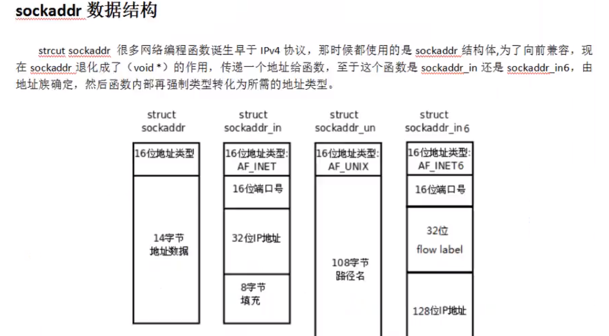

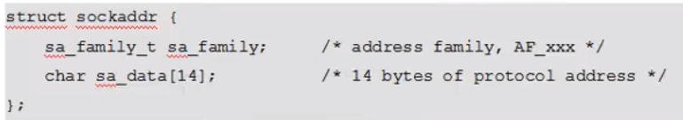

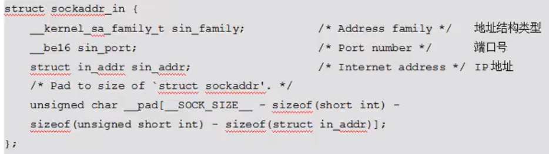

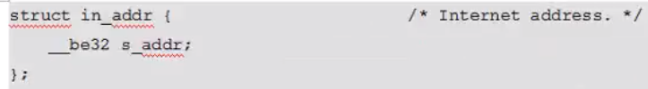

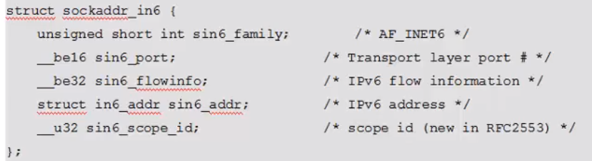

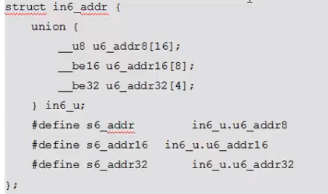

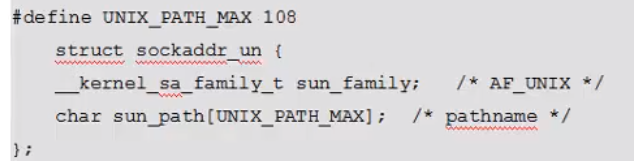

# 2 网络套接字函数

## `socket`模型创建流程图

- TCP客户端可以不调用bind()函数进行显式绑定IP和端口号，可以让操作系统自动分配

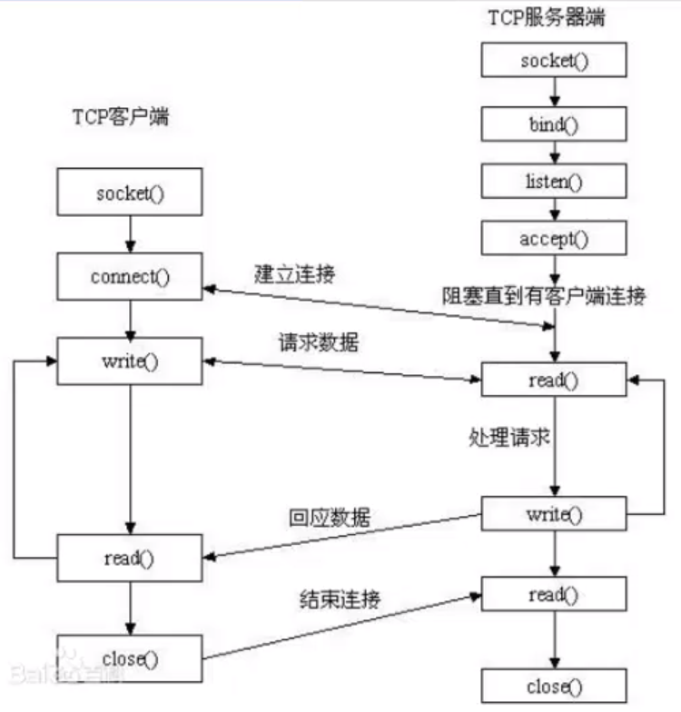

## `socket`函数

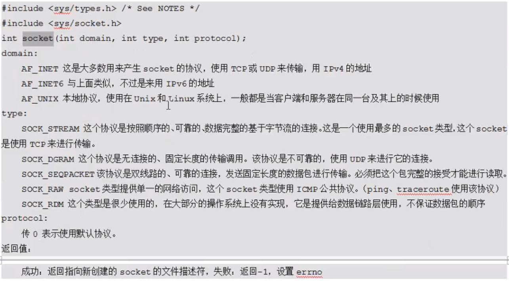

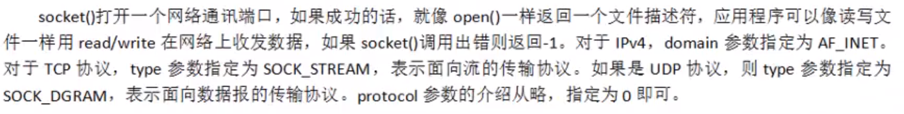

## `bind`函数

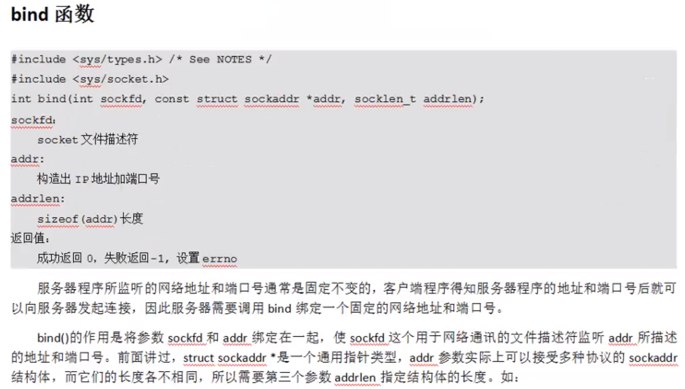

## `listen`函数

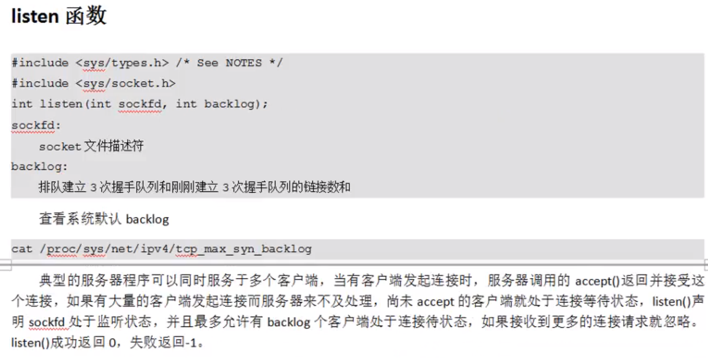

## `accept`函数

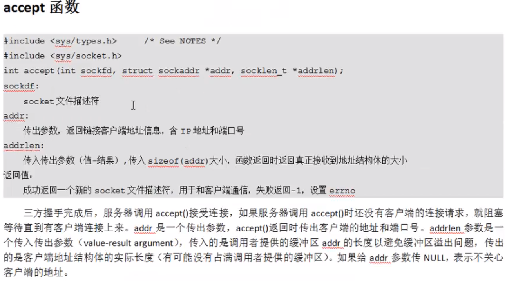

## `connect`函数

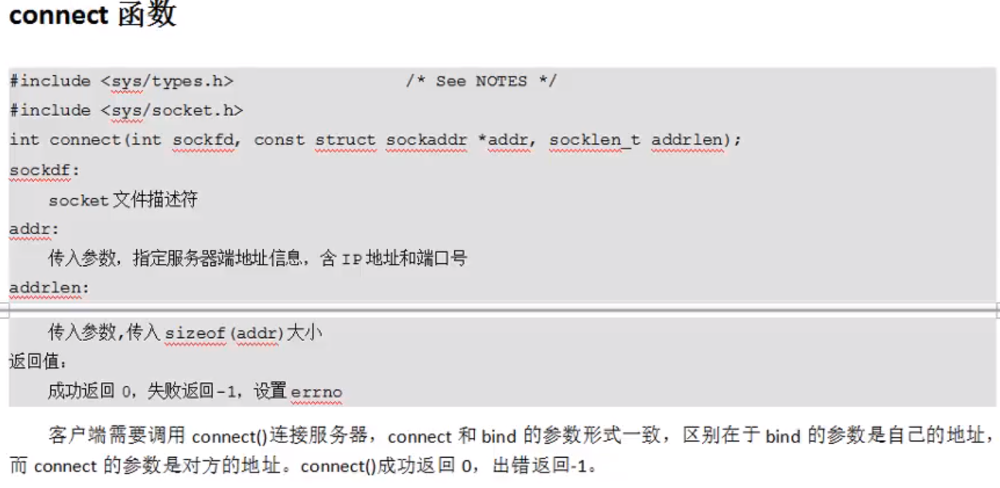

## 例子

### <font color=blue>服务端</font>

```c
#include<stdio.h>
#include<stdlib.h>
#include<unistd.h>
#include<fcntl.h>
#include<string.h>
#include<sys/socket.h>
#include<arpa/inet.h>
int main(){
    //1、建立套接字
    int sfd = socket(AF_INET,SOCK_STREAM,0);
    if(sfd == -1){
        perror("套接字建立失败");
        exit(1);
    }
    //2、绑定IP和端口
    struct sockaddr_in server_addr;
    server_addr.sin_family = AF_INET;
    server_addr.sin_port = htons(6666);
    inet_pton(AF_INET,"127.0.0.1",&server_addr.sin_addr.s_addr);
    int ret = bind(sfd,(struct sockaddr*)&server_addr,sizeof(server_addr));
    if(ret == -1){
        perror("绑定失败");
        exit(2);
    }
    //3、监听，设置同时最多连接数(默认128个连接)
    ret = listen(sfd,128);
    if(ret == -1){
        perror("监听失败");
        exit(3);
    }
    //4、阻塞等待客户端连接，返回客户端的地址信息
    struct sockaddr_in client_addr;
    socklen_t client_len = sizeof(client_addr);
    int cfd = accept(sfd,(struct sockaddr*)&client_addr,&client_len);
    
      //读连接的客户端的IP和端口
    char client_addrBUF[BUFSIZ];    
    printf("clientiP:%sPort:%d\n",inet_ntop(AF_INET,&client_addr.sin_addr.s_addr,
			client_addrBUF,sizeof(client_addrBUF)),ntohs(client_addr.sin_port));
    
    
    //5、读客户端发送的数据
    char buf[1024];
    int i = 0;
    int len;
    while(1){
        memset(buf,0,sizeof(buf));
        len = read(cfd,buf,sizeof(buf));
        for(i=0;i<len;i++){
            buf[i] = toupper(buf[i]);
        }
        //读到的数据转换为大写，再返回给客户端
        write(cfd,buf,len);
    }
    //6、关闭客户端与服务端的文件描述符
    close(sfd);
    close(cfd);
    return 0;
}
```

### <font color=blue>客户端</font>

```c
#include<stdio.h>
#include<stdlib.h>
#include<unistd.h>
#include<fcntl.h>
#include<string.h>
#include<arpa/inet.h>
#include<sys/socket.h>
int main(){
    //1、建立通信套接字
    int cfd = socket(AF_INET,SOCK_STREAM,0);
    //2、连接服务器端
    struct sockaddr_in client_addr;
    client_addr.sin_family = AF_INET;
    client_addr.sin_port = htons(6666);
    inet_pton(AF_INET,"127.0.0.1",&client_addr.sin_addr.s_addr);
    socklen_t client_len = sizeof(client_addr);
    connect(cfd,(struct sockaddr*)&client_addr,client_len);
    //3、向服务器端写数据
    char buf[BUFSIZ];
    while(1){
        fgets(buf,sizeof(buf),stdin);
        write(cfd,buf,strlen(buf));
        int len = read(cfd,buf,sizeof(buf));
        write(STDOUT_FILENO,buf,len);
    }
    //4、关闭文件描述符
    close(cfd);
    return 0;
}
```

# 3 多进/线程并发服务器

## 多进程

```c
#include<stdio.h>
#include<stdlib.h>
#include<signal.h>
#include<unistd.h>
#include<fcntl.h>
#include<string.h>
#include<sys/socket.h>
#include<arpa/inet.h>

#define PORT 8888
#define IP "127.0.0.1"

void catch_SIGCHLD(int signum){
    int waitret;
    while( (waitret = waitpid(-1,NULL,WNOHANG)) > 0);
    printf("cleaned %d\n",waitret);
    return;
}

int main(){
    //1、建立套接字
    int sfd = socket(AF_INET,SOCK_STREAM,0);
    if(sfd == -1){
        perror("socket error");
        exit(1);
    }
	//2、绑定
    struct sockaddr_in serv_addr;
    socklen_t serv_len;
    serv_addr.sin_family = AF_INET;
    serv_addr.sin_port = htons(PORT);
    inet_pton(AF_INET,IP,&serv_addr.sin_addr.s_addr);
    serv_len = sizeof(serv_addr);
    int ret = bind(sfd,(struct sockaddr*)&serv_addr,serv_len);
    if(ret == -1){
        perror("bind error");
        exit(2);
    }
	//3、监听
    ret = listen(sfd,128);
    if(ret == -1){
        perror("listen error");
        exit(3);
    }

    struct sockaddr_in clie_addr;
    int cfd;
    pid_t pid;
    while(1){
        //接受连接，连接到后就fork()子进程
        //父进程负责接受连接，子进程负责去读写
        socklen_t clie_len = sizeof(clie_addr);
        cfd = accept(sfd,(struct sockaddr*)&clie_addr,&clie_len);
        pid = fork();
        if(pid == -1){
            perror("fork error");
            exit(4);
        }else if(pid == 0){
            close(sfd);
            break;
        }else{
            close(cfd);
            //父进程中注册信号，写回调函数，让内核帮助回收子进程
            struct sigaction act;
            act.sa_handler = catch_SIGCHLD;
            sigemptyset(&act.sa_mask);
            act.sa_flags = 0;
            ret = sigaction(SIGCHLD,&act,NULL);
            if(ret == -1){
                perror("sigaction error");
                exit(5);
            }
        }
    }

    char buf[BUFSIZ];
    int len,i;
    while(1){
        len = read(cfd,buf,sizeof(buf));
        for(i = 0; i < len; i++){
            buf[i] = toupper(buf[i]);
        }
        write(cfd,buf,strlen(buf));
    }
    return 0;
}
```

## 多线程

```c
#include<stdio.h>
#include<stdlib.h>
#include<unistd.h>
#include<fcntl.h>
#include<string.h>
#include<pthread.h>
#include<sys/socket.h>
#include<arpa/inet.h>
#define IP "127.0.0.1"
#define PORT 7777
int cfd;
void* do_work(void* arg){
    int i = (int)arg;
    printf("第%d个子线程连接\n",i);
    char buf[BUFSIZ];
    int len;
    int j;
    while(1){
        len = read(cfd,buf,sizeof(buf));
        if(len == 0){
            printf("客户端已经关闭\n");
            break;
        }
        for(j = 0; j < len; j++){
            buf[j] = toupper(buf[j]);
        }
        write(cfd,buf,len);
    }
    return ;
}

int main(){
    //1、建立套接字
    int sfd = socket(AF_INET,SOCK_STREAM,0);
    //2、绑定
    struct sockaddr_in serv_addr;
    serv_addr.sin_family = AF_INET;
    serv_addr.sin_port = htons(PORT);
    inet_pton(AF_INET,IP,&serv_addr.sin_addr.s_addr);
    socklen_t serv_len = sizeof(serv_addr);
    int ret = bind(sfd,(struct sockaddr*)&serv_addr,serv_len);
    if(ret == -1){
        perror("bind eror");
        exit(1);
    }
    //3、监听 设置最大连接数
    ret = listen(sfd,128);
    if(ret != 0){
        perror("listen error");
        printf("listen error:%s\n",strerror(ret));
        exit(2);
    }
    //4、开始使用多线程 主线程接受连接，子进程处理每个连接
    struct sockaddr_in clie_addr;
    socklen_t clie_len = sizeof(clie_addr);
    int i = 0;
    pthread_t tid[128];
    char buf[BUFSIZ];
    while(1){
        cfd = accept(sfd,(struct sockaddr *)&clie_addr,&clie_len);
        printf("%s连接，端口为：%d\n",inet_ntop(AF_INET,&clie_addr.sin_addr.s_addr,buf,sizeof(buf)),ntohs(clie_addr.sin_port));
        //创建子线程
        ret = pthread_create(&tid[i],NULL,do_work,(void*)i);
        if(ret != 0){
            printf("pthread_create error:%s\n",strerror(ret));
            exit(3);
        }
        //采用线程分离的方式，自动回收子线程资源
        pthread_detach(tid[i]);
        i++;
    }

    return 0;
｝
```

# 4 半关闭

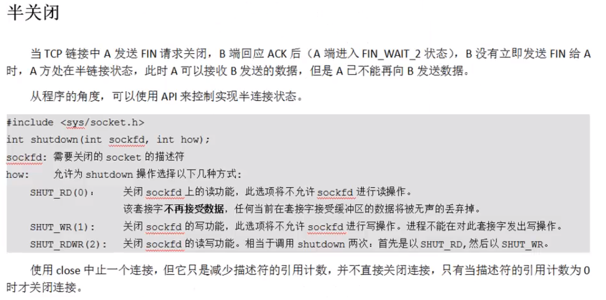

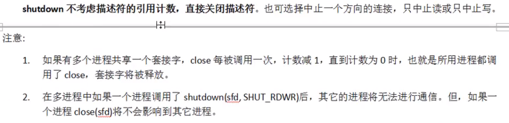 

# 5 端口复用

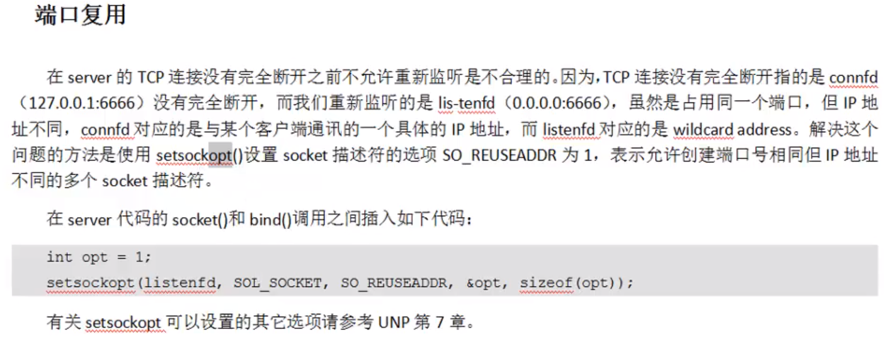

```c
//在绑定之前，建立套接字之后 设置端口复用
int opt = 1;//1代表端口可以复用
setsockopt(sfd,SOL_SOCKET,SO_REUSEPORT,&opt,sizeof(opt));
```


