多路IO转接服务器又叫多任务IO服务器。该类服务器实现的主旨思想是：不再由应用程序自己监听客户端连接，取而代之由内核代替应用程序监视文件。**<font color=red>这些函数也能应用在管道、文件上，不仅仅只能应用在套接字上</font>**

主要使用方法有三种：

# 1 `select`

## 函数原型

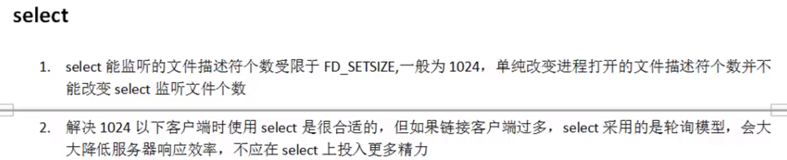

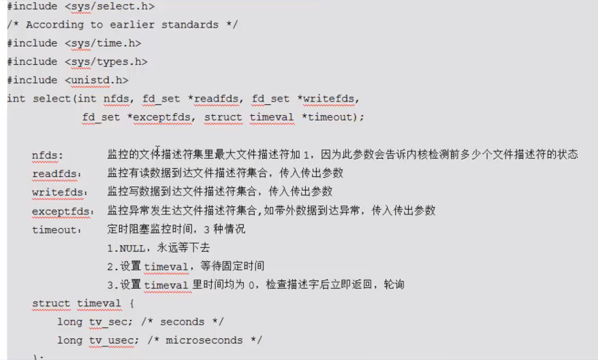

返回值

- 成功：返回所监听的所有 监听集合中 满足条件的总数。
- 失败：返回-1，设置errno。

## 四个工具函数

```c
//fd_set类型为位图集合
void FD_CLR(int fd, fd_set *set);//将fd从set集合中清除出去，相当于将对应位置为0
int  FD_ISSET(int fd, fd_set *set);//判断fd是否在set集合中，返回1为在集合中，0为假，即不在集合中
void FD_SET(int fd, fd_set *set);//将fd设置到set集合中，相当于将对应位置为1
void FD_ZERO(fd_set *set);//将文件描述符集合清空，位图清空相当于全部置为0
```
## 例子

```c
#include<stdio.h>
#include<stdlib.h>
#include<unistd.h>
#include<fcntl.h>
#include<string.h>
#include<sys/socket.h>
#include<arpa/inet.h>
#include<sys/select.h>
#include<sys/types.h>
#include<sys/time.h>
#include<ctype.h>
#define PORT 8888
#define IP "127.0.0.1"
int main(){
    //1、建立套接字
    int sfd = socket(AF_INET,SOCK_STREAM,0);

    //2、绑定
    struct sockaddr_in serv_addr;
    bzero(&serv_addr,sizeof(serv_addr));
    serv_addr.sin_family = AF_INET;
    serv_addr.sin_port = htons(PORT);
    inet_pton(AF_INET,IP,&serv_addr.sin_addr.s_addr);
    socklen_t serv_len = sizeof(serv_addr);
    int ret = bind(sfd,(struct sockaddr*)&serv_addr,serv_len);
    if(ret != 0){
        printf("bind err:%s\n",strerror(ret));
        exit(1);
    }

    //3、监听
    listen(sfd,128);

    //定义一个客户端数组，用来存放监听文件描述符，以免select到时候循坏0~1023个文件描述符
    int client[FD_SETSIZE];

    //将数组内值全部初始化为-1
    for(int i = 0; i < FD_SETSIZE;i++){
        client[i] = -1;
    }

    fd_set rset,allset;//rset 用来保存满足读监听条件的文件描述符集合,allset用来保存要监听的文件描述符集合
    FD_ZERO(&allset);
    FD_SET(sfd,&allset);
    int nready,i;
    int index = -1;//定义数组下标
    int maxfd = sfd;//定义一个最大文件描述符，select第一个参数：监听的文件描述符集里最大的文件描述符+1
    while(1){
        //rset中存放监听条件为读的文件描述符
        rset = allset;

        //只监听读集合,写集合与异常集合暂时不监听，timeout参数传NULL表示永不超时
        /*select调用后会更改rset集中文件描述符集，只保留符合监听条件的文件描述符*/
        nready = select(maxfd+1,&rset,NULL,NULL,NULL);
        if(nready < 0){
            printf("监听的集合中没有满足条件的文件描述符\n");
        }

        int sockfd;
        //判断sfd是否存在于满足监听条件的集合中
        if(FD_ISSET(sfd,&rset)){
            //如果监听到了有满足条件的文件描述符，开始accept()
            struct sockaddr_in clie_addr;
            socklen_t clie_len = sizeof(clie_addr);
            int cfd = accept(sfd,(struct sockaddr*)&clie_addr,&clie_len);//返回一个新的客户端的文件描述符
            if(cfd == -1){
                perror("accept error");
                exit(2);
            }
            char buf[BUFSIZ];
            printf("%sconnected...；port：%d\n",inet_ntop(AF_INET,&clie_addr.sin_addr.s_addr,buf,sizeof(buf)),
                   ntohs(clie_addr.sin_port));//打印谁连接了上来

            for(i = 0; i < FD_SETSIZE;i++){
                if(client[i] < 0){
                    client[i] = cfd;
                    break;
                }
            }
            //由于select()函数只能有1024个文件描述符，所以进行判断，如果超过了就应该退出
            if(i == FD_SETSIZE){
                printf("too many connecting...\n");
                exit(1);
            }
            FD_SET(cfd,&allset);
            //更新文件描述符集中最大的文件描述符
            if(cfd > maxfd){
                maxfd = cfd;
            }

            if(i > index){
                index = i;
            }

            if(--nready == 0){
                continue;
            }
        }
        //遍历client[i]数组，查看数组中是否需要监听的文件描述符
        int len;
        char rwbuf[BUFSIZ];

        for(i = 0; i <= index;i++)
        {
            if((sockfd=client[i]) < 0){
                //满足此语句说明client[]中i位置是-1，并将client[i]的值赋给sockfd
                continue;
            }
            //如果sockfd文件描述符在rset读文件描述符集中，说明是要监听的
            if(FD_ISSET(sockfd,&rset)){
                len = read(sockfd,rwbuf,sizeof(rwbuf));
                if(len==0){
                    //说明客户端关闭了
                    //将这个文件描述符从allset中清除，在对应的client[]中i位置改回-1
                    printf("------%d--disconnected\n",i);
                    close(sockfd);
                    FD_CLR(sockfd,&allset);
                    client[i] = -1;
                }else if(len > 0){
                    for(int j = 0; j < len;j++){
                        rwbuf[j] = toupper(rwbuf[j]);
                    }
                    write(sockfd,rwbuf,len);
                }
                if(--nready == 0){
                    break;
                }
            }
        }

    }
    close(sfd);
    return 0;
}
```

# 2 `poll`

`poll`函数相对于`select`函数的优点

- `poll`函数突破了`select`函数1024个文件描述符的限制
- `poll`函数将监听的文件描述符集合与满足监听条件的文件描述符集合给分开了
- 缩小了要监听的文件描述符的搜素范围

缺点：

- `poll`只支持Linux平台，`select`支持跨平台

## 函数原型

头文件<poll.h>

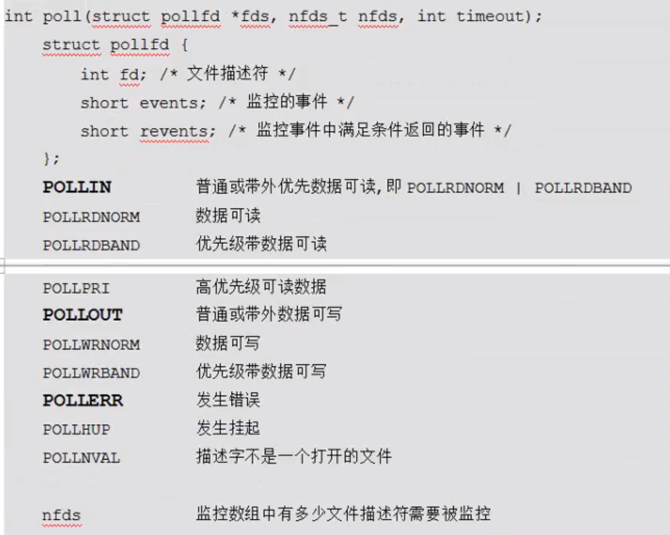

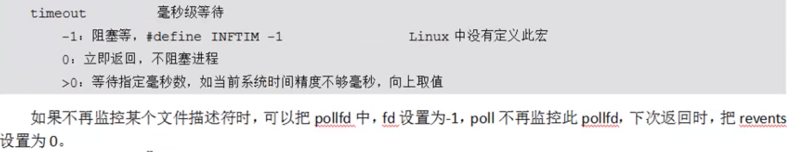

## 例子

```c
#include <stdio.h>
#include <sys/socket.h>
#include <poll.h>
#include <arpa/inet.h>
#include <string.h>
#include <unistd.h>
#include <stdlib.h>
#include <ctype.h>

#define PORT 8888
#define IP "127.0.0.1"
#define MAXNUM 6
int main()
{
    //获得通信套接字
    int sfd = socket(AF_INET,SOCK_STREAM,0);

    //绑定
    struct sockaddr_in serv_addr;
    serv_addr.sin_family = AF_INET;
    serv_addr.sin_port = htons(PORT);
    inet_pton(AF_INET,IP,&serv_addr.sin_addr.s_addr);
    socklen_t serv_len = sizeof (serv_addr);
    int ret = bind(sfd,(struct sockaddr*)&serv_addr,serv_len);
    if(ret != 0){
        printf("bind error：%s\n",strerror(ret));
    }

    //监听
    listen(sfd,128);

    //初始化struct pollfd结构体数组，将sfd放入数组的0号位置
    struct pollfd client[MAXNUM];
    client[0].fd = sfd;
    client[0].events = POLLIN;
    //第三个参数revents一般不需要初始化，调用过poll函数后，poll函数会将满足监听条件的文件描述符放进去

    for(int i = 1; i < MAXNUM; i++){
        client[i].fd = -1;
    }
    int maxi = 0;
    char buf[BUFSIZ];
    memset(buf,0,sizeof (buf));
    while(1){
        ret = poll(client,maxi+1,-1);

        //此时监听的sfd如果有读事件发生，说明有新的连接要建立，调用accept()函数
        if(client[0].revents & POLLIN){
            struct sockaddr_in clie_addr;
            socklen_t clie_len = sizeof (clie_addr);
            //返回客户端 cfd
            int cfd = accept(client[0].fd,(struct sockaddr*)&clie_addr,&clie_len);
            printf("%sconnected and port=%d\n",inet_ntop(AF_INET,&clie_addr.sin_addr.s_addr,buf,sizeof (buf)),
                   ntohs(clie_addr.sin_port));

            //将客户端文件描述符加入监听数组中即client[]中
            //找到数组中的空位置才能加入
            int i;
            for(i = 1; i < MAXNUM;i++){
                if(client[i].fd < 0){
                    client[i].fd = cfd;
                    break;
                }
            }
            //这里设置了最大的监听数为MAXNUM，如果超过了这个值就不再监听，退出
            if(i == MAXNUM){
                printf("too many connected...\n");
                exit(1);
            }

            //将cfd加入监听数组client[]中后，设置其监听属性，即是要监听他的读事件还是写事件异常事件
            client[i].events = POLLIN;//此处设置为监听他的读事件

            //将数组下标位置后移，其实就是现在一共实际要监听的文件描述符个数
            if(i > maxi){
                maxi = i;
            }

            //此处if语句条件满足要continue的原因是，假如ret中只有一个sfd时，
            //说明客户端没有向服务端发送数据，所以跳出继续监听sfd的下一个连接
            if(--ret == 0){
                continue;
            }
        }
        //代码走到这里说明监听数组client[]中，有客户端在发数据了，接下来就是读数据并写回去
        int sockfd;
        int k;
        for(k = 1; k <= MAXNUM; k++){
            if((sockfd = client[k].fd) < 0){
                continue;
            }
            //k从1开始，就是跳过了第一个sfd，其余的客户端发送数据的文件描述符
            char rwbuf[BUFSIZ];
            memset(buf,0,sizeof (buf));
            if(client[k].revents & POLLIN){
                //如果满足 条件，开始读数据
                int len = read(sockfd,rwbuf,sizeof (rwbuf));
                if(len == 0){
                    //说明客户端关闭了
                    printf("client %d disconnected...\n",k);
                    close(sockfd);
                    client[k].fd = -1;
                }else if(len > 0){
                    //读到了数，将小写转换为大写
                    for(int i = 0; i< len; i++){
                        rwbuf[i] = toupper(rwbuf[i]);
                    }
                    write(sockfd,rwbuf,len);
                }
                if(--ret == 0){
                    break;
                }
            }
        }
    }
    close(sfd);
    return 0;
}
```

# 3 `epoll`

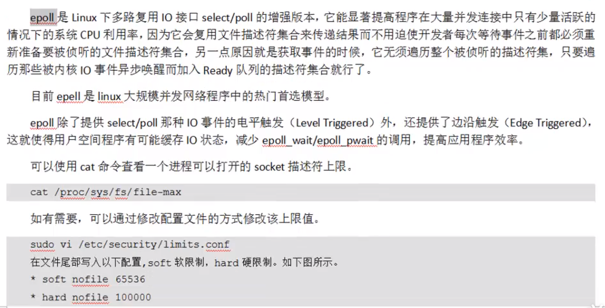

## 边沿触发与水平触发

这两个实际是由模拟电路上的高低电频来的，

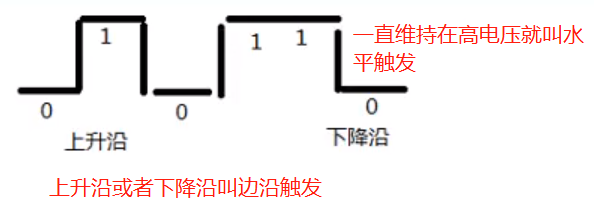

- 边沿触发：epoll ET

- 水平触发：epoll LT

当客户端向服务端写数据，假如1000B的数据，服务端第一次读了500B后，还剩下500B在缓冲区中，假如此时能触发`epoll_wait`函数的监听读事件，就叫**水平触发**，假如此时`epoll_wait`函数不触发，那么就叫**边沿触发**。

**<font color=red>代码演示使用差别</font>**

```c
struct epoll_event event;
event.events = EPOLLIN|EPOLLET;//这就设置为边沿触发
event.events = EPOLLIN;//这就设置为水平触发，也就是说只要缓冲区内有数据，就会触发epoll_wait函数，发送读事件信号   
```

## 基础API

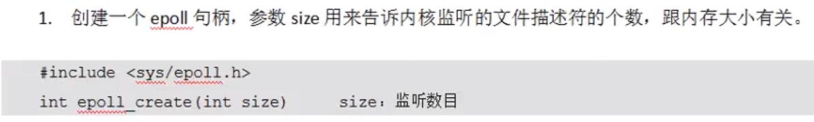

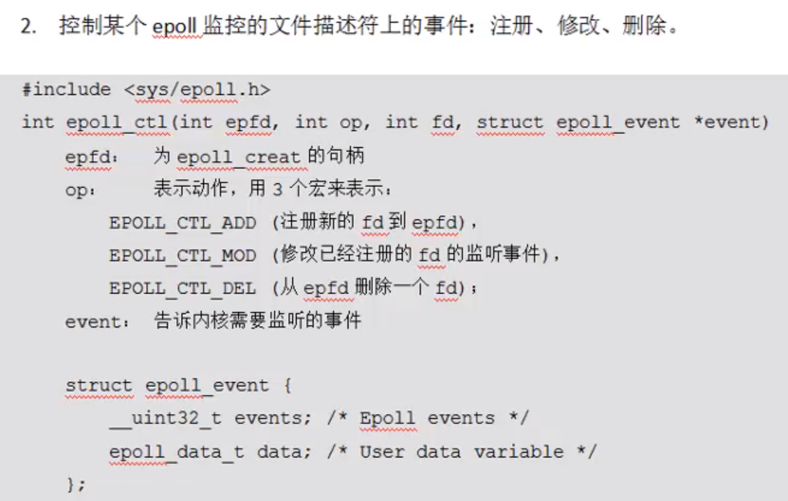

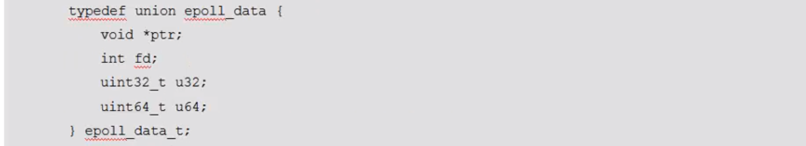

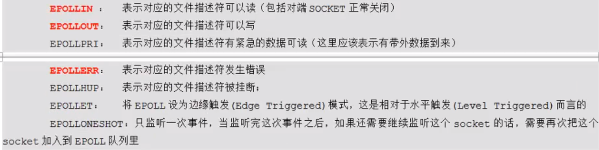

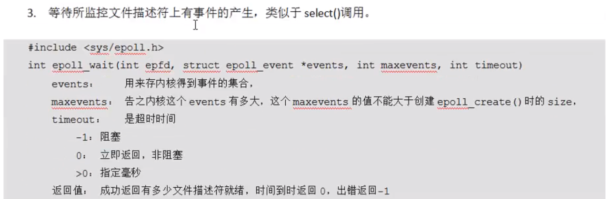

## 例子

```c
#include <stdio.h>
#include <sys/epoll.h>
#include <sys/socket.h>
#include <unistd.h>
#include <sys/types.h>
#include <arpa/inet.h>
#include <stdlib.h>
#include <string.h>
#include <ctype.h>

#define IP "127.0.0.1"
#define PORT 8888

int main()
{
    //1、创建套接字
    int sfd = socket(AF_INET,SOCK_STREAM,0);

    //设置端口复用，免去TIME_WAIT阶段需要等的2MSL时间
    int opt = 1;
    setsockopt(sfd,SOL_SOCKET,SO_REUSEPORT,&opt,sizeof (opt));

    //2、绑定
    struct sockaddr_in serv_addr;
    serv_addr.sin_family = AF_INET;
    serv_addr.sin_port = htons(PORT);
    inet_pton(AF_INET,IP,&serv_addr.sin_addr.s_addr);
    socklen_t serv_len = sizeof (serv_addr);
    int ret = bind(sfd,(struct sockaddr*)&serv_addr,serv_len);
    if(ret != 0){
        printf("bind error:%s\n",strerror(ret));
        exit(1);
    }

    //3、监听，设置最大连接数
    listen(sfd,128);

    //开始使用epoll帮忙监听
    while(1){
        //创建红黑树的根节点出来，返回值epfd个数是要监听的文件描述符个数
        int epfd = epoll_create(10);
        if(ret < 0){
            perror("epoll_create error");
            exit(2);
        }

        //将sfd文件描述符挂到这颗红黑树上
        struct epoll_event inevent;
        inevent.events = EPOLLIN;
        inevent.data.fd = sfd;
        epoll_ctl(epfd,EPOLL_CTL_ADD,sfd,&inevent);

        while(1){
            //监听，如果有事件发生，会传出到outevent[]中
            struct epoll_event outevent[10];
            ret = epoll_wait(epfd,outevent,sizeof (outevent),-1);
            //epoll_wait函数发生后，就会有事件发生后，直接遍历这ret个文件描述符，看是哪个文件描述符发生了事件
            for(int i = 0; i < ret;i++){
                printf("-----------%d------------\n",i);
                if(!(outevent[i].events & EPOLLIN))//如果不是“读”事件就continue
                    continue;

                //判断如果是sfd有读事件发生，说明有新的客户端连接，调用accept
                //如果不是sfd有读事件发生，说明是客户端要发送数据
                int sockfd = outevent[i].data.fd;
                if(outevent[i].data.fd == sfd){
                    struct sockaddr_in clie_addr;
                    socklen_t clie_len = sizeof (clie_addr);
                    sockfd = accept(sfd,(struct sockaddr*)&clie_addr,&clie_len);
                    //打印客户端的ip和port
                    char buf[BUFSIZ];
                    memset(buf,0,sizeof (buf));
                    printf("%s connected, port: %d\n",inet_ntop(AF_INET,&clie_addr.sin_addr.s_addr,buf,
                                                                sizeof (buf)),ntohs(clie_addr.sin_port));

                    //将新连接的客户端的文件描述符也加入到这颗红黑树中进行监听
                    struct epoll_event cevent;
                    cevent.events = EPOLLIN;
                    cevent.data.fd = sockfd;
                    epoll_ctl(epfd,EPOLL_CTL_ADD,sockfd,&cevent);
                }else{
                    char rwbuf[BUFSIZ];
                    memset(rwbuf,0,sizeof (rwbuf));
                    int len = read(sockfd,rwbuf,sizeof (rwbuf));
                    if(len == 0){//读结束了，客户端关闭了
                        printf(" client disconnected\n");
                        //将这个文件描述符从监听列表中去除
                        close(sockfd);
                        epoll_ctl(epfd,EPOLL_CTL_DEL,sockfd,outevent);
                    }else if(len > 0){
                        for(int j = 0; j < len; j++){
                            rwbuf[j] = toupper(rwbuf[j]);
                        }
                        write(sockfd,rwbuf,len);
                    }
                }
            }
        }
    }
    close(sfd);
    return 0;
}
```

## `epoll`非阻塞IO模式

采用边沿触发模式，通过`fcntl`函数修改文件属性为非阻塞，相当于使用边沿触发实现了水平触发的效果。这种方法相比单纯的水平触发与边沿触发模式都要好。相比较于单纯的水平触发，调用`epoll_wait`函数的次数少了，增加了代码的执行效率。相比较于单纯的边沿触发，增加了灵活性，且有效避免了“死锁”的出现。

**<font color=red>服务端</font>**

```c
#include <stdio.h>
#include <sys/socket.h>
#include <unistd.h>
#include <arpa/inet.h>
#include <string.h>
#include <ctype.h>
#include <sys/epoll.h>
#include <fcntl.h>

#define IP "127.0.0.1"
#define PORT 8888
#define READNUM 10

int main()
{
    int sfd = socket(AF_INET,SOCK_STREAM,0);

    struct sockaddr_in serv_addr;
    bzero(&serv_addr,sizeof (serv_addr));
    serv_addr.sin_family = AF_INET;
    serv_addr.sin_port = htons(PORT);
    inet_pton(AF_INET,IP,&serv_addr.sin_addr.s_addr);
    socklen_t serv_len = sizeof (serv_addr);
    bind(sfd,(struct sockaddr*)&serv_addr,serv_len);

    listen(sfd,128);

    //创建监听的红黑树
    int epfd = epoll_create(10);
    struct epoll_event event;
    //event.events = EPOLLIN;
    event.events = EPOLLIN|EPOLLET;


    struct sockaddr_in clie_addr;
    socklen_t clie_len = sizeof (clie_addr);
    int cfd = accept(sfd,(struct sockaddr*)&clie_addr,&clie_len);
    char acceptbuf[BUFSIZ];
    printf("%s connected, port = %d\n",inet_ntop(AF_INET,&clie_addr.sin_addr.s_addr,acceptbuf,sizeof (acceptbuf))
           ,ntohs(clie_addr.sin_port));

	//通过fcntl将文件属性设置为非阻塞
    int flag = fcntl(cfd,F_GETFL);
    flag |= O_NONBLOCK;
    fcntl(cfd,F_SETFL,flag);

    event.data.fd = cfd;
    //将cfd加入到红黑树中监听
    epoll_ctl(epfd,EPOLL_CTL_ADD,cfd,&event);

    while(1){
        struct epoll_event outevent[10];
        //返回的就是直接满足监听条件的文件描述符个数
        int nready = epoll_wait(epfd,outevent,sizeof (outevent),-1);
        for(int i = 0; i < nready; i++){
            //如果监听的不是读事件 就跳过
            if(!(outevent[i].events & EPOLLIN))
                continue;
            char buf[BUFSIZ];
            memset(buf,0,sizeof (buf));
            int len = 0;
            if(outevent[i].data.fd == cfd){
          //使用while语句，当缓冲区还有数据时会直接读完，减少了重复调用epoll_wait的次数。
     //且此处即使使用readn函数一次读不够且不会发生阻塞，因为使用fcntl函数改变属性为非阻塞了
                while((len = read(cfd,buf,READNUM/2)) > 0)
                    write(STDOUT_FILENO,buf,len);
            }
        }
    }
    close(sfd);
    return 0;
}
```

# 4 `epoll`反应堆模型(libevent库核心思想实现)

libevent库可以跨平台，且效率高，内部使用了`epoll`非阻塞IO模式+大量回调函数。

这里与之前学的不同地方就是之前学习只是监听能不能读事件，但是这里更偏向于实战，因为TCP要进行流量控制，所以要检测现在能不能写数据给对方，监听到读事件发生后，将其文件描述符从红黑树上摘下，在挂上监听写事件，监听到写事件（即可写）时，在写

**<font color=red>这里需要补充代码</font>**

# 5 TCP异常断开

## 心跳检测机制


