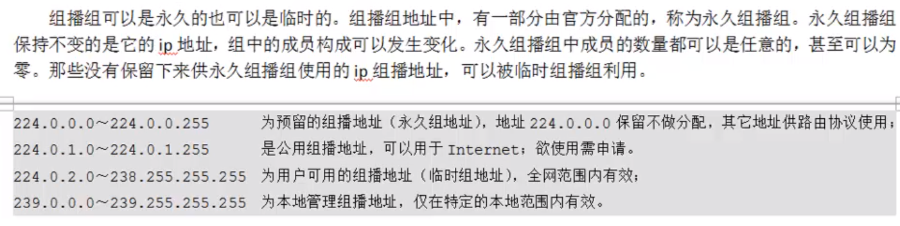

# 1 UDP通信


## C/S模型-UDP


## 例子

### 服务端

1. 建立通信套接字
2. 绑定IP和端口
3. recvfrom读数据，对端的IP和PORT包含在recvfrom函数的传出参数中
4. sendto发送数据给对端，对端的IP和PORT由第三步得来

```
#include <stdio.h>
#include <sys/socket.h>
#include <arpa/inet.h>
#include <string.h>
#include <stdlib.h>
#include <ctype.h>
#include <unistd.h>

#define PORT 8888
#define IP "127.0.0.1"

int main()
{
    int sfd = socket(AF_INET,SOCK_DGRAM,0);

    struct sockaddr_in serv_addr;
    serv_addr.sin_family = AF_INET;
    serv_addr.sin_port = PORT;
    inet_pton(AF_INET,IP,&serv_addr.sin_addr.s_addr);
    bind(sfd,(struct sockaddr*)&serv_addr,sizeof (serv_addr));

    printf("accepting connect...\n");
    char buf[BUFSIZ];
    memset(buf,0,sizeof (buf));
    struct sockaddr_in peer_addr;
    bzero(&peer_addr,sizeof (peer_addr));
    socklen_t peer_len = sizeof (peer_addr);
    char rwbuf[BUFSIZ];
    while (1) {
    	//这里的peer_addr为传出参数，其中包括对端的IP和PORT
        int ret = recvfrom(sfd,rwbuf,sizeof (rwbuf),0,(struct sockaddr*)&peer_addr,&peer_len);
        if(ret == -1){
            perror("recvfrom error");
            exit(1);
        }

        printf("%s connected..port %d\n",inet_ntop(AF_INET,&peer_addr.sin_addr,buf,sizeof (buf)),ntohs(peer_addr.sin_port));

        for(int i = 0; i < ret; i++){
            rwbuf[i] = toupper(rwbuf[i]);
        }

        sendto(sfd,rwbuf,ret,0,(struct sockaddr*)&peer_addr,peer_len);
    }
    close(sfd);
    return 0;
}
```

### 客户端

1. 建立通信套接字
2. sendto发送数据，服务器的IP和PORT是需要已知的
3. recvfrom读数据

```c
#include <stdio.h>
#include <sys/socket.h>
#include <sys/types.h>
#include <arpa/inet.h>
#include <string.h>
#include <unistd.h>

#define PORT 8888
#define IP "127.0.0.1"

int main()
{
    int cfd = socket(AF_INET,SOCK_DGRAM,0);

    struct sockaddr_in clie_addr;
    clie_addr.sin_family = AF_INET;
    clie_addr.sin_port = PORT;
    inet_pton(AF_INET,IP,&clie_addr.sin_addr.s_addr);

    char buf[BUFSIZ];
    memset(buf,0,sizeof (buf));
    while(1){
        read(STDIN_FILENO,buf,sizeof (buf));
        int len = sendto(cfd,buf,sizeof (buf),0,(struct sockaddr*)&clie_addr,sizeof (clie_addr));
        memset(buf,0,sizeof (buf));
        recvfrom(cfd,buf,sizeof(buf),0,NULL,0);
        write(STDOUT_FILENO,buf,len);
        memset(buf,0,sizeof (buf));
    }
    return 0;
}
```

# 2 广播

## 服务端

1. 建立监听套接字
2. 绑定服务器的IP和端口
3. 使用`setsockopt`设置允许进行广播
4. `sendto`发送数据到指定的广播地址与端口

```c
#include <stdio.h>
#include <sys/socket.h>
#include <arpa/inet.h>
#include <string.h>
#include <unistd.h>

#define PORT 8888
#define IP "127.0.0.1"

#define CLIEPORT 9000

int main()
{
    int sfd = socket(AF_INET,SOCK_DGRAM,0);

    struct sockaddr_in serv_addr;
    bzero(&serv_addr,sizeof (serv_addr));
    serv_addr.sin_family = AF_INET;
    serv_addr.sin_port = htons(PORT);
    inet_pton(sfd,IP,&serv_addr.sin_addr.s_addr);
    socklen_t serv_len = sizeof (serv_addr);
    bind(sfd,(struct sockaddr*)&serv_addr,serv_len);
	
    //这里必须要将监听套接字设置允许广播
    int opt = 1;
    setsockopt(sfd,SOL_SOCKET,SO_BROADCAST,&opt,sizeof (opt));

    struct sockaddr_in clie_addr;
    bzero(&clie_addr,sizeof (clie_addr));
    clie_addr.sin_family = AF_INET;
    clie_addr.sin_port = htons(CLIEPORT);
    inet_pton(AF_INET,"192.168.217.255",&clie_addr.sin_addr.s_addr);
    char buf[BUFSIZ];
    memset(buf,0,sizeof (buf));
    int i = 0;
    while(1){
        sprintf(buf,"i want to buy %d apple\n",++i);
        int len = sendto(sfd,buf,sizeof(buf),0,(struct sockaddr*)&clie_addr,sizeof(clie_addr));
        printf("send %d\n",len);
        sleep(1);
    }
    close(sfd);
    return 0;
}
```

## 客户端

1. 建立通信套接字
2. 绑定自己的端口和广播地址
3. `recvfrom`读取数据

```c
#include <stdio.h>
#include <sys/socket.h>
#include <arpa/inet.h>
#include <string.h>
#include <unistd.h>

#define PORT 9000

int main()
{
    int cfd = socket(AF_INET,SOCK_DGRAM,0);

    struct sockaddr_in clie_addr;
    bzero(&clie_addr,sizeof (clie_addr));
    clie_addr.sin_family = AF_INET;
    clie_addr.sin_port = htons(PORT);
    inet_pton(AF_INET,"0.0.0.0",&clie_addr.sin_addr.s_addr);

    bind(cfd,(struct sockaddr*)&clie_addr,sizeof (clie_addr));

    char buf[BUFSIZ];
    memset(buf,0,sizeof (buf));
    while (1) {
        int len = recvfrom(cfd,buf,sizeof (buf),0,NULL,0);
        printf("recv %d",len);
        write(STDOUT_FILENO,buf,len);
    }
    close(cfd);
    return 0;
}
```

# 3 多播（组播）



## 获取网卡编号

### 使用命令

可使用`ip addr`获取网卡编号，如图所示`ens33`网卡的编号为2，且其支持BROADCAST,MULTICAST


### 使用函数

使用`if_nametoindex`函数，传入网卡名(`ens33`)，可得到网卡编号2


## 例子

**在多播中，无论是发送还是接收端都必须绑定一个本地地址，这个地址就是多播通信时处理信息的端口，最好全绑定为IPADDR_ANY宏** 

### 服务端

```c
#include <stdio.h>
#include <sys/socket.h>
#include <arpa/inet.h>
#include <net/if.h>
#include <unistd.h>
#include <string.h>

int main()
{
    int sfd = socket(AF_INET,SOCK_DGRAM,0);

    struct sockaddr_in serv_addr;
    serv_addr.sin_family = AF_INET;
    serv_addr.sin_port = htons(9000);
    //此处不能选择回环IP地址
    inet_pton(AF_INET,"192.168.217.129",&serv_addr.sin_addr.s_addr);
    bind(sfd,(struct sockaddr*)&serv_addr,sizeof (serv_addr));

    /* 设置组播权限 */
    struct ip_mreqn group;//组播结构体
    //设置组播地址
    inet_pton(sfd,"239.0.0.2",&group.imr_multiaddr);
    //本地任意IP
    inet_pton(sfd,"127.0.0.1",&group.imr_address);
    //设置网卡编号
    group.imr_ifindex = if_nametoindex("ens33");
    setsockopt(sfd,IPPROTO_IP,IP_MULTICAST_IF,&group,sizeof (group));

    char buf[BUFSIZ];
    struct sockaddr_in clie_addr;
    clie_addr.sin_family = AF_INET;
    clie_addr.sin_port = htons(8888);
    inet_pton(AF_INET,"239.0.0.2",&clie_addr.sin_addr.s_addr);
    socklen_t clie_len = sizeof(clie_addr);
    int i = 0;
    while(1){
        sprintf(buf,"multicast test %d\n",++i);
        sendto(sfd,buf,strlen(buf),0,(struct sockaddr*)&clie_addr,clie_len);
        sleep(1);
    }
    close(sfd);
    return 0;
}
```

### 客户端

```c
#include <stdio.h>
#include <sys/socket.h>
#include <arpa/inet.h>
#include <string.h>
#include <unistd.h>
#include <net/if.h>

int main()
{
    int cfd = socket(AF_INET,SOCK_DGRAM,0);

    struct sockaddr_in clie_addr;
    clie_addr.sin_family = AF_INET;
    clie_addr.sin_port = htons(8888);
    //这里绑定不能随便隐式绑定，IP不能随便变，"0.0.0.0"等价于INADDR_ANY，系统选定固定能用的IP
    inet_pton(AF_INET,"0.0.0.0",&clie_addr.sin_addr.s_addr);
    bind(cfd,(struct sockaddr*)&clie_addr,sizeof (clie_addr));

    /*客户端也要设置加入组播*/
    struct ip_mreqn group;
    inet_pton(AF_INET,"239.0.0.2",&group.imr_multiaddr);
    //本地任意IP地址加入到组播中
    inet_pton(AF_INET,"0.0.0.0",&group.imr_address);
    group.imr_ifindex = if_nametoindex("ens33");
    setsockopt(cfd,IPPROTO_IP,IP_ADD_MEMBERSHIP,&group,sizeof (group));

    char buf[BUFSIZ];
    memset(buf,0,sizeof (buf));
    while (1) {
        int len = recvfrom(cfd,buf,sizeof (buf),0,NULL,0);
        printf("............\n");
        write(STDOUT_FILENO,buf,len);
    }
    close(cfd);
    return 0;
}
```

# 4 总结`setsockopt`作用

1. 端口复用
2. 开发广播权限
3. 开放组播权限
4. 加入组播组
5. 设置缓冲区大小（通信套接字时的缓冲区大小）


