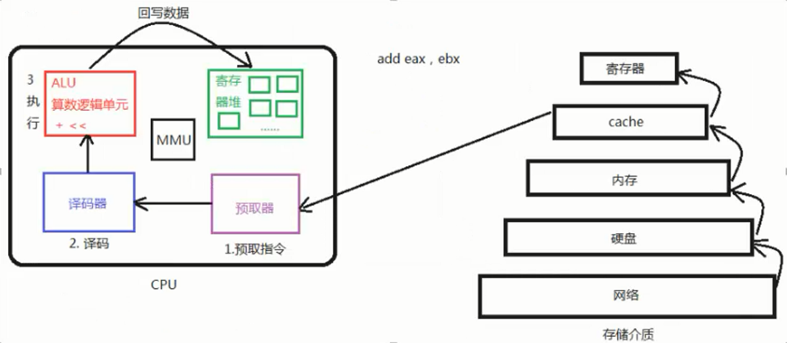
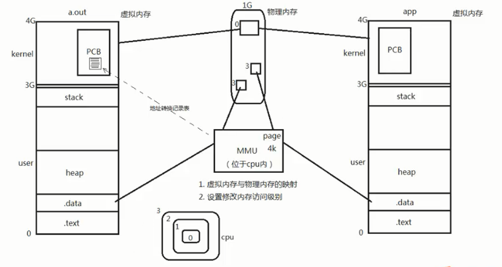
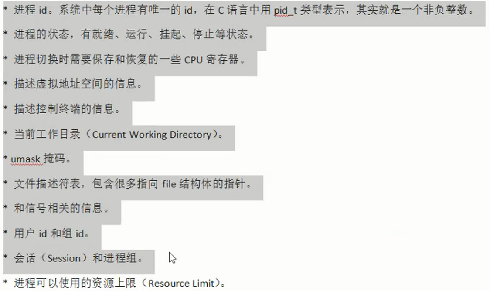
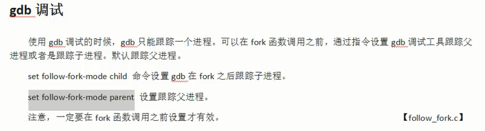

# 1 程序和进程

- 程序：编译好的二进制文件，在磁盘上，不占用系统资源（CPU、内存、打开的文件等）
- 进程：活跃的程序，占用系统资源，在内存中执行。（程序运行起来，产生一个进程）
- 一个程序可以产生多个进程

# 2 CPU和MMU

## CPU

<font color=blue>程序执行过程：</font>

1. 将程序从硬盘读取到内存中
2. 再从内存读取到cache中
3. 放入寄存器
4. 预取器从寄存器中取出指令
5. 译码器负责辨认该条指令目的
6. 交给算数逻辑单元执行
7. 最后交给寄存器堆中写入到cache



## MMU



- 右侧虚拟内存不是直接虚拟出了4个G的空间大小，而是分配内存时，给地址起名字的时候可以起到可用的地址空间为4个G
- 当申请了一块内存时，MMU会将虚拟内存中的地址值对应到内存上

<font color=blue>MMU作用：</font>

1. <font color=red>虚拟内存和物理内存之间的映射。</font>MMU开辟空间的最小单位为4K，当同一个程序开启两份时，相当于开启了两个进程，此时两个进程之间独立，所以会在物理内存中映射两份，但是内核部分只会映射一份，两个进程的内核空间虽在一块物理内存中，但是他们所干的事情却不一样
2. 给CPU设置修改内存的访问级别，正常的CPU的访问级别有0~3级，0级别最高，但是在Linux中CPU对内存的访问级别只有两种，就是0、3级，0是内核段级别，3是用户段级别

# 3 进程控制块PCB（又叫进程描述符）

- PCB本质是一个结构体，在Linux系统中这个结构体名字为task_struct，其内部有如下成员：



# 4 进程的五种状态

- 初始化态、就绪态、运行态、挂起态、终止态
    - 就绪态：等待CPU分配时间片
    - 运行态：正在占用CPU
    - 挂起态：等待除CPU以外的其他资源主动放弃CPU

# 5 打印系统的环境变量

```c
#define _CRT_SECURE_NO_WARNINGS
#include <stdio.h>
#include <stdlib.h>
extern char** environ;//所有的环境变量都存在environ中，通过extern导出到此处，环境变量的结尾为null
int main()
{
	while (environ != NULL)
	{
		printf("%s\n", *environ);
		environ++;
	}
	system("pause");
	return EXIT_SUCCESS;
}
```

# 6 `fork()`函数创建进程

## 函数原型

`pid_t fork(void);`

- 返回值

    -1：进程创建失败

    返回值为0：此时{}中的语句，就是子进程要去做的事情

    返回值大于0：此时{}中的语句，仍然是调用`fork()`函数的进程（父进程）在做的事情

## 例子

- 父进程与`fork()`开启的子进程两个执行顺序不一定。在虚拟内存中，当使用`fork()`函数开启了一个子进程后，子进程会直接从`fork()`函数后开始执行，相当于子进程和父进程都会执行虚拟内存中`fork()`后的指令，所以可以看到打印了两遍“练习结束”

```c
#include <stdio.h>
#include <unistd.h>

int main(void){
        printf("练习fork函数\n");
        pid_t pid;
        pid = fork();
        if(pid == -1){
                perror("进程开启失败：");
        }else if(pid == 0){
                printf("这是子进程，父进程的id为：%u；子进程的id为：%u\n",getppid(),getpid());
        }else{
                printf("这是父进程，且父进程的ID为：%u\n",getpid());
        }
        printf("练习结束\n");
        return 0;
}
/*执行结果：
练习fork函数
这是父进程，且父进程的ID为：22138
练习结束
这是子进程，父进程的id为：22138；子进程的id为：22139
练习结束*/
```

# 7 父子进程调用`fork()`后的相同点与不同点

- 相同处

    全局变量、.text、.data、栈、堆、环境变量、用户ID、宿主目录、进程工作目录、信号处理方式...

- 不同处

    进程ID、`fork()`的返回值、父进程ID、进程运行时间、闹钟（定时器）、未决信号集

- 粗略记为：0~4G的虚拟内存中除了PCB不同，其他的都相同


**<font color=blue>父子进程之间永远共享的：</font>**

1. 文件描述符
2. mmap建立的映射区

# 8 gdb调试




