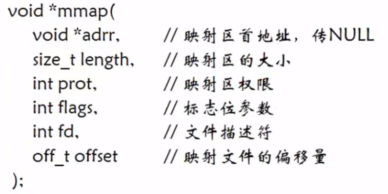

# 1 创建内存映射区方式

## 1.1 `mmap`函数

### 函数功能

- 创建内存映射
- 将磁盘文件的数据映射到内存中，用户通过修改内存就能修改磁盘文件

### 函数原型



- `length`：大小为4K的倍数，且不能为0。
    - 一般文件多大，映射区的大小就指定为多大
- `prot`：
    - `PROT_READ`：映射区必须要有读权限
    - `PROT_WRITE`
    - 读写权限是：`PROT_READ|PROT_WRITE`
- `flags`：
    - `MAP_SHARED`：修改了内存数据<font color=red>会</font>同步到磁盘
    - `MAP_PRIVATE`：修改了内存数据<font color=red>不会</font>同步到磁盘
- `fd`：要映射的文件的`fd`。通过`open()`函数得到
- `offset`：映射的时候文件指针的偏移量
    - 必须是4K的整数倍
    - 一般指定为0

返回值

- 调用成功返回映射区的首地址
- 调用失败返回`MAP_FAILED`宏（-1）

## 1.2 `munmap`函数

### 函数作用

- 释放内存映射区

### 函数原型

`int munmap(void* addr,size_t length);`

- 参数

    `addr`：`mmap`的返回值，映射区的首地址

    `length`：`mmap`的第二个参数，映射区的大小

- 返回值

    失败返回-1

## 1.3 列子

```c
#include<stdio.h>
#include<stdlib.h>
#include<unistd.h>
#include<fcntl.h>
#include<string.h>
#include<sys/mman.h>
int main(){
    //打开要映射的文件
    int fd = open("hello",O_RDWR);
    if(fd == -1){
        perror("文件打开失败");
        exit(1);
    }
    //求文件大小
    int len = lseek(fd,0,SEEK_END);
    void* ptr = mmap(NULL,len,PROT_READ|PROT_WRITE,MAP_SHARED,fd,0);
    if(ptr == MAP_FAILED){
        perror("创建内存映射区失败");
        exit(2);
    }
    printf("%s\n",(char*)ptr);
    //释放内存映射区
    munmap(ptr,len);
    close(fd);
    return 0;
}
```

# 2 使用内存映射区进行进程间通信

## 2.1 有血缘关系的进程间通信

### 有名内存映射区（借助文件）

- 文件hello中也会写入写的内容

```c
#include<stdio.h>
#include<stdlib.h>
#include<unistd.h>
#include<fcntl.h>
#include<string.h>
#include<sys/mman.h>
int main(){
    int fd = open("hello",O_RDWR);
    if(fd == -1){
        perror("文件打开失败");
        exit(1);
    }
    //计算文件大小
    int len = lseek(fd,0,SEEK_END);
    //创建内存映射区
    void* ptr = mmap(NULL,len,PROT_READ|PROT_WRITE,MAP_SHARED,fd,0);
    if(ptr == MAP_FAILED){
        perror("文件映射区创建失败");
        exit(2);
    }
    //创建子进程，进行进程间通信
    pid_t pid = fork();
    if(pid == -1){
        perror("子进程创建失败");
        exit(3);
    }else if(pid == 0){
        //子进程写，父进程读
        strcpy((char*)ptr,"写的内容\n");
    }else{
        //父进程读
        printf("%s",(char*)ptr);
        wait(NULL);
    }
    //释放内存映射区，关闭文件
    munmap(ptr,len);
    close(fd);
    return 0;
}
```

### 无名内存映射区（不借助文件）

如何创建匿名映射区`mmap`函数参数变化

- 第二个参数：直接指定创建内存映射区的长度
- 第四个参数：需要添加`MAP_ANON`宏
- 第五个参数：-1

```c
#include<stdio.h>
#include<stdlib.h>
#include<unistd.h>
#include<fcntl.h>
#include<string.h>
#include<sys/mman.h>
int main(){
    //直接指定内存映射区的长度
    int len = 4096;
    //创建内存映射区
    void* ptr = mmap(NULL,len,PROT_READ|PROT_WRITE,MAP_SHARED|MAP_ANON,-1,0);
    if(ptr == MAP_FAILED){
        perror("文件映射区创建失败");
        exit(2);
    }
    //创建子进程，进行进程间通信
    pid_t pid = fork();
    if(pid == -1){
        perror("子进程创建失败");
        exit(3);
    }else if(pid == 0){
        //子进程写，父进程读
        strcpy((char*)ptr,"写的内容\n");
    }else{
        //父进程读
        printf("%s",(char*)ptr);
        wait(NULL);
    }
    //释放内存映射区，关闭文件
    munmap(ptr,len);
    return 0;
}
```

## 2.2 没有血缘关系的进程间通信

- 不能使用匿名映射区
- 只能借助磁盘文件创建映射区
- 不阻塞

**<font color=red>读</font>**

```c
#include<stdio.h>
#include<stdlib.h>
#include<unistd.h>
#include<fcntl.h>
#include<string.h>
#include<sys/mman.h>
int main(){
    int fd = open("hello",O_RDWR|O_CREAT,0666);
    if(fd == -1){
        perror("打开文件失败");
        exit(1);
    }
    ftruncate(fd,4096);
    //计算出文件长度，用来指定开辟的映射区大小
    int len = lseek(fd,0,SEEK_END);
    //创建内存映射区
    void* ptr = mmap(NULL,len,PROT_READ|PROT_WRITE,MAP_SHARED,fd,0);
    if(ptr == MAP_FAILED){
        perror("映射区创建失败");
        exit(2);
    }
    while(1){
        printf("%s",(char*)ptr);
        sleep(1);
    }

    //释放内存映射区
    uunmap(ptr,len);
    //关闭文件
    close(fd);
    return 0;
}
```

**<font color=red>写</font>**

```c
#include<stdio.h>
#include<stdlib.h>
#include<unistd.h>
#include<fcntl.h>
#include<string.h>
#include<sys/mman.h>
#include<sys/types.h>
int main(){
    int fd = open("hello",O_RDWR|O_CREAT,0666);
    if(fd == -1){
        perror("打开文件失败");
        exit(1);
    }
    ftruncate(fd,4096);
    //计算出文件长度，用来指定开辟的映射区大小
    int len = lseek(fd,0,SEEK_END);
    //创建内存映射区
    void* ptr = mmap(NULL,len,PROT_READ|PROT_WRITE,MAP_SHARED,fd,0);
    if(ptr == MAP_FAILED){
        perror("映射区创建失败");
        exit(2);
    }
    char *buf = "没有血缘关系的进程间通信\n";
    while(1){
        strcpy(ptr,buf);
        sleep(4);
    }

    //释放内存映射区
    uunmap(ptr,len);
    //关闭文件
    close(fd);
    return 0;
}
```

