# 1 概念

**<font color=blue>使用命令`ps -Lf 进程id`可以查看线程号</font>**

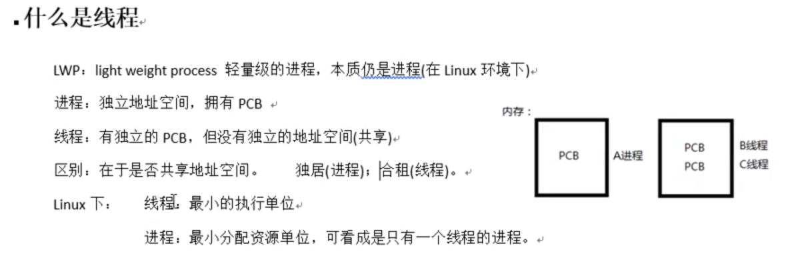

## 1.1 三级映射

进程pcb->页目录（可看成数组，首地址位于pcb中）->页表->物理页面->内存单元

## 1.2 线程共享资源

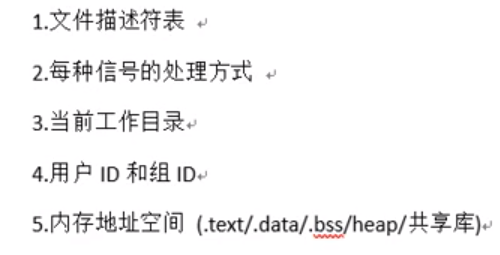

## 1.3 线程非共享资源

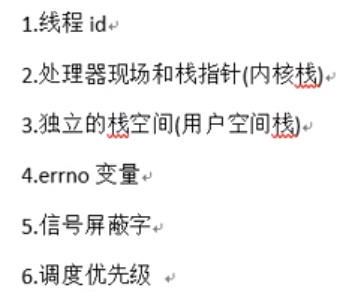

## 1.4 线程优、缺点

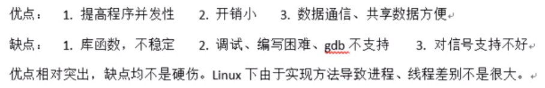

# 2 线程控制函数

## 2.1 `pthread_self`函数

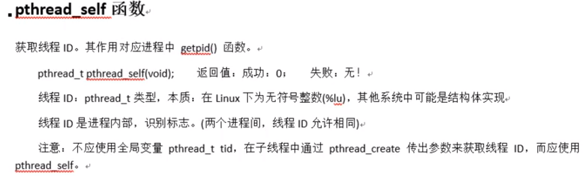

### 例子

```c
#include<stdio.h>
#include<stdlib.h>
#include<unistd.h>
#include<fcntl.h>
#include<string.h>
#include<pthread.h>
void* tfn(void* arg){
    printf("进程ID为：%d,线程ID为：%lu\n",getpid(),pthread_self());
}
int main(){
    pthread_t tid;
    printf("进程ID为：%d,线程ID为：%lu\n",getpid(),pthread_self());
    int ret = pthread_create(&tid,NULL,tfn,NULL);
    if(ret != 0){
        perror("线程创建失败");
        exit(1);
    }
    pthread_exit(NULL);
    return 0;
}
```

## 2.2 `pthread_create`函数

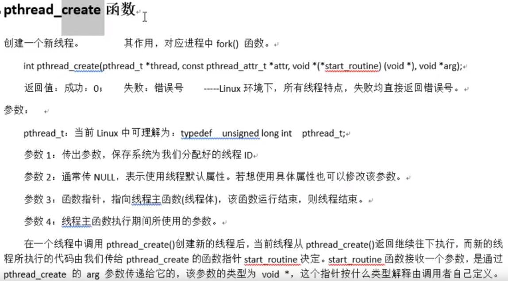

### 例子

```c
#include<stdio.h>
#include<stdlib.h>
#include<unistd.h>
#include<fcntl.h>
#include<string.h>
#include<pthread.h>
void* tfn(void* arg){
    int i = (int)arg;
    printf("我是第%d个子线程,进程ID为：%d；线程ID为：%lu\n", i+1,getpid(),pthread_self());
}
int main(){
    int i = 0;
    int ret = 0;
    pthread_t tid;
    for(;i<5;i++){
        ret = pthread_create(&tid,NULL,tfn,(void*)i);
        if(ret != 0){
            perror("创建子线程失败");
            exit(1);
        }
    }
    printf("我是主线程，我的进程ID为：%d,我的线程ID为：%lu\n", getpid(),pthread_self());
    pthread_exit(NULL);
    return 0;
}
```

## 2.3 `pthread_exit`函数

- `exit()`：退出当前进程

- `return`：返回到调用者那里去

- `pthread_exit()`：退出当前线程

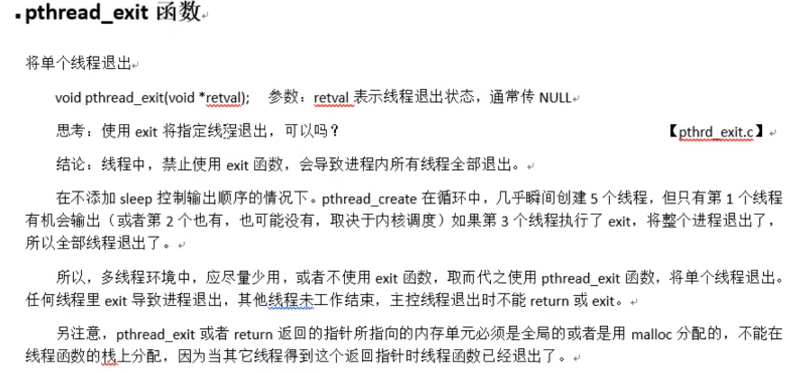

## 2.4 `pthread_join`函数

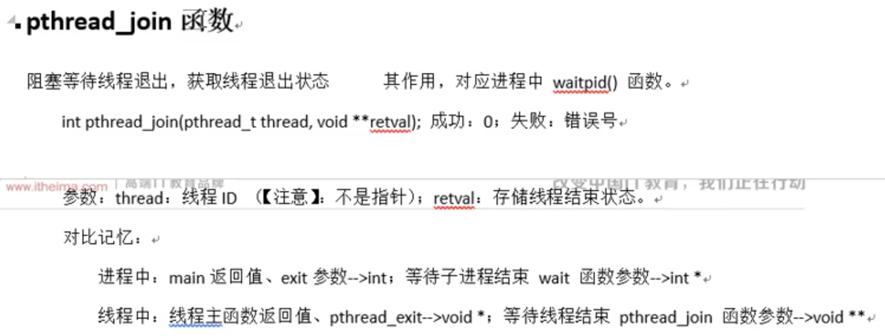

### 例子

```c
#include<stdio.h>
#include<stdlib.h>
#include<unistd.h>
#include<fcntl.h>
#include<string.h>
#include<pthread.h>
struct testS{
    int val;
    char str[256];
};

void* tfn(void* arg){
    struct testS *test;
    test=malloc(sizeof(test));
    test->val = 100;
    strcpy(test->str,("hello world"));
    return (void*)test;
}

int main(){
    pthread_t tid;
    int ret = pthread_create(&tid,NULL,tfn,NULL);
    if(ret != 0){
        perror("子线程创建失败");
        exit(1);
    }
    struct testS * ptest;
    ret = pthread_join(tid,(void**)&ptest);
    if(ret != 0){
        perror("子进程资源回收失败");
        exit(1);
    }
    printf("子进程已经被回收，val = %d,str= %s\n",ptest->val,ptest->str);
    pthread_exit(NULL);
}
```

## 2.6 `pthread_cancel`函数

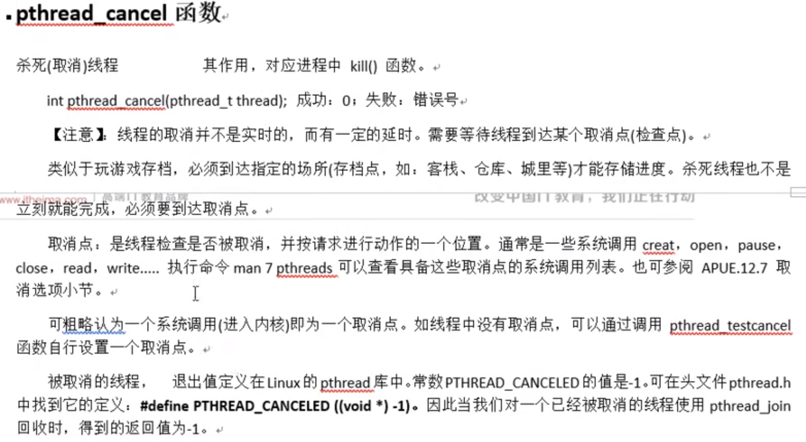

### 例子

```c
#include<stdio.h>
#include<stdlib.h>
#include<unistd.h>
#include<fcntl.h>
#include<string.h>
#include<pthread.h>
void* func(void* arg){
    /*while(1){
    //此处对函数进行了调用，进入了内核，所以可以杀死线程
        printf("线程ID为：%lu\n",pthread_self());
        sleep(1);
    }*/
    while(1){
        //当while内没有调用系统函数时，需要调用此函数来帮忙杀死子线程
        pthread_testcancel();
    }
}

int main(){
    pthread_t tid;
    int ret = 0;
    ret = pthread_create(&tid,NULL,func,NULL);
    if(ret != 0){
        perror("子线程创建失败");
        exit(1);
    }
    sleep(5);
    ret = pthread_cancel(tid);
    if(ret != 0){
        perror("子线程回收失败");
        exit(2);
    }
    pthread_exit(NULL);
}
```

## 2.7 `pthread_detach`函数

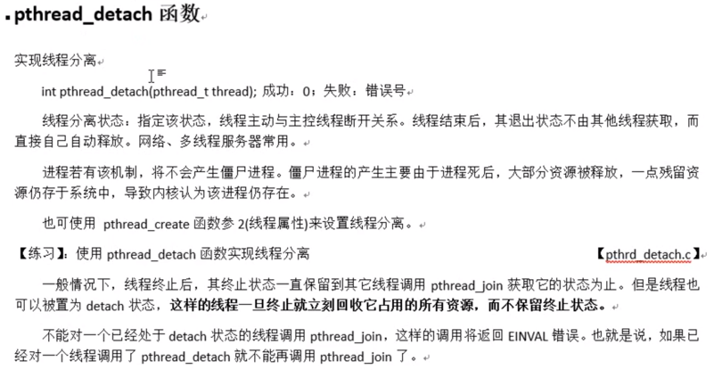

### 例子

```c
#include<stdio.h>
#include<stdlib.h>
#include<unistd.h>
#include<fcntl.h>
#include<string.h>
#include<pthread.h>
void* func(void* arg){
    printf("子线程ID为：%lu\n",pthread_self());
}
int main(){
    pthread_t tid;
    int ret = pthread_create(&tid,NULL,func,NULL);
    if(ret != 0){
        fprintf(stderr,"线程创建失败，原因：%s\n",strerror(ret));
        exit(1);
    }

    //子线程分离，线程分离后会自动回收子线程资源，清理pcb
    ret = pthread_detach(tid);
    if(ret != 0){
        //strerror函数可以将传进来的错误号翻译成对应的错误信息传出
        fprintf(stderr,"线程分离失败，原因：%s\n",strerror(ret));
    }
    //子线程回收，运行后Invalid argument错误，因为上面pthread_detach函数可以实现线程自动回收，所以这里再次回收的时候tid已经是空了，所以出错
    ret = pthread_join(tid,NULL);
    if(ret != 0){
        fprintf(stderr,"子线程回收失败，原因：%s\n",strerror(ret));
    }
    //主线程结束直接退出
    pthread_exit(NULL);
}
```

## 2.8 进程线程控制原语对比

|      | 线程控制原语       | 进程控制原语       |
| ---- | ------------------ | ------------------ |
| 创建 | `pthread_create()` | `fork()`           |
| 查看 | `pthread_self()`   | `getpid()`         |
| 结束 | `pthread_exit()`   | `exit()`           |
| 回收 | `pthread_join()`   | `wait()/waitpid()` |
| 杀死 | `pthread_cancel()` | `kill()`           |
| 分离 | `pthread_detach()` | 没有               |

# 3 设置线程属性

- **<font color=blue>`pthread_create()`函数中第二个参数用来设置线程属性</font>**
- attr参数指向一个pthread_attr_t结构，它的内容在线程创建时用于确定新线程的属性;使用`pthread_attr_init(pthread_attr_t * attr)`和相关函数初始化该结构。如果attr为NULL，则用默认属性创建线程。

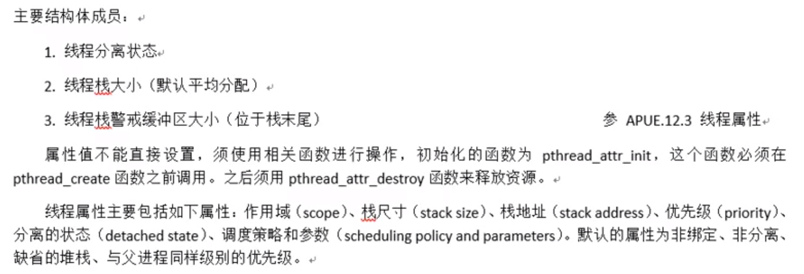

### 线程属性初始化

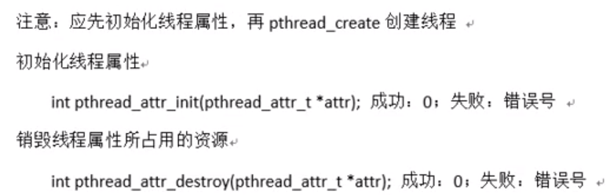

### 设置线程属性为分离状态

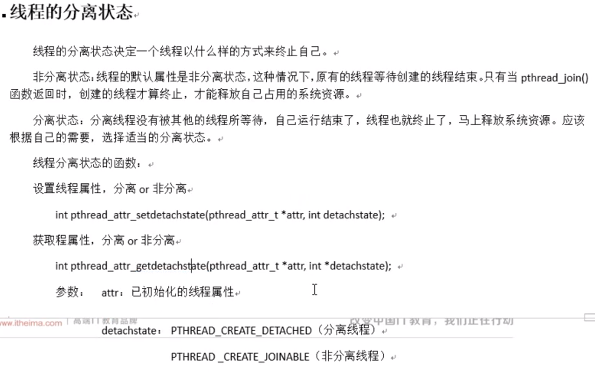

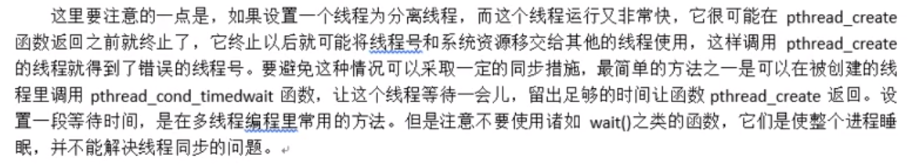

### 线程设置属性流程

- 以设置属性为分离状态示例

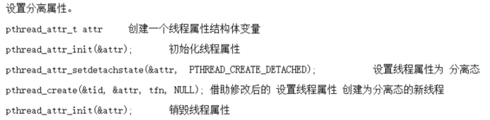

### 例子

```c
#include<stdio.h>
#include<stdlib.h>
#include<unistd.h>
#include<fcntl.h>
#include<string.h>
#include<pthread.h>
void* func(void* arg){
    printf("子线程ID为：%lu\n",pthread_self());
}
int main(){
    int ret = 0;
    //创建线程属性变量
    pthread_attr_t attr;
    
    //初始化线程属性
    ret = pthread_attr_init(&attr);
    if(ret != 0){
        fprintf(stderr,"pthread_attr_init err:%s\n",strerror(ret));
        exit(1);
    }
    
    
    //开始设置具体的线程属性,第二个参数传对应属性的宏
    ret = pthread_attr_setdetachstate(&attr,PTHREAD_CREATE_DETACHED);
    if(ret != 0){
        fprintf(stderr,"pthread_attr_setdetachstate err:%s\n",strerror(ret));
        exit(1);
    }
    
    //将线程属性设置好之后，开始创建线程
    pthread_t tid;
    ret = pthread_create(&tid,&attr,func,NULL);
    if(ret != 0){
        fprintf(stderr,"pthread_create err:%s\n",strerror(ret));
        exit(1);
    }
    
    //线程设置为分离属性后，不需要回收资源，此处用pthread_join函数测试
    //如果走了错误检查，就说明线程属性设置成功,最后结果确实成功
    ret = pthread_join(tid,NULL);
    if(ret != 0){
        fprintf(stderr,"pthread_join err:%s\n",strerror(ret));
        exit(1);
    }
    
    //初始化线程属性后销毁线程属性
    ret = pthread_attr_destroy(&attr);
    if(ret != 0){
        fprintf(stderr,"pthread_attr_init err:%s\n",strerror(ret));
        exit(1);
    }
    //主线程可以先结束
    pthread_exit(NULL);
}
```

# 4 线程使用注意事项

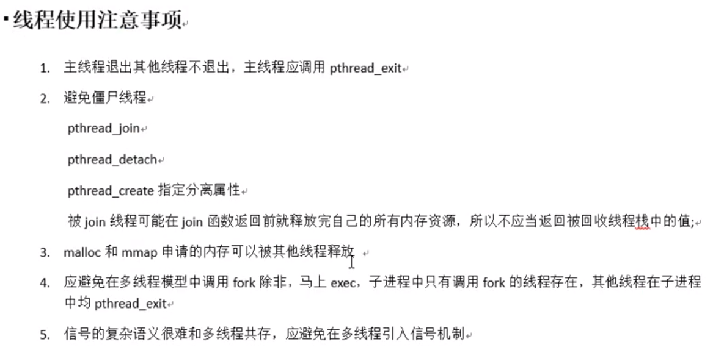


