# 1 线程同步

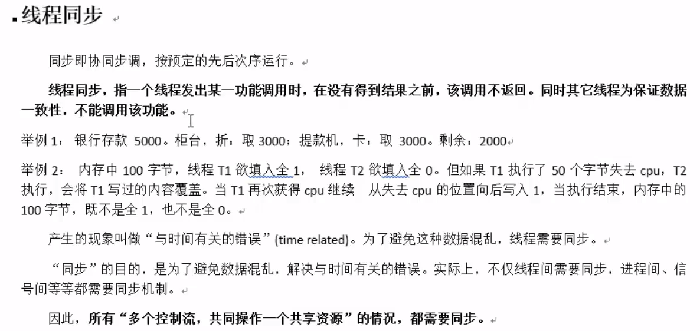

# 2 数据混乱原因

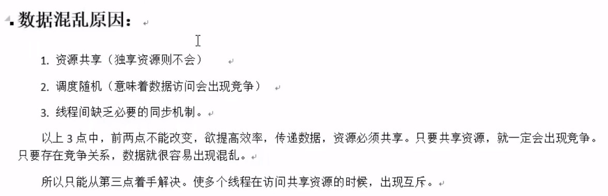

# 3 互斥量`mutex`

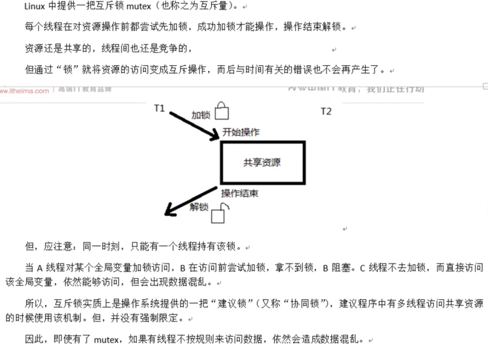

## 3.1 主要操作函数

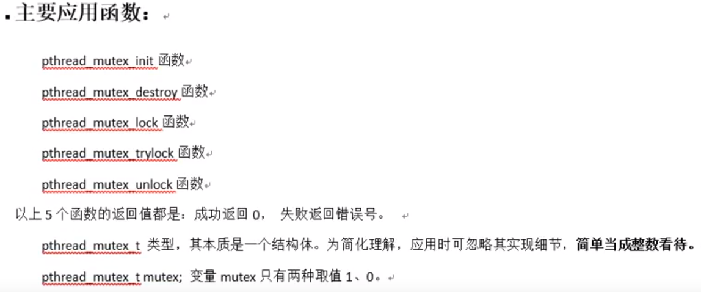

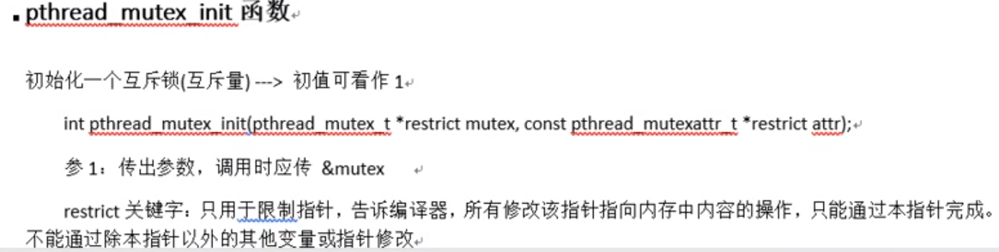

## 3.2 例子

```c
#include<stdio.h>
#include<stdlib.h>
#include<unistd.h>
#include<fcntl.h>
#include<string.h>
//主线程子线程共享全局变量，创建全局锁
pthread_mutex_t mux;
void* func(void* arg){
    while(1){
        pthread_mutex_lock(&mux);
        printf("hello");
        sleep(2);
        printf("world\n");
        pthread_mutex_unlock(&mux);
        sleep(2);
    }
}
int main(){
    pthread_t tid;
    int ret = 0;
    //初始化锁
    ret = pthread_mutex_init(&mux,NULL);
    if(ret != 0){
        fprintf(stderr,"锁初始化失败:%s\n",strerror(ret));
        exit(1);
    }
    ret = pthread_create(&tid,NULL,func,NULL);
    if(ret != 0){
        fprintf(stderr,"pthread_create error:%s\n",strerror(ret));
        exit(1);
    }
    while(1){
        pthread_mutex_lock(&mux);
        printf("HELLO");
        sleep(2);
        printf("WORLD\n");
        pthread_mutex_unlock(&mux);
        sleep(2);
    }
    ret = pthread_mutex_destroy(&mux);
    if(ret != 0){
     fprintf(stderr,"pthread_mutex_destroy error:%s\n",strerror(ret));
        exit(1);
    }
}
```

# 4 死锁

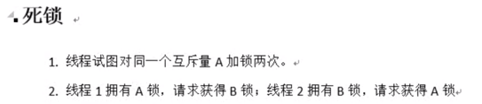

# 5 读写锁

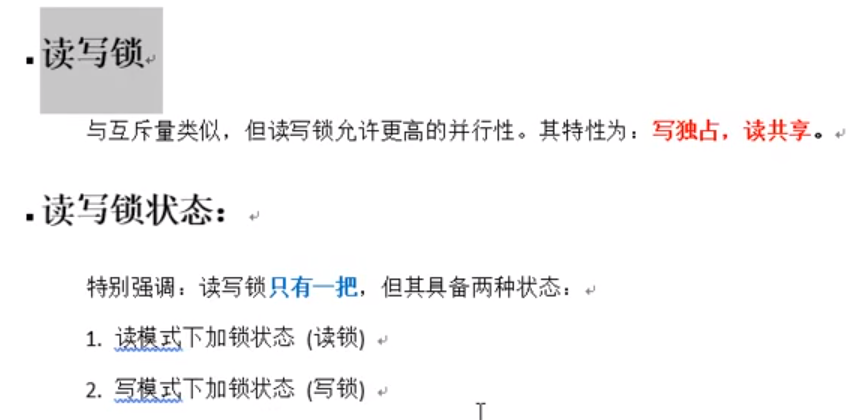

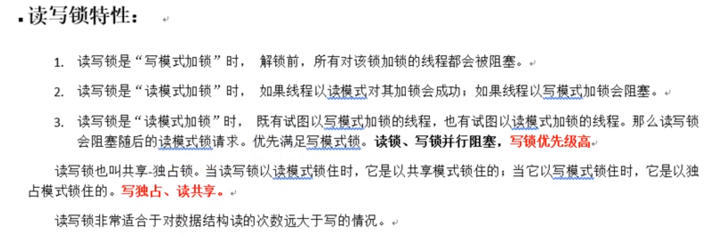

## 5.1 主要操作函数

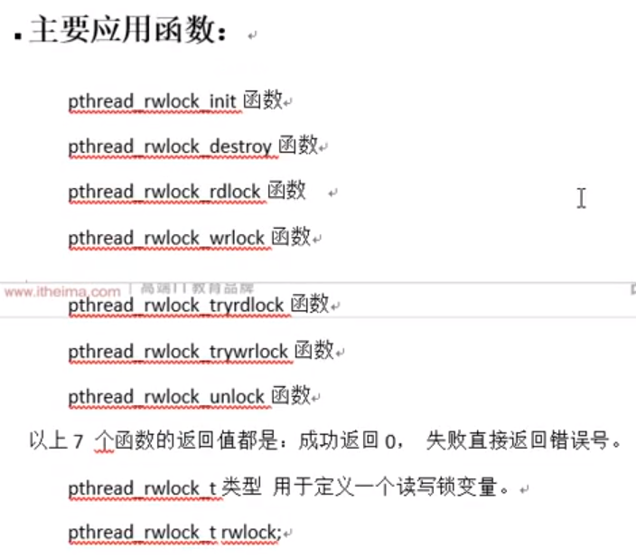

## 5.2例子

```c
#include<stdio.h>
#include<stdlib.h>
#include<unistd.h>
#include<fcntl.h>
#include<string.h>
#include<pthread.h>
int count = 0;
pthread_rwlock_t rwlock;
void* func_write(void* arg){
    int i = (int)arg;
    while(1){
        pthread_rwlock_wrlock(&rwlock);
        printf("第%d个线程在写，count=%d\n",i,++count);
        sleep(1);
        pthread_rwlock_unlock(&rwlock);
        sleep(5);
    }
}
void* func_read(void* arg){
    int i = (int)arg;
    while(1){
        pthread_rwlock_rdlock(&rwlock);
        printf("第%d个线程在读，count=%d\n",i,count);
        pthread_rwlock_unlock(&rwlock);
        sleep(1);
    }
}
int main(){
    pthread_t tid[8];
    pthread_rwlock_init(&rwlock,NULL);
    int i = 0;
    for(;i<3;i++){
        pthread_create(&tid[i],NULL,func_write,(void*)i);
    }
    for(i = 3;i<8;i++){
        pthread_create(&tid[i],NULL,func_read,(void*)i);
    }
    for(i = 0;i< 8; i++){
        pthread_join(tid[i],NULL);
    }
    pthread_rwlock_destroy(&rwlock);
    return 0;
}
```

# 6 条件变量

- <font color=red>条件变量本身不是锁</font>，但它也可以造成线程阻塞。通常与互斥锁配合使用。给多线程提供一个会合的场所。

## 6.1 主要相关函数

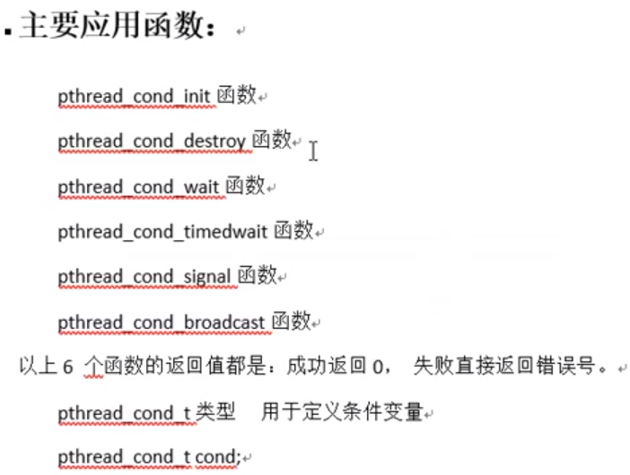

### `pthread_cond_wait`函数

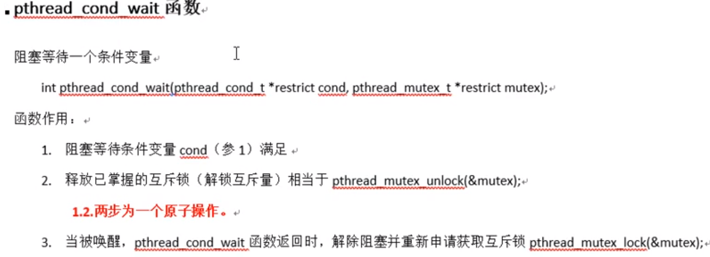

### 6.2 例子

```c
#include<stdio.h>
#include<stdlib.h>
#include<unistd.h>
#include<fcntl.h>
#include<string.h>
#include<pthread.h>
struct Msg{
    struct msg* next;
    int num;
};
struct Msg* head;

//初始化条件变量
pthread_cond_t cond = PTHREAD_COND_INITIALIZER;
//初始化互斥锁
pthread_mutex_t mutex = PTHREAD_MUTEX_INITIALIZER;

void* func_consumers(void* arg){
    struct Msg* msg;
    while(1){
        pthread_mutex_lock(&mutex);
        if(head == NULL){
            pthread_cond_wait(&cond,&mutex);
        }
        msg = head;
        head = msg->next;
        pthread_mutex_unlock(&mutex);
        printf("消费者：%d\n",msg->num);
        free(msg);
        sleep(rand()%5);
    }
}

void* func_producers(void* arg){
    struct Msg* msg;

    while(1){
        msg=malloc(sizeof(struct Msg));
        msg->num = rand()%1000+1;
        printf("-----生产者：%d\n",msg->num);


        pthread_mutex_lock(&mutex);
        msg->next = head;
        head = msg;
        pthread_mutex_unlock(&mutex);

        pthread_cond_signal(&cond);
        sleep(rand()%5);
    }
}
int main(){
    pthread_t tid[2];
    pthread_create(&tid[1],NULL,func_consumers,NULL);
    pthread_create(&tid[2],NULL,func_producers,NULL);
    pthread_join(tid[1],NULL);
    pthread_join(tid[2],NULL);
    return 0;
}
```

# 7 信号量

**<font color=blue>既可用于线程之间，也可以用于进程之间</font>**

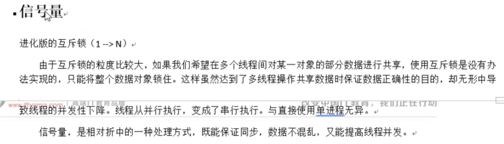

## 7.1 主要操作函数

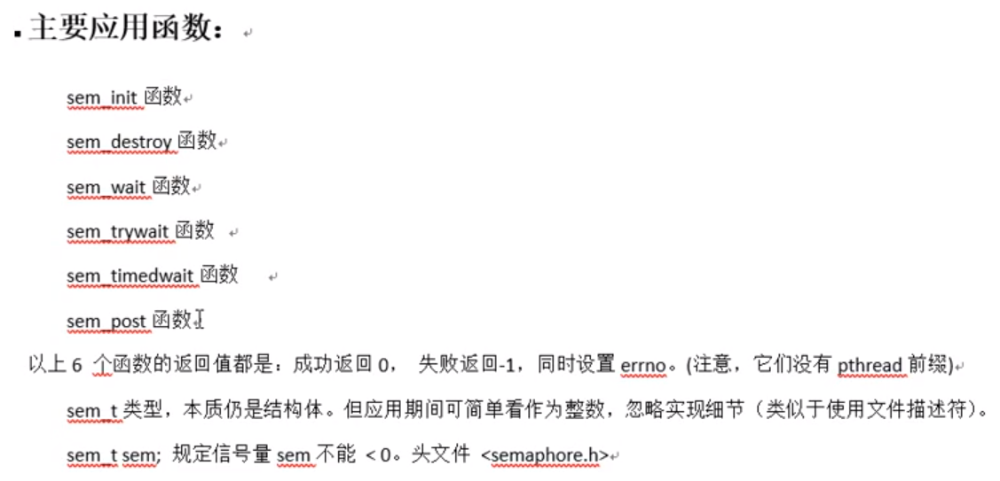

### `sem_init`函数

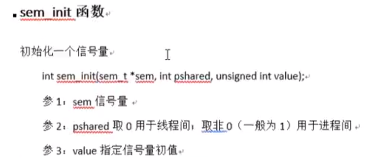

### `sem_wait`函数

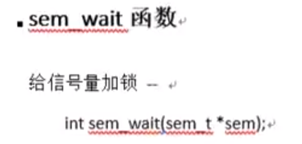

### `sem_post`函数

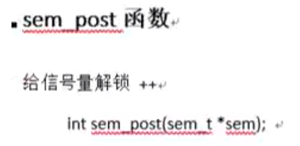

### `sem_destroy`函数

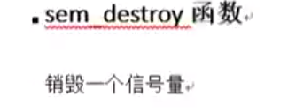

### `sem_trywait`函数

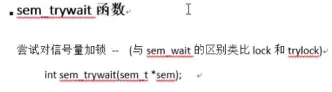

### `sem_timedwait`函数

- `sem_timedwait`函数中采用的是绝对时间（自1970年1月1号起算）

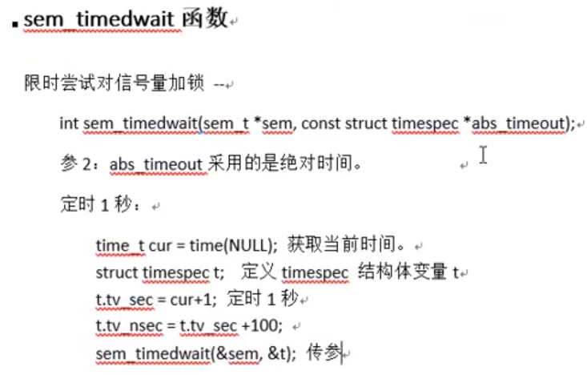

## 7.2 信号量基本操作

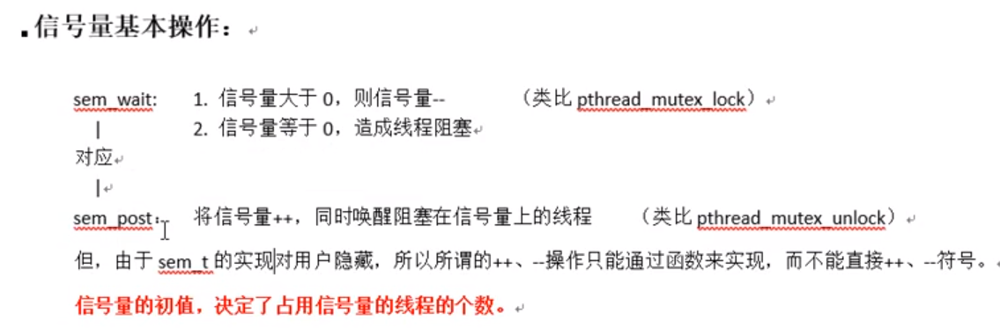

## 7.3 例子

```c
#include<stdio.h>
#include<stdlib.h>
#include<unistd.h>
#include<fcntl.h>
#include<string.h>
#include<pthread.h>
#include<semaphore.h>
#define NUM 5
sem_t sem_consumer;
sem_t sem_producer;
int queue[NUM];
void* func_consumer(void* arg){
    int i = 0;
    while(1){
        sem_wait(&sem_producer);
        printf("----consumer:%d\n",queue[i]);
        queue[i] = 0;
        sem_post(&sem_consumer);

        i = (i+1)%NUM;
        sleep(rand()%2);
    }
}

void* func_producer(void* arg){
    int i = 0;
    while(1){
        sem_post(&sem_consumer);
        queue[i] = rand()%1000 + 1;
        printf("producer:%d\n",queue[i]);
        sem_post(&sem_producer);
        i = (i+1)%NUM;
        sleep(rand()%3);
    }
}

int main(){
    pthread_t tid[2];
    sem_init(&sem_consumer,0,NUM);
    sem_init(&sem_producer,0,0);
    pthread_create(&tid[0],NULL,func_consumer,NULL);
    pthread_create(&tid[1],NULL,func_producer,NULL);
    pthread_join(tid[0],NULL);
    pthread_join(tid[1],NULL);
    sem_destroy(&sem_consumer);
    sem_destroy(&sem_producer);
    return 0;
}
```

 

