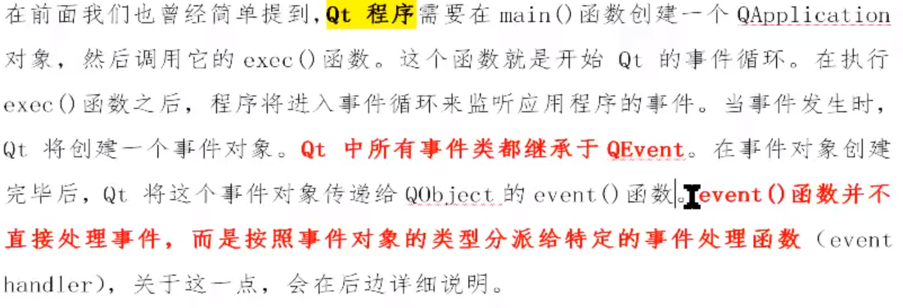

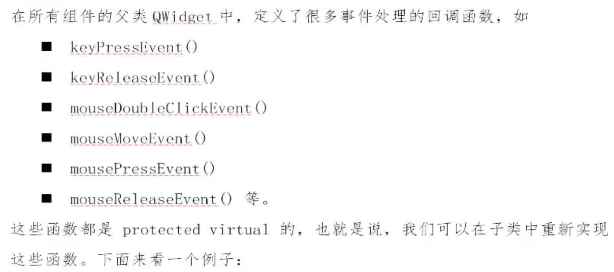

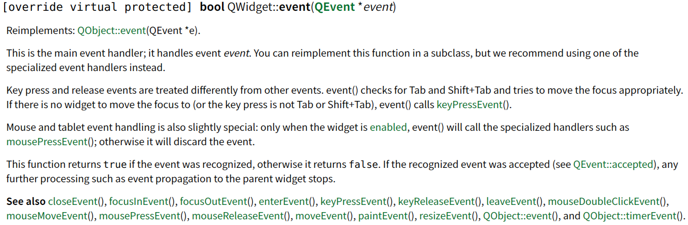

# 鼠标事件

**<font color=blue>进入、离开、移动、按下、抬起事件</font>**

在ui界面上添加label控件，然后将此控件提升为MyLabel类

```c++
//MyLabel的构造函数中设置鼠标追踪
MyLabel::MyLabel(QWidget *parent) : QLabel(parent)
{
    //鼠标移动事件是要按下的同时移动才能触发，设置鼠标追踪后不需要按下鼠标也可以触发移动事件
    this->setMouseTracking(true);
}

//mylable.h
class MyLabel : public QLabel
{
    Q_OBJECT
public:
    explicit MyLabel(QWidget *parent = nullptr);
    virtual void enterEvent(QEvent *event) override;
    virtual void leaveEvent(QEvent *event) override;
    virtual void mouseMoveEvent(QMouseEvent *event) override;
    virtual void mousePressEvent(QMouseEvent *ev) override;
    virtual void mouseReleaseEvent(QMouseEvent *ev) override;
};

//mylable.cpp
#include "mylabel.h"
#include <QDebug>
#include <QMouseEvent>
void MyLabel::enterEvent(QEvent *event)
{
    qDebug() << "鼠标进入了";
}

void MyLabel::leaveEvent(QEvent *event)
{
    qDebug() << "鼠标离开了";
}

void MyLabel::mouseMoveEvent(QMouseEvent *event)
{
    //在没有设置鼠标追踪时，触发此事件需要在鼠标按下的同时移动
    qDebug() << "鼠标移动了 x = " << event->x() << "; y = " << event->y();
}

void MyLabel::mousePressEvent(QMouseEvent *ev)
{
    if(ev->button() == Qt::LeftButton){
        qDebug() << "鼠标左键按下了";
    }else if(ev->button() == Qt::RightButton){
        qDebug() << "鼠标右键按下了";
    }else if(ev->button() == Qt::MidButton){
        qDebug() << "鼠标中间键按下了";
    }
    qDebug() << "局部坐标为x=" << ev->x() << " y=" << ev->y();
    qDebug() << "全局坐标为x=" << ev->globalX() << " y=" << ev->globalY();
}

void MyLabel::mouseReleaseEvent(QMouseEvent *ev)
{
    qDebug() << "鼠标抬起了";
}
MyLabel::MyLabel(QWidget *parent) : QLabel(parent)
{
}
```

# 事件分发器`event`

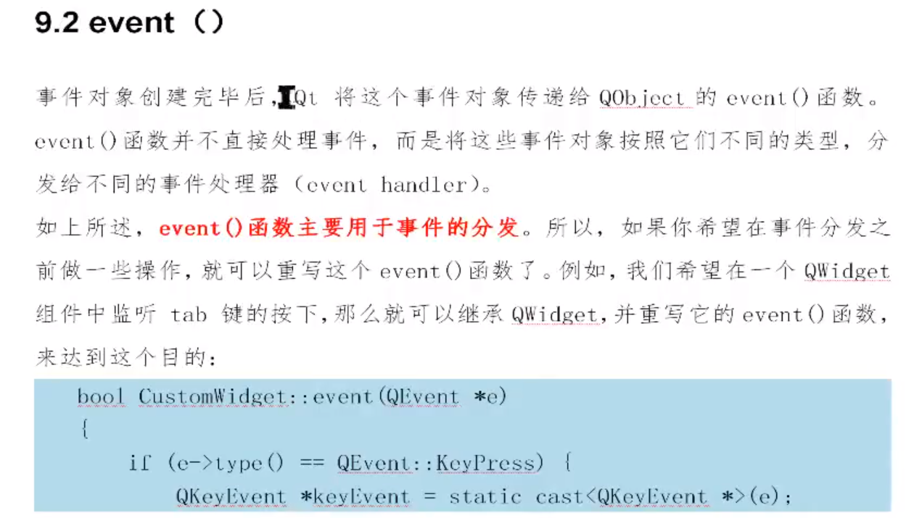

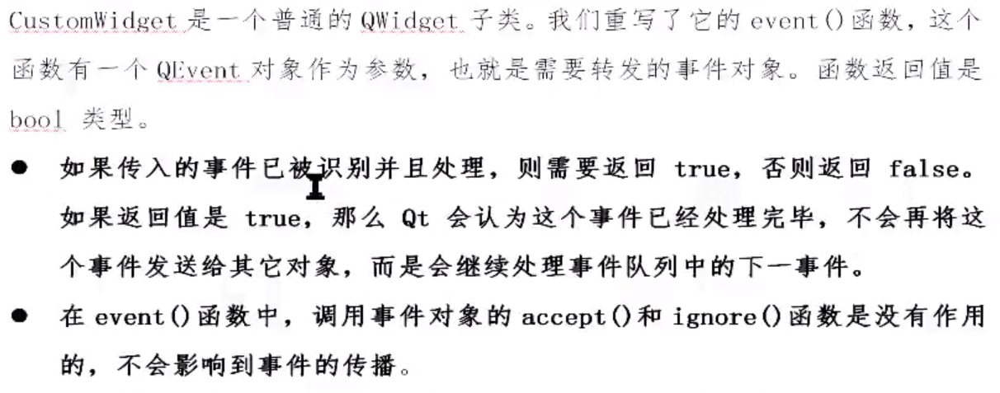

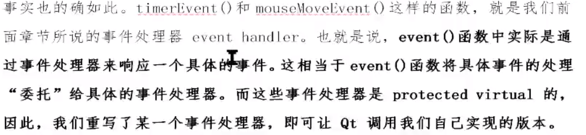

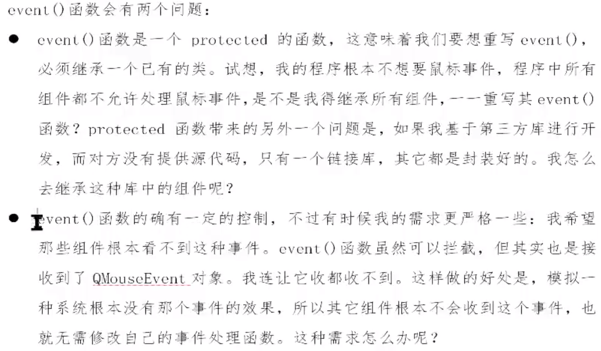

```c++
virtual bool event(QEvent *e) override;//头文件中重写event事件

//QLabel的事件分发器，所有的事件的都会经过这里，通过event()函数进行分发给对应的事件处理者
bool MyLabel::event(QEvent *e)
{
    //所有的事件都在变量e中
    if(e->type() == QEvent::MouseButtonPress){
        qDebug() << "事件分发器中处理了鼠标按下事件";
        //QEvent中没有坐标函数x()、y()，但是QMouseEvent中有，所以将QEvent *e转换成QMouseEvent *eve
        QMouseEvent* eve = static_cast<QMouseEvent*>(e);
        qDebug() << "event: x = " << eve->x() << "; y = " << eve->y();
        return true;//返回true代表告诉系统自己处理了这个事件
    }else if(e->type() == QEvent::MouseButtonRelease){
        e->ignore();//忽略鼠标抬起事件
        return  true;
    }
    //对自己感兴趣的事件处理过后，仍然要将其他自己不感兴趣的事件交给父类QLabel的事件分发器分发下去
    return QLabel::event(e);
}
```

# 事件过滤器

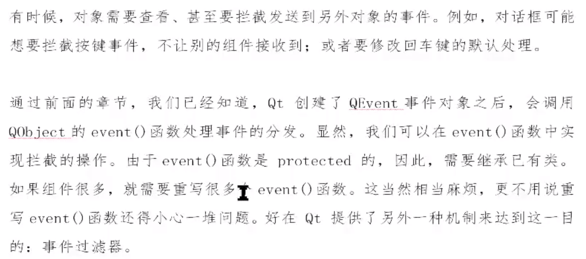

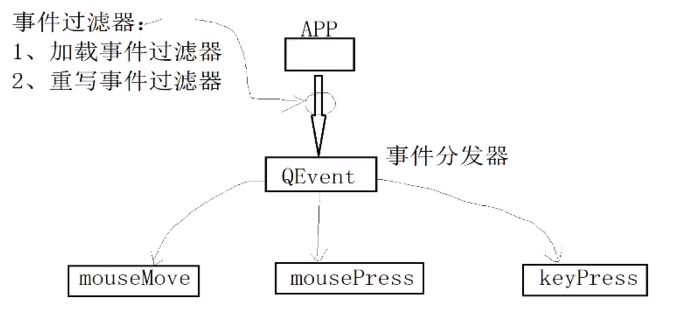

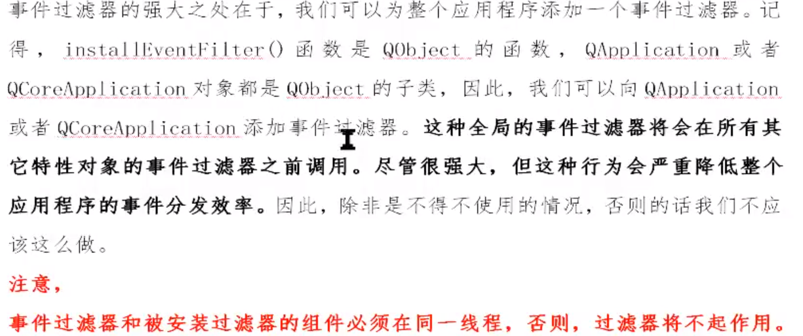

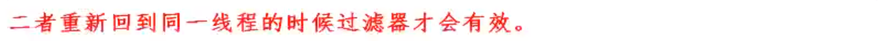

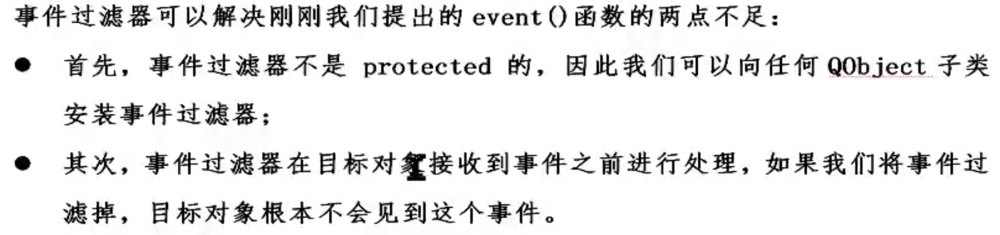

**<font color = green>事件过滤器添加步骤：</font>**

1. 为要添加过滤器的控件或者对象注册过滤器
2. 重写eventFileter函数

```c++
//重写事件过滤器函数eventFilter，参1：要过滤的对象或控件；参2：要过滤的事件
bool MyLabel::eventFilter(QObject *obj, QEvent *e)
{
    if(obj == this){
        if(e->type() == QEvent::MouseButtonPress){
            qDebug() << "事件过滤器中处理";
            QMouseEvent *eve = static_cast<QMouseEvent*>(e);
            qDebug() << "eventFiilter的坐标x = " << eve->x() << "；y = " << eve->y();
            return true;
        }else if(e->type() == QEvent::MouseButtonRelease){
            e->ignore();
            return  true;
        }
    }
    //处理过自己感兴趣的事件后，将其他不感兴趣的事件仍然交给父类处理
    return QLabel::eventFilter(obj,e);
}
```

# 总结

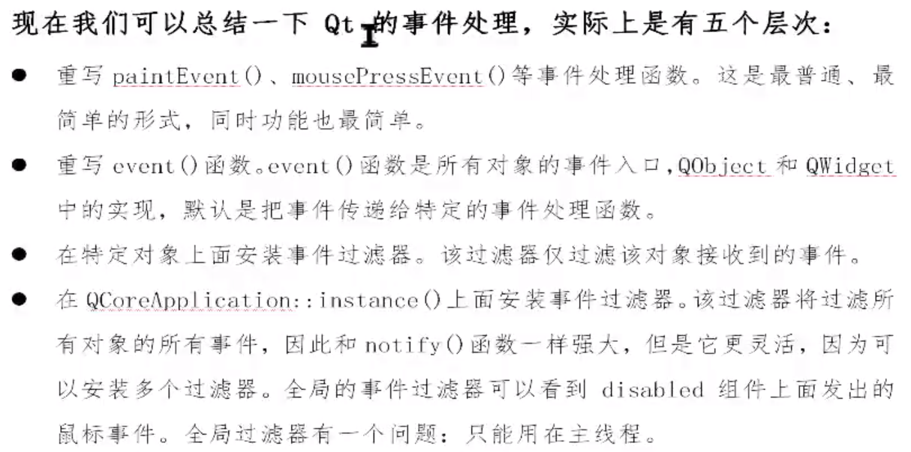

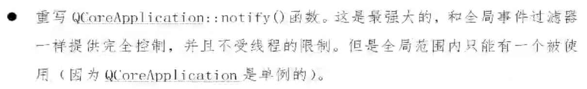

# 定时器事件

- 定时器在触发的时候，会先首先运行开始定时器函数时间，然后才会触发开启信号

```c++
//头文件中定义timeId1、timeId2，并且声明重写timerEvent()事件
timeId1 = this->startTimer(1000);//启动，定时器间隔时间为1秒
timeId2 = this->startTimer(2000);//启动，定时器间隔时间为2秒
//.cpp文件中
void Widget::timerEvent(QTimerEvent *e)
{
    static int  num1 = 0;
    static int  num2 = 0;
    //上面开启的两个定时器都会触发该事件，所以需要根据timeId判断是哪个定时器触发的
    if(e->timerId() == timeId1){
        ui->lcdNumber->display(num1++);
    }else if (e->timerId() == timeId2){
        ui->lcdNumber_2->display(num2++);
    }
}
```

触发定时器的第二种方法还可以依靠定时器类`QTimer`

```c++
QTimer *timer = new QTimer(this);
timer->start(10000);
int num = 0;
//定时器每隔1秒触发一次timeout信号
connect(timer,&QTimer::timeout,[&](){
    ui->lcdNumber_3->display(++num);
});
```

延迟开启一个任务，使用静态函数`singleshot`

```c++
 QTimer::singleShot(10000,[=](){qDebug() << "开启了";});//延迟了10秒，然后打印出“开启了”
```


