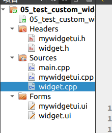

# `QListWidget`控件

```c++
Widget::Widget(QWidget *parent)
    : QWidget(parent)
    , ui(new Ui::Widget)
{
    ui->setupUi(this);
    /*添加item的三种方式*/
    //1.
    ui->listWidget->addItem("hahha");
    ui->listWidget->addItem("hehehe");
    //2.
    QListWidgetItem *item = new QListWidgetItem("哈哈哈");
    ui->listWidget->addItem(item);
    //3.
    QStringList list;
    list << "我的" << "天呐";
    ui->listWidget->addItems(list);
    connect(ui->listWidget,&QListWidget::itemClicked,[](QListWidgetItem *item){
        qDebug() << item->font().family();//获得item字体
        qDebug() << item->text();//获得点击的item
    });
}
```

# `QTreeWidget`控件

```c++
    ui->treeWidget->setHeaderLabels(QStringList() << "英雄"<<"英雄介绍");//设置树表头标签

    QTreeWidgetItem *item1 = new QTreeWidgetItem(QStringList() << "德玛");
    item1->addChild(new QTreeWidgetItem(QStringList() << "上单" << "坦克，肉"));//QStringList() 中添加的条数要与树表头标签条数相同
    //ui->treeWidget->addTopLevelItem(item1);

    QTreeWidgetItem *item2 = new QTreeWidgetItem(QStringList() << "盲僧");
    item2->addChild(new QTreeWidgetItem(QStringList() << "打野" << "背锅的"));
    //ui->treeWidget->addTopLevelItem(item2);

    QTreeWidgetItem *item3 = new QTreeWidgetItem(QStringList() << "提莫");
    item3->addChild(new QTreeWidgetItem(QStringList() << "上单" << "很垃圾的一个英雄" ));
    //ui->treeWidget->addTopLevelItem(item3);
    //此种方法可以一次添加多个
    ui->treeWidget->addTopLevelItems(QList<QTreeWidgetItem*>() << item1 << item2 << item3);
```

# `QTableWidget`控件

```c++
    //设置列数为3列
    ui->tableWidget->setColumnCount(3);
    //设置行数为5行
    ui->tableWidget->setRowCount(5);
    //设置水平表头标签（列名）
    ui->tableWidget->setHorizontalHeaderLabels(QStringList() << "人物" << "性别" << "年龄");
    ui->tableWidget->setVerticalHeaderLabels(QStringList() << "第一行" << "第二行" << "第三行" <<  "第四行" << "第五行");
    //设置表中内容 3列5行
    QStringList name;
    name << "关羽" << "张飞" << "赵云" << "黄忠" << "马超";
    QStringList gender;
    gender << "男" << "男" << "男" << "男" << "男";
    for(int i = 0; i < 5; i++){
        ui->tableWidget->setItem(i,0,new QTableWidgetItem(name.at(i)));
        ui->tableWidget->setItem(i,1,new QTableWidgetItem(gender.at(i)));
        ui->tableWidget->setItem(i,2,new QTableWidgetItem(QString::number(20+i)));
    }
```

#  `Combox`下拉框控件

```c++
    //填充下拉框备选项
    ui->comboBox->addItems(QStringList() << "宝马" << "奥迪" << "奔驰" << "五菱宏光");
    /*设置默认选项*/
    //ui->comboBox->setCurrentText("宝马");
    ui->comboBox->setCurrentIndex(3);
    void (QComboBox::*p)(int) = &QComboBox::currentIndexChanged;
    //获取当前选中的项索引和项文本
    connect(ui->comboBox,p,[=](int index){
        qDebug() << index;
        qDebug() << ui->comboBox->currentText();
    });
```

# 自定义控件

1. 添加新Qt设计师界面文件，在主窗口widget.ui中添加控件widget，然后将此控件提升为类，选择类名MyWidgetUi，并且设置全局包含
2. 此时主窗口中的ui->widget就代表着MyWidgetUi类
3. 在MyWidgetUi类中实现函数（外部接口），可以在主窗口中使用ui->widget调用这些函数完成对mywidgetui.ui的控制



```c++
Widget::Widget(QWidget *parent)
    : QWidget(parent)
    , ui(new Ui::Widget)
{
    ui->setupUi(this);
    connect(ui->pushButton,&QPushButton::clicked,[=](){
        ui->widget->mySetValue(50);
    });
    connect(ui->pushButton_2,&QPushButton::clicked,[=](){
        qDebug() << ui->widget->myGetValue();
    });
}
```


