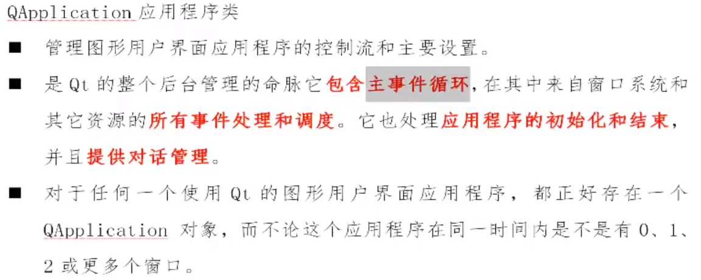

# `QApplication`应用程序类



```c++
MyWidget::MyWidget(QWidget *parent)
    : QWidget(parent)
{
    //设置窗口名字
    this->setWindowTitle("第一个窗口");
    //设置窗口固定大小
    this->setFixedSize(800,400);
    //this->resize(800,400);   
    //创建按钮控件，利用有参构造起按钮名字，指定父对象为this主窗口
    QPushButton *pushbutton = new QPushButton("haha",this);
    //将按钮移动到300，200位置
    pushbutton->move(300,200);
    //设置按钮为固定大小
    pushbutton->setFixedSize(50,70);
}
```

`resize`函数与`setFixedSize`函数区别

1. `resize`函数设置完窗口大小后，窗口仍然可以拉伸
2. `setFixedSize`函数设置完窗口大小后，窗口大小固定，不能拉伸