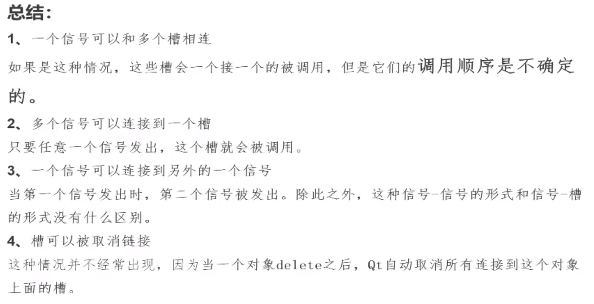

**当信号与槽函数重载的时候，需要通过函数指针指定使用的是哪个信号、哪个槽，并且需要添加函数指针对应的作用域**

```c++
MyWidget::MyWidget(QWidget *parent)
    : QWidget(parent)
{
    this->resize(800,600);
    QPushButton *btn1 = new QPushButton("无参槽函数",this);
    QPushButton *btn2 = new QPushButton("有参槽函数",this);
    btn2->move(400,300);

    Teacher *tea = new Teacher;
    Student *stu = new Student;
    //此处需要传入的是信号和槽函数的函数入口地址，当信号和槽重载的时候需要使用函数指针，明确使用哪个信号、哪个槽
    void (Teacher::*p1)() = &Teacher::hungry;
    void (Student::*t1)() = &Student::treat;
    //connect(tea,&Teacher::hungry,stu,&Student::treat);此处报错
    connect(tea,p1,stu,t1);
    void(Teacher::*p2)(QString foodName) = &Teacher::hungry;
    void(Student::*t2)(QString foodName) = &Student::treat;
    connect(tea,p2,stu,t2);
	//信号也可以连接另一个信号，当信号没有参数的时候
    //clicked信号触发，槽函数为另一个信号p1，此时信号p1也会正常触发
    connect(btn1,&QPushButton::clicked,tea,p1);
    connect(btn2,&QPushButton::clicked,[=](){
        emit tea->hungry(QString("锅包肉"));
    });
}
```

# 信号和槽总结



5. 槽函数参数个数必须要大于等于信号的参数个数，如果槽函数参数少的时候，只能按顺序少后面的参数。