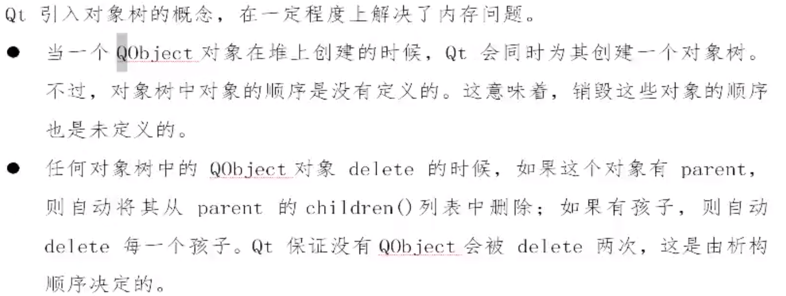

- 创建`QObject`对象时，可以提供一个其父对象，我们创建的这个`QObject`对象会自动添加到其父对象的`children()`列表
- 当父对象析构的时候，这个列表中的所有对象也会被析构（注意：这里的父对象并不是继承意义上的父类）

`QWidget`是能够在屏幕上显示的一切组件的父类

- `QWidget`继承自`QObject`，因此也继承了这种对象树关系。一个孩子自动地成为父组件的一个子组件
- 我们也可以自己删除子对象，它们会自动从其父对象列表中删除

Qt引入对象树的概念，在一定程度上**<font color=blue>解决了内存问题</font>**



**<font color=red>Qt建议创建对象从堆区申请空间，而不是从栈区申请空间，这样容易造成对象多次释放的问题</font>**

**原因：**

```c++
{
    QPushButton quit("Quit");
    QWidget window;
    quit.setParent(&window);
}
```

这段代码在执行的时候，入栈顺序quit、window，出栈顺序window、quit，超出作用域时，window首先被析构，它会调用子对象列表中每一个对象的析构函数，也就是说，quit此时就被析构了，代码继续执行，当执行到局部变量quit时，quit也会被析构，这时已经是第二次调用quit的析构函数了，C++不允许调用两次析构函数，因此程序崩溃。

**总结：尽量在构造的时候就指定parent对象，并且大胆在堆上创建。**