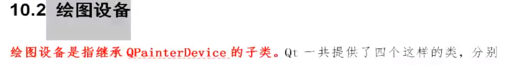

# 画家`painter`

1. 如果在主窗口中绘图，必须在绘图事件中完成
2. 绘图事件的调用时机
    1. 窗口加载的时候
    2. 使用update()函数人为调用

```c++
//头文件中声明重写paintEvent事件
void paintEvent(QPaintEvent *event) override;
//.cpp文件中实现点击按钮然后图片向右移动十个像素点
Widget::Widget(QWidget *parent)
    : QWidget(parent)
    , ui(new Ui::Widget)
{
    ui->setupUi(this);
    //人为调用update()函数，重绘窗口
    connect(ui->pushButton,&QPushButton::clicked,[=](){
        this->update();
    });
}
void Widget::paintEvent(QPaintEvent *event)
{
    static int x = 0;
    QPainter *painter = new QPainter(this);
    QPixmap pix;
    pix.load(":/image/1.jpg");
    pix.scaled(pix.width(),pix.height());
    painter->drawPixmap(x+=10,0,pix.width()*0.5,pix.height()*0.5,pix);
    painter->end();
    if(x >= this->width()){
        x = 0;
    }
}
```

**画线、画矩形**

```c++
//画线
painter->begin(this);
QPen pen;
pen.setColor(Qt::red);
pen.setStyle(Qt::DotLine);
pen.setWidth(20);
painter->setPen(pen);
painter->drawLine(150,150,600,600);
//画矩形
pen.setColor(Qt::green);
painter->setPen(pen);
painter->drawRect(20,20,400,400);
```

**画圆和椭圆**

```c++
//画圆和椭圆
painter->setBrush(Qt::SolidPattern);
painter->drawEllipse(200,200,300,300);
painter->drawEllipse(300,300,50,100);
```

# 绘图设备




## `QPixmap`


## `QBitmap`


```c++
//如果要在主窗口中绘图，那么必须在paintEvent事件中画图，如果在绘图设备上画图哪里都可以
//Qt中三个绘图设备为QPixmap、QPicture、QBitmap
QBitmap bit(200,200);
QPainter p(&bit);
p.drawEllipse(QPoint(100,100),100,100);
bit.save("/home/QtReview/07_test_paintEvent/image/66.jpg");
p.end();
```

## `QImage`


```c++
QImage img(":/image/2.jpg");
for(int i = 50; i < 100; i++){
     for(int j = 50; j < 100; j++){
         //将2.jpg图片中50~100像素点换成了红色
        img.setPixel(i,j,qRgb(255,0,0));
     }
}
img.save("/home/QtReview/07_test_paintEvent/image/6666.jpg");
```

**<font color=blue>如果要在主窗口中绘图，那么必须在paintEvent事件中画图，如果在绘图设备上画图哪里都可以</font>**

## `QPicture`


```c++
void Widget::paintEvent(QPaintEvent *event)
{
//首先先让画家在QPicture绘图设备上画图，然后用picture保存绘图指令到本地
    QPicture picture;
    QPainter painter;
    painter.begin(&picture);
    //画一个椭圆
    painter.drawEllipse(20,20,100,50);
    //画一个用红色填充的一个矩阵
    painter.fillRect(20,100,100,100,Qt::red);
    painter.end();
    picture.save("./333.zl");

//让QPicture绘图设备加载picture绘图指令，然后让画家在QPaintEvent事件中画到当前窗口上
    picture.load("./333.zl");
    painter.begin(this);
    painter.drawPicture(QPoint(100,100),picture);
    painter.end();
}
```


