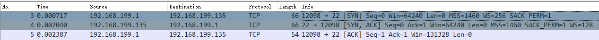
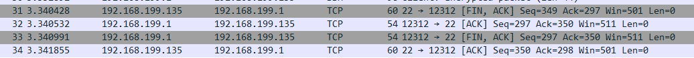
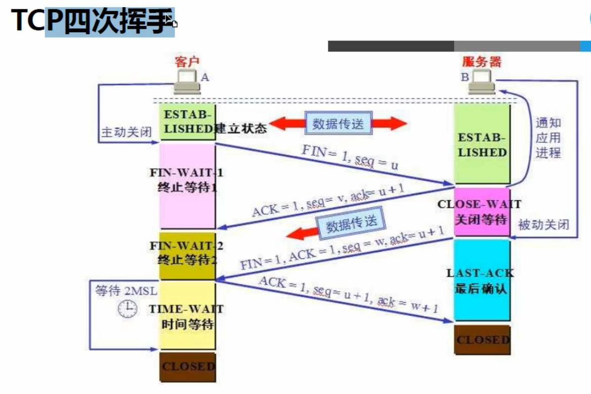

# 1 控制字段

- `SYN`：请求建立连接控制字段
- `ACK`：数据信息确认控制字段
- `FIN`：请求断开连接控制字段

# 2 三次握手

1. 第一次握手
    - 发送`SYN`字段请求建立连接
    - 发送`seq`序列号信息，第一个数据包序列号默认为0（此处假设为X）
2. 第二次握手
    - 发送`SYN`字段请求建立连接，发送`ACK`信息确认字段
    - 发送`seq`序列号信息(Y)，发送`ack`确认号信息（此处为X+1）
3. 第三次握手
    - 发送`ACK`信息确认控制字段
    - 发送`seq`序列号信息（X+1），发送`ack`确认号信息（Y+1）

## 图示

192.168.199.1与192.168.199.135通信

# 3 四次挥手

1. 第一次挥手
    - 发送`FIN`请求断开连接
2. 第二次挥手
    - 发送`ACK`确认信息控制字段
3. 第三次挥手
    - 发送`FIN`请求断开连接，发送`ACK`确认收到上次的确认
4. 第四次挥手
    - 发送`ACK`确认信息控制字段

## 图示1

192.168.199.135主动与192.168.199.1断开连接

## 图示2

