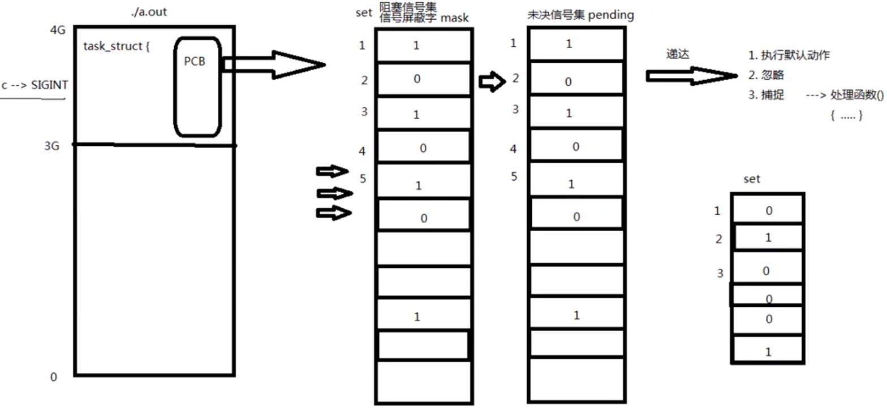
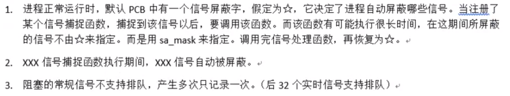
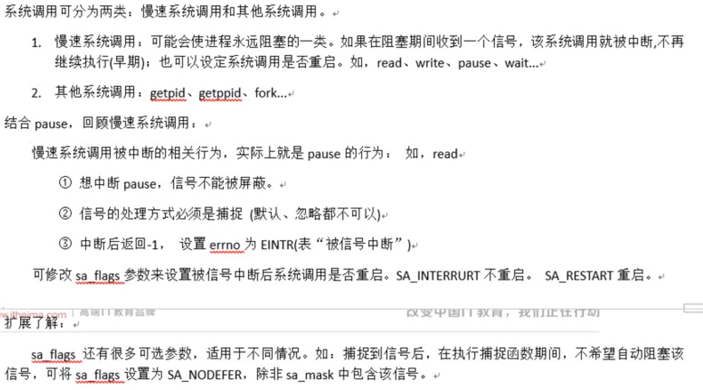

# 1 概念

## 1.1 信号的状态

- 产生状态

- 未决状态

    没有被处理的信号

- 递达状态

    已经被处理的信号

## 1.2 信号的处理方式

1. 执行默认动作
2. 忽略（丢弃）
3. 捕捉（调用用户处理函数）

## 1.3 信号四要素

- 编号
- 名称
- 信号对应事件
- 信号默认处理动作

## 1.4 阻塞信号集（信号屏蔽字）

- 都位于pcb中
- 将某些信号加入集合，对他们设置屏蔽，当屏蔽某信号后，在收到该信号，该信号的处理将推后（解除屏蔽后）

## 1.5 未决信号集

- 信号产生，未决信号集中描述该信号的位立刻翻转为1，表示信号处于未决状态。当信号被处理对应位翻转为0.这一时刻往往非常短暂
- 信号产生后由于某些原因（主要是阻塞）不能抵达。这类信号的集合称之为未决信号集。在屏蔽解除前，信号一直处于未决状态



# 2 信号常用函数

## 2.1 `kill`函数

- 发送信号给指定进程

#### 函数原型

`int kill(pid_t pid, int sig);`

- 参数

    `pid`：进程号，要发送给哪个进程

    - 传进来的值>0：发送信号给传进来的值
    - 传进来的值=0：发送信号给与调用`kill`函数进程属于同一进程组的所有进程
    - 传进来的值<-1：取|pid|发给对应进程组
    - 传进来的值=-1：发送给进程有权限发送的系统中所有进程

    `sig`：信号，要发送什么信息（可用kill -l)命令查看

- 返回值

    成功返回0

    失败返回-1（进程ID非法，信号非法，或者普通信号杀init进程等权级问题

#### 例子

```c
#include<stdio.h>
#include<stdlib.h>
#include<unistd.h>
#include<fcntl.h>
#include<string.h>
#include<signal.h>
int main(){
    pid_t pid = fork();
    if(pid == -1){
        perror("子进程创建失败");
        exit(1);
    }else if(pid == 0){
        //子进程
        sleep(2);
        kill(getppid(),SIGKILL);
    }else{
        //父进程
        while(1){
            printf("父进程ID为：%d\n",getpid());
            sleep(1);
        }
    }
    return 0;
}
```

## 2.2 `raise`函数

- 自己给自己发信号

#### 函数原型

`int raise(int sig);`

#### 例子

```c
#include<stdio.h>
#include<stdlib.h>
#include<unistd.h>
#include<fcntl.h>
#include<string.h>
#include<signal.h>
int main(){
    pid_t pid = fork();
    if(pid == -1){
        perror("子进程创建失败");
        exit;
    }else if(pid == 0){
        printf("子进程发出%d信号\n",SIGINT);
        raise(SIGINT);
    }else{
        int status;
        pid_t pid = wait(&status);
        if(WIFSIGNALED(status)){
            printf("子进程被%d信号杀死\n",WTERMSIG(status));
        }
    }
    return 0;
}
```

## 2.3 `abort`函数

- 给自己发送异常终止信号

#### 函数原型

`void abort(void);`

- 没有参数，没有返回值，永远不会调用失败

#### 例子

```c
#include<stdio.h>
#include<stdlib.h>
#include<unistd.h>
#include<fcntl.h>
#include<string.h>
#include<signal.h>
int main(){
    pid_t pid = fork();
    if(pid == -1){
        perror("子进程创建失败");
        exit;
    }else if(pid == 0){
        printf("子进程发出%d信号\n",SIGABRT);
        abort();
    }else{
        int status;
        pid_t pid = wait(&status);
        if(WIFSIGNALED(status)){
            printf("子进程被%d信号杀死\n",WTERMSIG(status));
        }
    }
    return 0;
}
```

## 2.4 闹钟函数（定时器）

### `alarm`函数

- 设置定时器（每个进程只有一个定时器）
- 使用的是自然定时法，不受进程状态影响

#### 函数原型

`unsigned int alarm(unsigned int seconds);`

- 参数

    `seconds`：定时器设置的秒数

- 返回值

    重置定时器时会返回上一次定时器还剩下的秒数

- <font color=red>当时间到达的时候会发出**SIGALRM信号**</font>

#### 例子

```c
#include<stdio.h>
#include<stdlib.h>
#include<unistd.h>
#include<fcntl.h>
#include<string.h>
int main(){
    unsigned int ret = alarm(5);//设置定时器时间为5秒
    printf("当前定时器剩余时间%d\n",ret);//0秒
    sleep(2);
    //重置定时器
    ret = alarm(4);
    printf("重置定时器为4秒时，此时定时器剩余时间%d\n",ret);//3秒
    while(1){//一秒输出一次，输出四次，与重置定时器4秒吻合
        printf("hello world\n");
        sleep(1);
    }
    return 0;
}
```

### `setitimer`函数

- 定时器，实现周期性定时

#### 函数原型

`int setitimer(int which, const struct itimerval* new_value,struct itimerval* old value);`

- 返回值：-1表示失败，0表示成功

- 参数

    `which`：

    1. 自然定时：宏`ITMER_REAL`，发送`14)SIGLARM`信号，计算自然时间
    2. 虚拟空间计时（用户空间）：宏`ITIMER_VIRTUAL`，发送`26)SIGVTALRM`信号，只计算进程占用CPU时间
    3. 运行时计时（用户+内核）：宏`ITMER_PROF`，发送`27)SIGPROF`信号，计算占用CPU及执行系统调用的时间

    `new_value`：设置闹钟的定时秒数

    `old_value`：上次定时剩余的时间

- 参数中的两个结构体

    ```c
    struct itimerval {
          struct timeval it_interval; /* next value */
          struct timeval it_value;    /* current value */
    };
    struct timeval {
          time_t      tv_sec;         /* seconds */
          suseconds_t tv_usec;        /* microseconds */
    };
    ```

#### 例子

```c
#include<stdio.h>
#include<stdlib.h>
#include<unistd.h>
#include<fcntl.h>
#include<string.h>
#include<sys/time.h>
#include<signal.h>
void myfunc(int signal){
    printf("hello world\n");
}
int main(){
    struct itimerval itimer;
    //注册SIGALRM信号的捕捉处理函数
    signal(SIGALRM,myfunc);
    //定时器第一次触发时间2秒
    //启动程序后，2秒后开始打印"hello world"
    itimer.it_value.tv_sec = 2;
    itimer.it_value.tv_usec = 0;
    //周期性触发时间5秒
    //每次打印"hello world"时间间隔为5秒
    itimer.it_interval.tv_sec = 5;
    itimer.it_interval.tv_usec = 0;
    setitimer(ITIMER_REAL,&itimer,NULL);
    while(1);
    return 0;
}
```

# 3 信号集操作函数

- `sigset_t set`：自定义信号集

- `int sigemptyset(sigset_t* set);`：清空信号集
- `int sigfillset(sigset_t* set);`：将信号集全部置为1
- `int sigaddset(sigset_t* set, int signum);`：将一个信号添加到集合中
- `int sigdelset(sigset_t* set, int signum);`：将一个信号从集合中移除
- `int sigismember(const sigset_t* set, int signum);`：判断一个信号是否在集合中
    - 在返回1，不在返回0

## 3.1 `sigprocmask`函数

- 用来屏蔽信号，解除屏蔽也使用该函数。本质是读取或修改进程的信号屏蔽字（PCB）中
- <font color=blue>屏蔽信号只是将信号处理延后执行（延至解除屏蔽）；而忽略表示将信号丢处理</font>

#### 函数原型

`int sigprocmask(int how,const sigset_t* set, sigset_t* oldset);`

- 参数

    `how`：

    `set`：传入参数，是一个位图，set中哪个位置为1，就表示当前进程屏蔽哪个信号

    `oldset`：传出参数，保存旧的信号屏蔽集


## 3.2 `sigpending`函数

- 读取当前进程的未决信号集

#### 函数原型

`int sigpending(sigset_t* set)`

- 参数

    `set`：传出的未决信号集
    
- 返回值

    成功返回0；失败返回-1.

## 3.3 例子

```c
#include<stdio.h>
#include<stdlib.h>
#include<unistd.h>
#include<fcntl.h>
#include<string.h>
#include<signal.h>

void print_sigSet(sigset_t *set){
    int i = 0;
    for(;i < 32;i++){
       if(sigismember(set,i)){
           putchar('1');
       }else{
           putchar('0');
       }
    }
    printf("\n");
}
int main(){
    sigset_t set,pedset;//创建自定义信号集
    sigemptyset(&set);//清空信号集
    sigaddset(&set,SIGINT);//将SIGINT信号添加到信号集中，相当于将SIGINT信号对应的位置为1
	//自定义信号集去影响pcb中阻塞信号集
    int ret = sigprocmask(SIG_BLOCK,&set,NULL);
    if(ret == -1){
        perror("改变信号集出错");
        exit(1);
    }
    while(1){
        //读出当前进程的未决信号集，给pedset
        ret = sigpending(&pedset);
        if(ret == -1){
            perror("查看当前未决信号集出错");
            exit(2);
        }
        //打印当前进程的未决信号集
        print_sigSet(&pedset);
        sleep(1);
    }
    return 0;
}
```

# 4 `signal`函数

- <font color=blue>注册一个信号捕捉函数</font>

## 4.1 函数原型

- **该函数由`ANSI`定义，最好使用`sigaction`函数代替**

```
typedef void(*sighandler_t)(int);
sighandler_t signal(int signum,sighandler_t handler);
```

## 4.2 例子

```c
#include<stdio.h>
#include<stdlib.h>
#include<unistd.h>
#include<fcntl.h>
#include<string.h>
#include<signal.h>
void catch_SIGINT(int signum){
    printf("catched SIGINT\n");
}
int main(){
    signal(SIGINT,catch_SIGINT);
    //...一段代码...
    while(1);
    return 0;
}
```

# 5 `sigaction`函数

- 修改信号处理动作（通常在Linux用来注册一个信号的捕捉函数）

## 5.1 函数原型

`int sigaction(int signum,const struct sigaction* act,struct sigaction* oldact);`

- 返回值：成功返回0；失败返回-1.

- `struct sigaction结构体`

    ```
    struct sigaction {
          void     (*sa_handler)(int);//回调函数
          void     (*sa_sigaction)(int, siginfo_t *, void *);
          sigset_t   sa_mask;//信号屏蔽字，只在捕捉期间有用
          int        sa_flags;//一般设置为0，表示屏蔽
          void     (*sa_restorer)(void);//已废弃
    };
    ```

## 5.2 例子

```c
#include<stdio.h>
#include<stdlib.h>
#include<unistd.h>
#include<fcntl.h>
#include<string.h>
#include<signal.h>
void catch_SIGINT(int signum){
    printf("catch it who num=%d\n",signum);
}
int main(){
    struct sigaction act;//创建sigaction结构体
    act.sa_handler = catch_SIGINT;//指定回调函数名字
    sigemptyset(&act.sa_mask);//清空信号屏蔽字集
    act.sa_flags = 0;
    int ret = sigaction(SIGINT,&act,NULL);//注册信号捕捉函数
    if(ret == -1){
        perror("信号屏蔽失败");
        exit(1);
    }
    while(1);
    return 0;
}
```

## 5.3 信号捕捉特性



- 捕捉函数执行期间，信号屏蔽字由mask->sa_mask，捕捉函数执行结束。回复回mask
- 捕捉函数执行期间，本信号自动屏蔽（sa_flgs = 0)
- 捕捉函数执行期间，被屏蔽信号多次发送，解除屏蔽后只处理一次

# 6 `SIGCHLD`信号

## 6.1 `SIGCHLD`的产生条件

1. 子进程终止时
2. 子进程接受到`SIGSTOP`信号停止时
3. 子进程处在停止态，接受到`SIGCONT`后唤醒时

## 6.2 借助`SIGCHLD`信号回收子进程

子进程结束运行，其父进程会收到`SIGCHLD`信号，该信号默认处理动作是忽略。可以捕捉该信号，在捕捉函数中完成子进程状态的回收。

## 6.3 例子

```c
#include<stdio.h>
#include<stdlib.h>
#include<unistd.h>
#include<fcntl.h>
#include<string.h>
#include<signal.h>
//捕捉信号的处理函数，当子进程结束时会发送SIGCHLD信号，收到这个信号后
//在捕捉信号的处理函数中去对子进程资源的释放
void catch_SIGCHLD(int signum){
    int status;
    int wid;
    while((wid = waitpid(-1,&status,0)) != -1){
        //!=-1表示还有子进程没有回收
        if(WIFEXITED(status)){
            printf("catch child id %d，status=%d\n",wid,WEXITSTATUS(status));
        }
    }
}
int main(){
    //循环创建子进程
    int i = 0;
    pid_t pid;
    for(;i<5;i++){
        if((pid = fork()) == 0){
            break;
        }
    }
    if( i == 5){
        printf("这是父进程，ID=%d\n",getpid());
        //子进程中注册信号，回收子进程
        struct sigaction sig;
        sig.sa_handler = catch_SIGCHLD;//指定回调函数
        sigemptyset(&sig.sa_mask);//指定信号屏蔽字集
        sig.sa_flags = 0;
        sigaction(SIGCHLD,&sig,NULL);//注册信号
        //while(1);
    }
    if(i < 5){
        printf("这是子进程，ID=%d\n",getpid());
    }
    return 0;
}
```

# 7 中断系统调用




