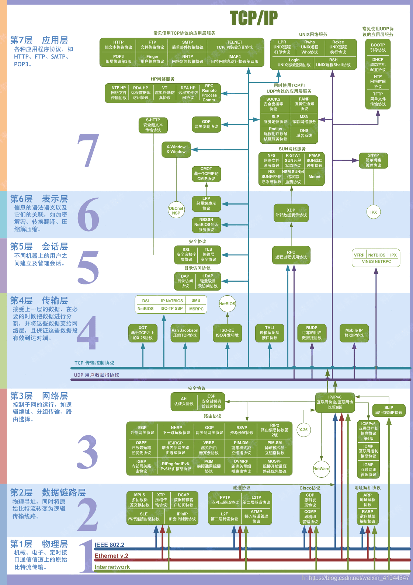
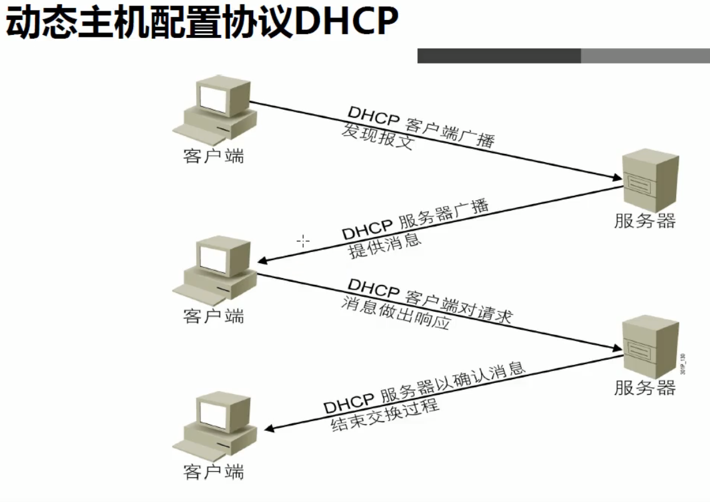
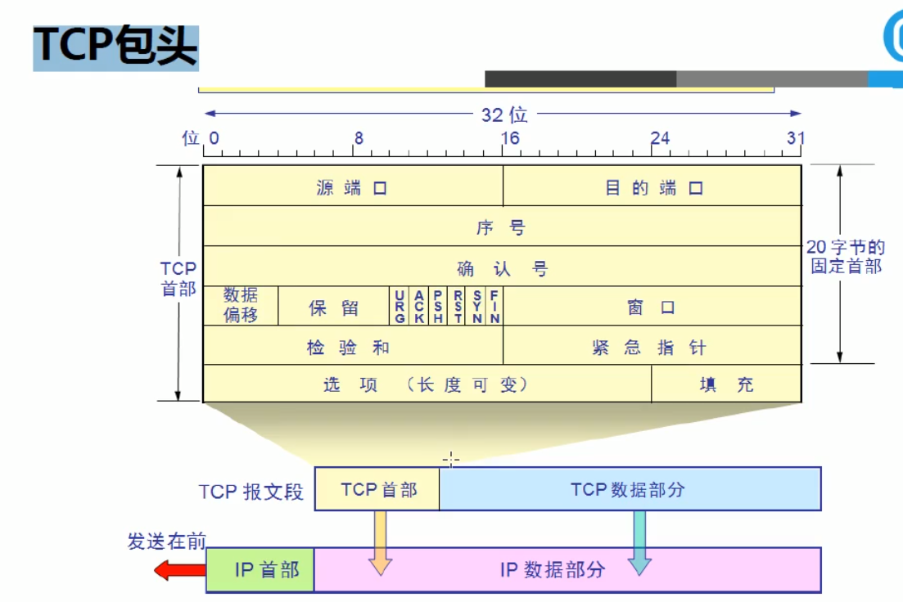
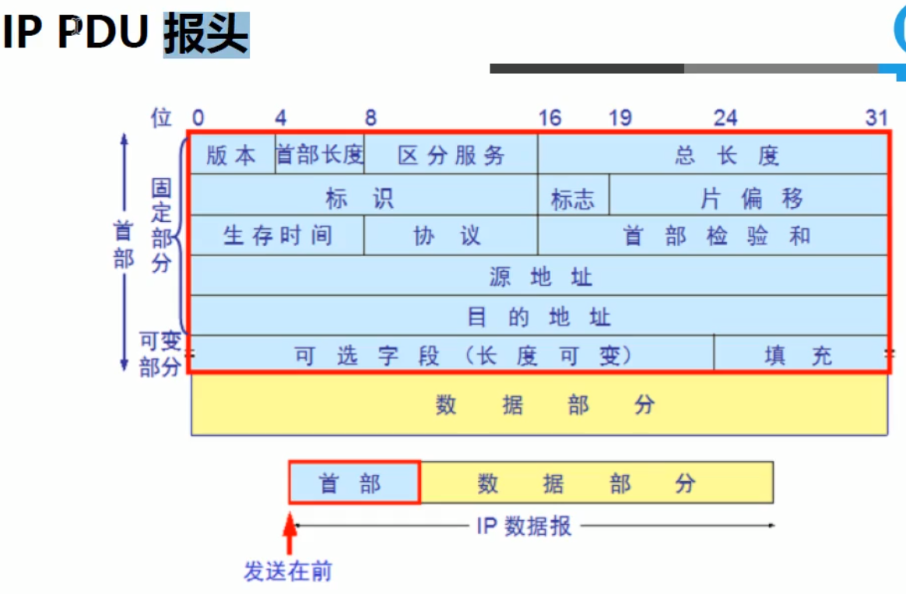

# OSI七层参考模型图

# 1 应用层协议

## 1.1 DHCP协议

- DHCP是使用UDP的应用层协议

### 图示

- 四种状态

# 2 传输层协议

## 2.1 TCP协议

- 传输控制协议

### TCP协议特性

1. 工作在传输层。
2. 面向连接的
3. 通信传输协议采用全双工协议
4. 可靠性传输
5. 拥塞控制，慢起动和拥塞避免算法
6. 错误检查
7. 将数据打包成段，排序
8. 确认机制
9. 流量控制，滑动窗口
10. 半关闭
11. 数据恢复与重传

### TCP包头结构

## 2.2 UDP协议

- 用户数据报协议

### UDP协议特性

1. 工作在传输层
2. 面向无连接
3. 提供不可靠的网络访问
4. 传输效率高
5. 有限的错误检查
6. 无数据恢复特性

### UDP包头

# 3 网络层

## 3.1 ARP协议

- **ARP协议在TCP/IP模型中位于网络层，OSI模型中位于链路层**
- 地址解析协议，通过解析IP地址得到MAC地址

## 3.2 IP协议

- 负责把一个数据包从一个网段转发到另一个网段

### IP协议报头

## 3.3 ICMP协议

- 负责检测网络层是否有故障，ping命令就来自ICMP协议

## 3.4 IGMP协议

- 用来报告多址广播组成员身份的协议
- 通知本地路由器希望加入或接受某个特定组播组的信息
- 路由器通过IGMP协议周期性查询某个局域网内某个已知组成员是否处于活动状态

# 4 数据链路层

# 5 物理层

