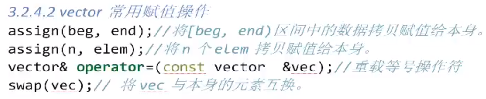
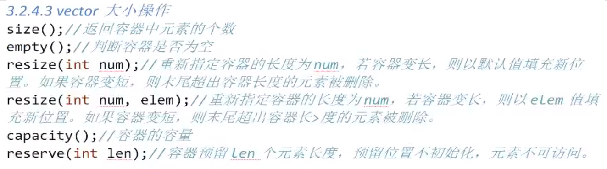
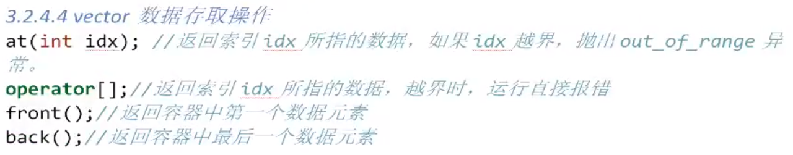
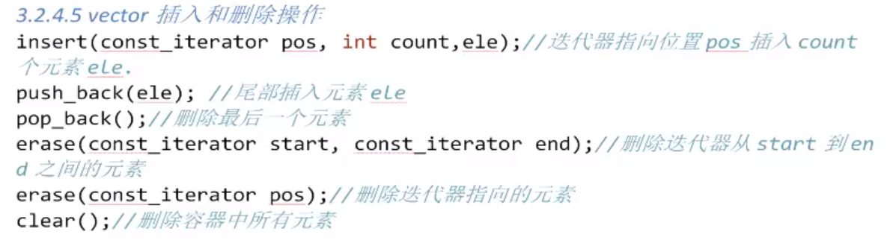

# 1 迭代器

- 随机访问迭代器（可以通过指针进行加加减减操作）

# 2 数据结构

- 单端动态数组（只能在一端进行插入或删除操作）

- 一块<font color=red>线性的连续内存空间</font>，当这块空间满时，会另外寻找一块更大的连续空间，将原来的数据搬过去

# 3 vector构造函数


# 4 vector常用赋值操作



# 5 vector大小操作

- `resize()`<font color=red>函数只改变容器大小，不改变容器容量</font>



```c++
vector<int> v(100,5);//使用构造函数，初始化100个值为5的容器
v.resize(2);//将容器大小改为2
vector<int>(v).swap(v);//使用匿名容器将v的容量也改为2
//调用swap()函数时，编译器交换匿名容器和v的指向，匿名容器指向容量为100的空间，
//v指向容量为2的空间，第3行语句执行完毕，系统释放匿名容器的空间，所以v的容量变为2.
```

# 6 vector数据存取操作



# 7 vector插入和删除操作




