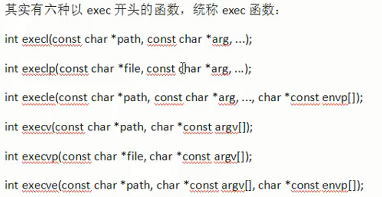
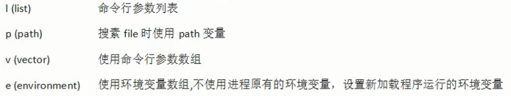
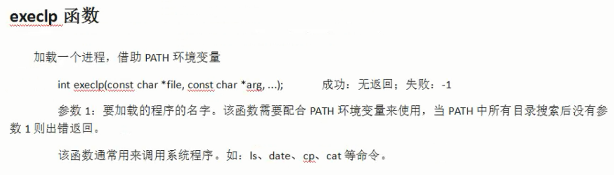
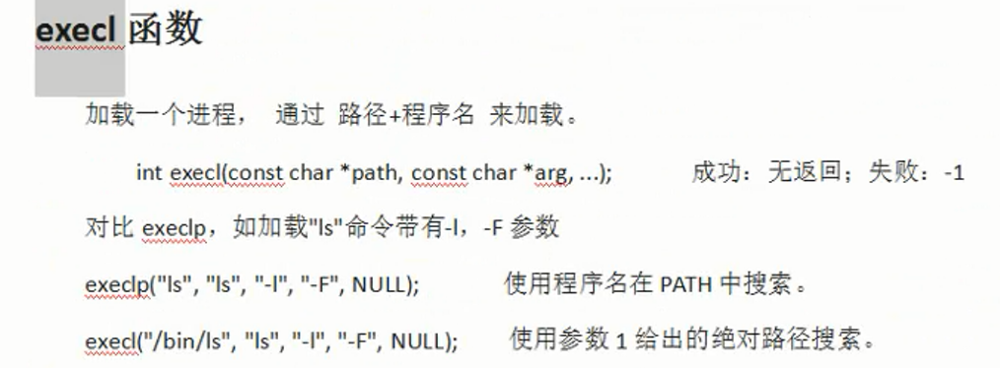
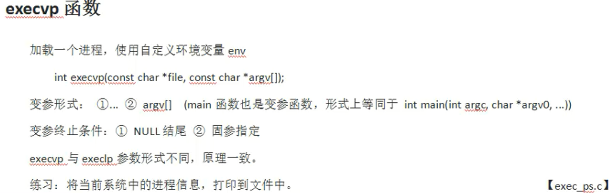
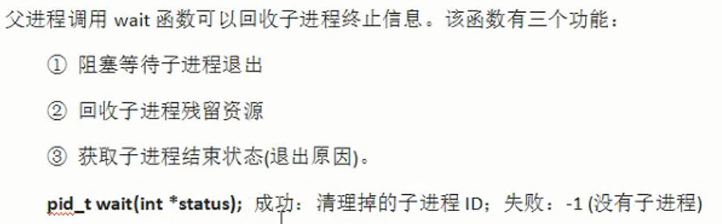
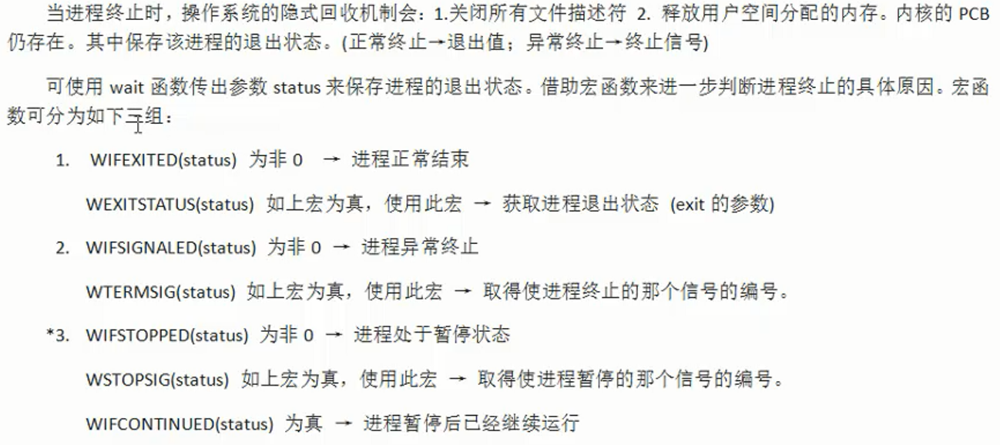
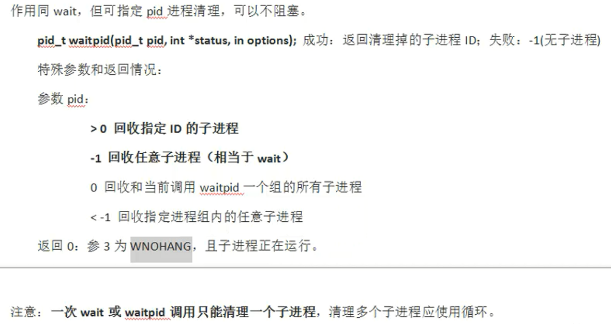

# 1 `exec`函数族

- `exec`函数一旦调用成功即执行新的程序，不会执行`exec`函数下面的语句
- 只有失败时候才会返回-1
- 通常直接在`exec`函数后面调用`perror()`函数和`exit()`，无需进行if语句判断



<font color=blue>`exec`函数后所加字母的意思：</font>



## `execlp`函数



## `execl`函数



## `execvp`函数



### 例子

```c
#include<stdio.h>
#include<stdlib.h>
#include<unistd.h>
#include<fcntl.h>
#include<string.h>
int main(int argc, char* argv[]){
    int fd = open("ps.out",O_WRONLY|O_CREAT|O_TRUNC,0666);
    if(fd == -1){
        perror("文件打开失败！");
        exit(1);
    }

    dup2(fd,STDOUT_FILENO);//更改标准输出的文件描述符指向,指为"ps.out"文件

    execlp("ps","ps","aux",NULL);
    //exec函数族一旦调用成功就会去执行新的程序，不会执行后面的代码
    //close(fd);利用隐式回收，关闭fd
    printf("execlp函数调用成功，此句不会被执行\n");
    return 0;
}
```

# 2 僵尸进程和孤儿进程

## 僵尸进程

- 进程终止，父进程未回收，子进程残留资源(PCB)存放于内核中，变成僵尸进程

## 孤儿进程

- 父进程比子进程先结束，子进程成为孤儿进程
- init进程会领养孤儿进程，成为这个子进程的父进程

# 3 `wait`函数

## 函数原型

`pid_t wait(int* status);`

- 返回值

    成功：清理掉的子进程ID

    失败：-1（没有子进程）

## 函数功能





## 例子

```c
#include<stdio.h>
#include<stdlib.h>
#include<unistd.h>
#include<fcntl.h>
#include<string.h>
int main(int argc, char* argv[]){
    int status;
    pid_t pid = fork();
    if(pid == -1){
        perror("子进程开启失败");
        exit(1);
    }
    if(pid == 0){
        printf("子进程开启，子进程ID为：%d；父进程ID为：%d\n",getpid(),getppid());
        sleep(10);
        exit(11);
    }else if(pid > 0){
        pid_t exitStatus = wait(&status);
        if(exitStatus == -1){
            perror("子进程回收失败");
            exit(2);
        }
        //判断子进程的退出状态
        if(WIFEXITED(status)){
            printf("子进程ID为：%d；退出状态码为：%d\n",exitStatus,WEXITSTATUS(status));
        }

        while(1){
            printf("父进程，父进程ID为：%d\n",getpid());
            sleep(1);
        }
    }
    return 0;
}
```

# 4 `waitpid`函数

## 函数原型

`pid_t waitpid(pid_t pid,int* status,int options);`

- 返回值

    成功：返回清理掉的子进程ID

    失败：返回-1（无子进程）

    0：当第三个参数指定为WNOHANG，且子进程正在运行时会返回0




