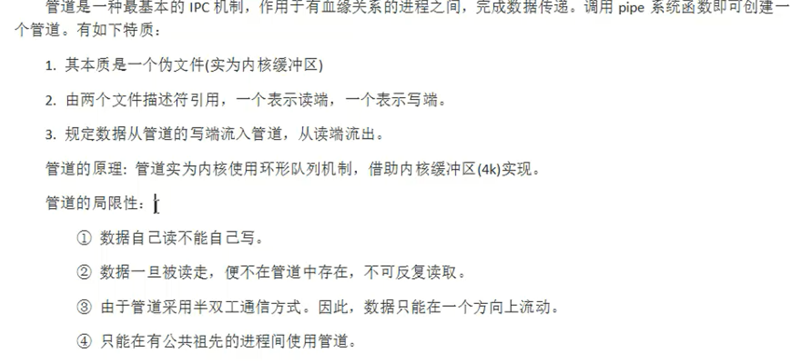

# 1 概念



## 1.1 管道的读写行为

- 读操作

    - 管道中有数据

        read正常读，返回读出的字节数

    - 管道中没有数据

        - 写端全部关闭

            read解除阻塞，返回0，相当于读文件到了尾部

        - 写端没有全部关闭

            read阻塞等待数据写入后读

- 写操作

    - 读端全部关闭

        管道破裂，内核给当前进程发送SIGPIPE信号，进程被终止，

    - 读端没有全部关闭

        - 管道没满

            write继续写

        - 管道满了

            wirte阻塞等待

## 1.2 查看管道缓冲区大小

- 命令：`ulimit -a`
- 函数：`long fpathconf(int fd,int name)`

## 1.3 设置管道为非阻塞

**<font color=blue>管道默认读写两端都阻塞</font>**

- 设置读端为非阻塞

    - `fcntl`：变参函数

        复制文件描述符，相当于`dup`函数

    - 修改文件属性（`open`时对应的`flag`属性）

    - 设置方法：

        - 获取原来的flags

            `int flags = fcntl(fd[0],F_GETFL);`

        - 设置新的flags

            `flags |= O_NONBLOCK;`==`flags = flags | O_NONBLOKC;`

            `fcntl(fd[0],F_SETFL,flags);`

# 2 有血缘关系的进程间通信

## 2.1 `pipe`函数

### 函数作用

**<font color=blue>利用`pipe`函数创建一个匿名管道，用于有血缘关系的进程间通信</font>**

### 函数原型

`int pipe(int pipefd[2]);`

- 返回值

    成功：返回0

    失败：返回-1

- 函数调用成功后返回r/w两个文件描述符。无需手动open，但需手动close

    - `pipefd[0]`：代表读
    - `pipefd[1]`：代表写

- 向管道内读写数据，其实是在读写内存缓冲区

### 例子

```c
#include<stdio.h>
#include<stdlib.h>
#include<unistd.h>
#include<fcntl.h>
#include<string.h>
//管道只要规定好一端读，一端写即可，哪方读哪方写自己规定
//此处子进程读，父进程写
int main(){
    int fd[2];
    int ret = pipe(fd);
    pid_t pid = fork();
    if(pid == -1){
        perror("子进程创建失败");
        exit;
    }else if(pid == 0){
        close(fd[1]);//子进程读数据，关闭写文件的文件描述符,防止子进程再往里面写数据
        char buf[1024];//此处读数据，没用循环是因为写的内容一次性可以读完
        ret = read(fd[0],buf,sizeof(buf));
        printf("读到的数据为；%s",buf);//将读到的数据打印到屏幕上
        write(STDOUT_FILENO,buf,ret);//将读到的数据打印到屏幕上
    }else{
        close(fd[0]);//父进程写数据，关闭读数据的文件描述符，防止子进程再自己把读走
        char *str = "hello world\n";
        write(fd[1],str,strlen(str));
    }
    return 0;
}
```

# 3 无血缘关系的进程间通信

## 3.1 `fifo`函数

- 有名管道
- 在磁盘上有一个管道文件
- 伪文件，在磁盘大小永远为0
- 在内核中有一个对应的缓冲区
- 半双工的通信方式

### 函数作用

**<font color=blue>利用`fifo`函数创建一个有名管道，用于无血缘关系的进程间通信</font>**

### 创建方式

1. 命令

    `mkfifo 管道名`

2. 函数

    `int mkfifo(const char* pathname, mode_t mode);`

    - 参数

        `pathname`：管道文件名

        `mode`：管道文件的权限

- **fifo文件可以使用IO函数操作**
    - open/close
    - read/write
    - <font color=red>不能使用lseek操作</font>

### 例子

```c
//写
#include<stdio.h>
#include<stdlib.h>
#include<unistd.h>
#include<fcntl.h>
#include<string.h>
int main(){
    //判断管道文件是否存在，不存在创建
    int ret = access("myfifo",F_OK);
    if(ret == -1){
        ret = mkfifo("myfifo",0666);
        if(ret == -1){
            perror("管道文件fifo创建失败");
            exit(1);
        }
    }

    int fd = open("myfifo",O_WRONLY);
    if(fd == -1){
        perror("文件打开失败");
        exit(2);
    }
    char buf[] = "hello world\n";
    while(1){
        write(fd,buf,sizeof(buf));
        sleep(1);
    }
    close(fd);
    return 0;
}

//读
#include<stdio.h>
#include<stdlib.h>
#include<unistd.h>
#include<fcntl.h>
#include<string.h>
int main(){
    int fd = open("myfifo",O_RDONLY);
    if(fd == -1){
        perror("文件打开失败");
        exit(1);
    }else if(fd == 0){
        printf("%d\n",fd);
    }
    char buf[1024];
    int len;
    while(1){
        len = read(fd,buf,sizeof(buf));
        write(STDOUT_FILENO,buf,len);
    }
    close(fd);
    return 0;
}
```
