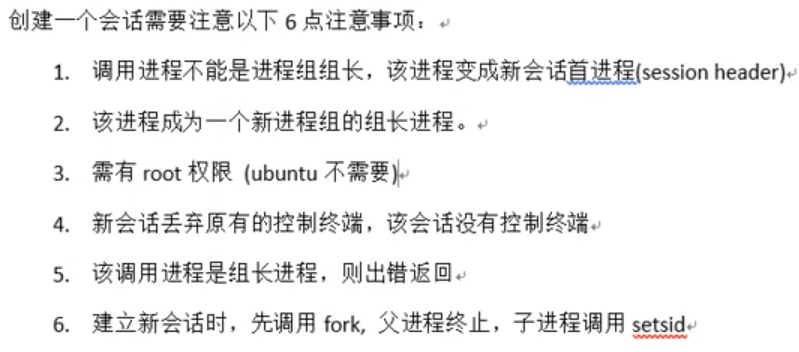
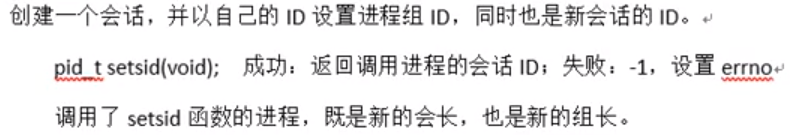
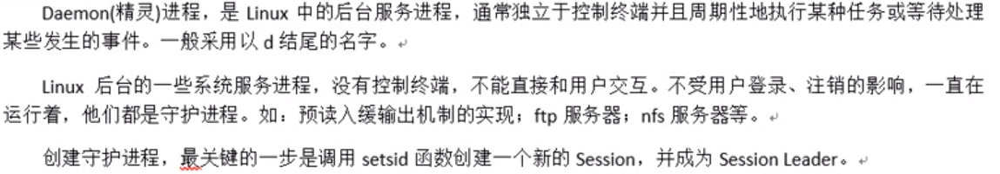
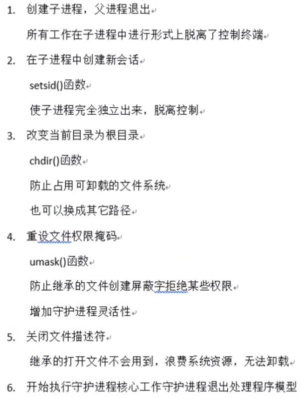

# 1 创建会话



# 2 `setsid`函数



# 3 `getsid`函数

- 获取进程所属的会话ID

## 3.1 函数原型

`pid_t getsid(pid_t pid);`

- 返回值：

    成功：返回调用进程的会话ID

    失败：返回-1

- <font color=blue>传入参数传0时表示查看当前进程的会话ID</font>

- 组长进程不能成为新会话首进程，新会话首进程必定成为组长进程

## 3.2 例子

```c
#include<stdio.h>
#include<stdlib.h>
#include<unistd.h>
#include<fcntl.h>
#include<string.h>
int main(){
    pid_t pid = fork();
    if(pid == -1){
        perror("子进程创建失败");
        exit;
    }else if(pid == 0){
        printf("子进程ID为：%d\n",getpid());
        printf("进程组ID：%d\n",getpgid(0));
        printf("会话ID：%d\n",getsid(0));
        pid_t sid =  setsid();
        printf("-------------------\n");
        printf("子进程ID为：%d\n",getpid());
        printf("进程组ID：%d\n",getpgid(0));
        printf("会话ID：%d\n",getsid(0));
    }
    //父进程直接return 0，相当于终止了父进程，子进程去创建会话
    return 0;
}
```

# 4 守护进程



# 5 创建守护进程模型步骤



## 例子

```c
#include<stdio.h>
#include<stdlib.h>
#include<unistd.h>
#include<fcntl.h>
#include<string.h>
#include<sys/stat.h>
int main(){
    //1、创建子进程
    pid_t pid = fork();
    if(pid == -1){
        perror("子进程创建失败");
        exit(1);
    }
    if(pid > 0){//终止父进程相当于
        exit(0);
    }
    //2、通过子进程创建会话
    pid = setsid();
    if(pid == -1){
        perror("会话创建失败");
        exit(1);
    }
    //3、更改当前的工作目录
    chdir("/home");
    //4、重设文件权限掩码
    umask(0022);
    //5、关闭或者重定向文件描述符（标准输入输出错误）
    close(STDIN_FILENO);
    int fd = open("/dev/null",O_RDWR);//空洞文件
    dup2(fd,STDOUT_FILENO);
    dup2(fd,STDERR_FILENO);
    //6、开始守护进程的核心工作
    while(1);
    return 0;
}
```

